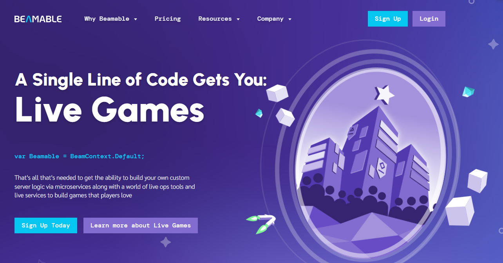

<div align="left">

[](https://beamable.com)

# Beamable<a id="beamable"></a>

var Beamable = BeamContext.Default; - That one line of code is a gateway to everything you need to build custom server logic via microservices along with a world of LiveOps tools and live services to build games that players love.


</div>

## Table of Contents<a id="table-of-contents"></a>

<!-- toc -->

- [Requirements](#requirements)
- [Installation](#installation)
- [Getting Started](#getting-started)
- [Async](#async)
- [Raw HTTP Response](#raw-http-response)
- [Reference](#reference)
  * [`beamable.account.check_availability`](#beamableaccountcheck_availability)
  * [`beamable.account.check_availability_0`](#beamableaccountcheck_availability_0)
  * [`beamable.account.check_third_party_availability`](#beamableaccountcheck_third_party_availability)
  * [`beamable.account.create_admin_user`](#beamableaccountcreate_admin_user)
  * [`beamable.account.delete_admin_scope`](#beamableaccountdelete_admin_scope)
  * [`beamable.account.delete_third_party`](#beamableaccountdelete_third_party)
  * [`beamable.account.delete_third_party_admin`](#beamableaccountdelete_third_party_admin)
  * [`beamable.account.find_accounts`](#beamableaccountfind_accounts)
  * [`beamable.account.get_admin_users`](#beamableaccountget_admin_users)
  * [`beamable.account.get_details`](#beamableaccountget_details)
  * [`beamable.account.get_object_available_roles`](#beamableaccountget_object_available_roles)
  * [`beamable.account.get_personally_identifiable_information`](#beamableaccountget_personally_identifiable_information)
  * [`beamable.account.get_user_info`](#beamableaccountget_user_info)
  * [`beamable.account.list_roles`](#beamableaccountlist_roles)
  * [`beamable.account.register_new_account`](#beamableaccountregister_new_account)
  * [`beamable.account.remove_admin_forget`](#beamableaccountremove_admin_forget)
  * [`beamable.account.remove_device`](#beamableaccountremove_device)
  * [`beamable.account.remove_role`](#beamableaccountremove_role)
  * [`beamable.account.search_accounts`](#beamableaccountsearch_accounts)
  * [`beamable.account.update_account_info`](#beamableaccountupdate_account_info)
  * [`beamable.account.update_admin_scope`](#beamableaccountupdate_admin_scope)
  * [`beamable.account.update_password_confirmation`](#beamableaccountupdate_password_confirmation)
  * [`beamable.account.update_password_init`](#beamableaccountupdate_password_init)
  * [`beamable.account.update_role`](#beamableaccountupdate_role)
  * [`beamable.account.update_third_party_admin`](#beamableaccountupdate_third_party_admin)
  * [`beamable.activity.get_running_events`](#beamableactivityget_running_events)
  * [`beamable.announcement.claim_object_announcement`](#beamableannouncementclaim_object_announcement)
  * [`beamable.announcement.create_new_announcement`](#beamableannouncementcreate_new_announcement)
  * [`beamable.announcement.delete_announcement`](#beamableannouncementdelete_announcement)
  * [`beamable.announcement.get_all_announcements`](#beamableannouncementget_all_announcements)
  * [`beamable.announcement.get_object_details`](#beamableannouncementget_object_details)
  * [`beamable.announcement.get_object_raw`](#beamableannouncementget_object_raw)
  * [`beamable.announcement.mark_as_read`](#beamableannouncementmark_as_read)
  * [`beamable.announcement.remove_announcement_object`](#beamableannouncementremove_announcement_object)
  * [`beamable.announcement.search_operation`](#beamableannouncementsearch_operation)
  * [`beamable.audit.get_payment_audits`](#beamableauditget_payment_audits)
  * [`beamable.authentication.get_token`](#beamableauthenticationget_token)
  * [`beamable.authentication.request_token`](#beamableauthenticationrequest_token)
  * [`beamable.authentication.steam_post_auth`](#beamableauthenticationsteam_post_auth)
  * [`beamable.block.user_social_blocked`](#beamableblockuser_social_blocked)
  * [`beamable.block.user_social_unblock`](#beamableblockuser_social_unblock)
  * [`beamable.campaign.create_new_legacy_cloud_campaign`](#beamablecampaigncreate_new_legacy_cloud_campaign)
  * [`beamable.campaign.get_legacy_cloud_campaigns`](#beamablecampaignget_legacy_cloud_campaigns)
  * [`beamable.campaign.remove_legacy_cloud`](#beamablecampaignremove_legacy_cloud)
  * [`beamable.campaign.update_schedule`](#beamablecampaignupdate_schedule)
  * [`beamable.cloudsaving.commit_manifest_put`](#beamablecloudsavingcommit_manifest_put)
  * [`beamable.cloudsaving.delete_data`](#beamablecloudsavingdelete_data)
  * [`beamable.cloudsaving.get_data`](#beamablecloudsavingget_data)
  * [`beamable.cloudsaving.get_data_download_url`](#beamablecloudsavingget_data_download_url)
  * [`beamable.cloudsaving.get_data_metadata`](#beamablecloudsavingget_data_metadata)
  * [`beamable.cloudsaving.move_data_put`](#beamablecloudsavingmove_data_put)
  * [`beamable.cloudsaving.replace_data`](#beamablecloudsavingreplace_data)
  * [`beamable.cloudsaving.upload_data_url`](#beamablecloudsavingupload_data_url)
  * [`beamable.cloudsaving.upload_url_from_portal`](#beamablecloudsavingupload_url_from_portal)
  * [`beamable.content.apply_content_data`](#beamablecontentapply_content_data)
  * [`beamable.content.check_manifest_checksum`](#beamablecontentcheck_manifest_checksum)
  * [`beamable.content.create_manifest_data`](#beamablecontentcreate_manifest_data)
  * [`beamable.content.create_new_content`](#beamablecontentcreate_new_content)
  * [`beamable.content.delete_event_content`](#beamablecontentdelete_event_content)
  * [`beamable.content.get_announcement_content`](#beamablecontentget_announcement_content)
  * [`beamable.content.get_content_data`](#beamablecontentget_content_data)
  * [`beamable.content.get_content_details`](#beamablecontentget_content_details)
  * [`beamable.content.get_manifest_data`](#beamablecontentget_manifest_data)
  * [`beamable.content.get_private_manifest`](#beamablecontentget_private_manifest)
  * [`beamable.content.get_public_manifest`](#beamablecontentget_public_manifest)
  * [`beamable.content.pull_manifest_data`](#beamablecontentpull_manifest_data)
  * [`beamable.content.submit_text_content`](#beamablecontentsubmit_text_content)
  * [`beamable.content.update_object_content`](#beamablecontentupdate_object_content)
  * [`beamable.currency.get_inventory_currency`](#beamablecurrencyget_inventory_currency)
  * [`beamable.entitlement.create_legacy_entitlement_defs`](#beamableentitlementcreate_legacy_entitlement_defs)
  * [`beamable.entitlement.create_legacy_entitlement_defs_0`](#beamableentitlementcreate_legacy_entitlement_defs_0)
  * [`beamable.entitlement.define_entitlement_legacy`](#beamableentitlementdefine_entitlement_legacy)
  * [`beamable.entitlement.get_player_entitlements`](#beamableentitlementget_player_entitlements)
  * [`beamable.entitlement.revoke_legacy_entitlement_defs`](#beamableentitlementrevoke_legacy_entitlement_defs)
  * [`beamable.entitlement.upload_legacy_entitlement_defs`](#beamableentitlementupload_legacy_entitlement_defs)
  * [`beamable.event.claim_object_event_players`](#beamableeventclaim_object_event_players)
  * [`beamable.event.get_calendar_events`](#beamableeventget_calendar_events)
  * [`beamable.event.get_object_events`](#beamableeventget_object_events)
  * [`beamable.event.get_players_data`](#beamableeventget_players_data)
  * [`beamable.event.ping_object_events`](#beamableeventping_object_events)
  * [`beamable.event.refresh_object_events`](#beamableeventrefresh_object_events)
  * [`beamable.event.update_object_end_phase`](#beamableeventupdate_object_end_phase)
  * [`beamable.event.update_player_score`](#beamableeventupdate_player_score)
  * [`beamable.friend.import_friends_data`](#beamablefriendimport_friends_data)
  * [`beamable.friend.remove_friend`](#beamablefriendremove_friend)
  * [`beamable.game.create_realm`](#beamablegamecreate_realm)
  * [`beamable.game.get_realms`](#beamablegameget_realms)
  * [`beamable.game.get_realms_games`](#beamablegameget_realms_games)
  * [`beamable.game.post_notification`](#beamablegamepost_notification)
  * [`beamable.game.relay_object_post`](#beamablegamerelay_object_post)
  * [`beamable.game.relay_object_results`](#beamablegamerelay_object_results)
  * [`beamable.game.relay_object_sync`](#beamablegamerelay_object_sync)
  * [`beamable.game.update_realm`](#beamablegameupdate_realm)
  * [`beamable.group.apply_object_groups`](#beamablegroupapply_object_groups)
  * [`beamable.group.assign_object_group`](#beamablegroupassign_object_group)
  * [`beamable.group.create_donation`](#beamablegroupcreate_donation)
  * [`beamable.group.create_petition`](#beamablegroupcreate_petition)
  * [`beamable.group.delete_object_group`](#beamablegroupdelete_object_group)
  * [`beamable.group.get_group_users`](#beamablegroupget_group_users)
  * [`beamable.group.get_object_groups`](#beamablegroupget_object_groups)
  * [`beamable.group.get_recommended_users`](#beamablegroupget_recommended_users)
  * [`beamable.group.get_user_availability`](#beamablegroupget_user_availability)
  * [`beamable.group.invite_object_group`](#beamablegroupinvite_object_group)
  * [`beamable.group.join_user_delete`](#beamablegroupjoin_user_delete)
  * [`beamable.group.join_user_to_group`](#beamablegroupjoin_user_to_group)
  * [`beamable.group.kick_object_group`](#beamablegroupkick_object_group)
  * [`beamable.group.remove_member`](#beamablegroupremove_member)
  * [`beamable.group.search_groups`](#beamablegroupsearch_groups)
  * [`beamable.group.search_users`](#beamablegroupsearch_users)
  * [`beamable.group.update_donation`](#beamablegroupupdate_donation)
  * [`beamable.group.update_object_group`](#beamablegroupupdate_object_group)
  * [`beamable.group.update_role`](#beamablegroupupdate_role)
  * [`beamable.history.get_api_access_history`](#beamablehistoryget_api_access_history)
  * [`beamable.history.get_api_access_url`](#beamablehistoryget_api_access_url)
  * [`beamable.history.get_event_history`](#beamablehistoryget_event_history)
  * [`beamable.history.get_microservices_history`](#beamablehistoryget_microservices_history)
  * [`beamable.history.get_query_data`](#beamablehistoryget_query_data)
  * [`beamable.history.get_query_results`](#beamablehistoryget_query_results)
  * [`beamable.item.list_items`](#beamableitemlist_items)
  * [`beamable.leaderboard.create_freeze_request`](#beamableleaderboardcreate_freeze_request)
  * [`beamable.leaderboard.delete_entries`](#beamableleaderboarddelete_entries)
  * [`beamable.leaderboard.delete_object_by_id`](#beamableleaderboarddelete_object_by_id)
  * [`beamable.leaderboard.get_assignment_leaderboard`](#beamableleaderboardget_assignment_leaderboard)
  * [`beamable.leaderboard.get_object_details`](#beamableleaderboardget_object_details)
  * [`beamable.leaderboard.get_object_matches`](#beamableleaderboardget_object_matches)
  * [`beamable.leaderboard.get_object_membership`](#beamableleaderboardget_object_membership)
  * [`beamable.leaderboard.get_object_partition`](#beamableleaderboardget_object_partition)
  * [`beamable.leaderboard.get_object_view`](#beamableleaderboardget_object_view)
  * [`beamable.leaderboard.get_player_scores`](#beamableleaderboardget_player_scores)
  * [`beamable.leaderboard.get_user_scores`](#beamableleaderboardget_user_scores)
  * [`beamable.leaderboard.list_object_ranks`](#beamableleaderboardlist_object_ranks)
  * [`beamable.leaderboard.list_user_scores`](#beamableleaderboardlist_user_scores)
  * [`beamable.leaderboard.remove_assignment`](#beamableleaderboardremove_assignment)
  * [`beamable.leaderboard.remove_entry`](#beamableleaderboardremove_entry)
  * [`beamable.leaderboard.submit_object_scores`](#beamableleaderboardsubmit_object_scores)
  * [`beamable.leaderboard.swap_object_leaderboard`](#beamableleaderboardswap_object_leaderboard)
  * [`beamable.leaderboard.update_entry`](#beamableleaderboardupdate_entry)
  * [`beamable.legacy_entitlement_def.create_definition`](#beamablelegacy_entitlement_defcreate_definition)
  * [`beamable.legacy_pvp_def.create_or_update_definition`](#beamablelegacy_pvp_defcreate_or_update_definition)
  * [`beamable.legacy_pvp_def.delete_definition`](#beamablelegacy_pvp_defdelete_definition)
  * [`beamable.legacy_pvp_def.delete_entitlement_definition`](#beamablelegacy_pvp_defdelete_entitlement_definition)
  * [`beamable.legacy_pvp_def.get_definitions`](#beamablelegacy_pvp_defget_definitions)
  * [`beamable.legacy_pvp_def.get_entitlement_defs`](#beamablelegacy_pvp_defget_entitlement_defs)
  * [`beamable.legacy_pvp_def.submit_pvp_file`](#beamablelegacy_pvp_defsubmit_pvp_file)
  * [`beamable.mail.accept_many`](#beamablemailaccept_many)
  * [`beamable.mail.create_object_mail`](#beamablemailcreate_object_mail)
  * [`beamable.mail.get_mail_template`](#beamablemailget_mail_template)
  * [`beamable.mail.get_messages`](#beamablemailget_messages)
  * [`beamable.mail.get_object_categories`](#beamablemailget_object_categories)
  * [`beamable.mail.get_object_detail`](#beamablemailget_object_detail)
  * [`beamable.mail.get_object_mail`](#beamablemailget_object_mail)
  * [`beamable.mail.search_mail_object`](#beamablemailsearch_mail_object)
  * [`beamable.mail.send_bulk_emails`](#beamablemailsend_bulk_emails)
  * [`beamable.mail.send_bulk_items`](#beamablemailsend_bulk_items)
  * [`beamable.mail.update_admin_email`](#beamablemailupdate_admin_email)
  * [`beamable.mail.update_email_confirmation`](#beamablemailupdate_email_confirmation)
  * [`beamable.mail.update_email_init`](#beamablemailupdate_email_init)
  * [`beamable.mail.update_mail_content`](#beamablemailupdate_mail_content)
  * [`beamable.mail.update_object_bulk`](#beamablemailupdate_object_bulk)
  * [`beamable.mail.update_object_mail`](#beamablemailupdate_object_mail)
  * [`beamable.mail.upload_attachment`](#beamablemailupload_attachment)
  * [`beamable.message.create_launch_message`](#beamablemessagecreate_launch_message)
  * [`beamable.message.delete_launch_message`](#beamablemessagedelete_launch_message)
  * [`beamable.message.get_launch_data`](#beamablemessageget_launch_data)
  * [`beamable.message.get_my_social_data`](#beamablemessageget_my_social_data)
  * [`beamable.message.send_message`](#beamablemessagesend_message)
  * [`beamable.message.send_push_notification`](#beamablemessagesend_push_notification)
  * [`beamable.notification.create_custom_notification`](#beamablenotificationcreate_custom_notification)
  * [`beamable.notification.get_unread_messages`](#beamablenotificationget_unread_messages)
  * [`beamable.notification.send_global_notification`](#beamablenotificationsend_global_notification)
  * [`beamable.notification.send_notification`](#beamablenotificationsend_notification)
  * [`beamable.notification.send_player_notification`](#beamablenotificationsend_player_notification)
  * [`beamable.notification.send_server_notification`](#beamablenotificationsend_server_notification)
  * [`beamable.object.claim_calendar`](#beamableobjectclaim_calendar)
  * [`beamable.object.create_chat_room`](#beamableobjectcreate_chat_room)
  * [`beamable.object.create_commerce_coupons`](#beamableobjectcreate_commerce_coupons)
  * [`beamable.object.create_inventory_object`](#beamableobjectcreate_inventory_object)
  * [`beamable.object.create_object_stats`](#beamableobjectcreate_object_stats)
  * [`beamable.object.delete_room`](#beamableobjectdelete_room)
  * [`beamable.object.delete_stats_object`](#beamableobjectdelete_stats_object)
  * [`beamable.object.delete_status_by_id`](#beamableobjectdelete_status_by_id)
  * [`beamable.object.get_by_id`](#beamableobjectget_by_id)
  * [`beamable.object.get_calendars`](#beamableobjectget_calendars)
  * [`beamable.object.get_chat_rooms`](#beamableobjectget_chat_rooms)
  * [`beamable.object.get_chat_v2`](#beamableobjectget_chat_v2)
  * [`beamable.object.get_client_stats`](#beamableobjectget_client_stats)
  * [`beamable.object.get_commerce_coupon_count`](#beamableobjectget_commerce_coupon_count)
  * [`beamable.object.get_commerce_listings`](#beamableobjectget_commerce_listings)
  * [`beamable.object.get_commerce_offers`](#beamableobjectget_commerce_offers)
  * [`beamable.object.get_inventory_object_by_id`](#beamableobjectget_inventory_object_by_id)
  * [`beamable.object.get_matchmaking_data`](#beamableobjectget_matchmaking_data)
  * [`beamable.object.get_multipliers`](#beamableobjectget_multipliers)
  * [`beamable.object.get_object_stats`](#beamableobjectget_object_stats)
  * [`beamable.object.get_offers_admin`](#beamableobjectget_offers_admin)
  * [`beamable.object.get_payment_details`](#beamableobjectget_payment_details)
  * [`beamable.object.matchmaking_delete`](#beamableobjectmatchmaking_delete)
  * [`beamable.object.post_client_stats`](#beamableobjectpost_client_stats)
  * [`beamable.object.post_client_stringlist`](#beamableobjectpost_client_stringlist)
  * [`beamable.object.purchase_by_id`](#beamableobjectpurchase_by_id)
  * [`beamable.object.purchase_item`](#beamableobjectpurchase_item)
  * [`beamable.object.remove_transaction_by_id`](#beamableobjectremove_transaction_by_id)
  * [`beamable.object.start_matchmaking_process`](#beamableobjectstart_matchmaking_process)
  * [`beamable.object.transfer_item_inventory`](#beamableobjecttransfer_item_inventory)
  * [`beamable.object.update_inventory_object`](#beamableobjectupdate_inventory_object)
  * [`beamable.object.update_inventory_preview`](#beamableobjectupdate_inventory_preview)
  * [`beamable.object.update_matchmaking_tick`](#beamableobjectupdate_matchmaking_tick)
  * [`beamable.object.update_stat_object`](#beamableobjectupdate_stat_object)
  * [`beamable.order.get_steam`](#beamableorderget_steam)
  * [`beamable.payment.cancel_purchase`](#beamablepaymentcancel_purchase)
  * [`beamable.payment.cancel_purchase_process`](#beamablepaymentcancel_purchase_process)
  * [`beamable.payment.complete_itunes_purchase`](#beamablepaymentcomplete_itunes_purchase)
  * [`beamable.payment.complete_purchase`](#beamablepaymentcomplete_purchase)
  * [`beamable.payment.complete_purchase_0`](#beamablepaymentcomplete_purchase_0)
  * [`beamable.payment.complete_purchase_process`](#beamablepaymentcomplete_purchase_process)
  * [`beamable.payment.coupon_purchase_begin`](#beamablepaymentcoupon_purchase_begin)
  * [`beamable.payment.coupon_purchase_cancel`](#beamablepaymentcoupon_purchase_cancel)
  * [`beamable.payment.facebook_purchase_begin`](#beamablepaymentfacebook_purchase_begin)
  * [`beamable.payment.facebook_purchase_cancel`](#beamablepaymentfacebook_purchase_cancel)
  * [`beamable.payment.facebook_purchase_complete`](#beamablepaymentfacebook_purchase_complete)
  * [`beamable.payment.facebook_purchase_failure`](#beamablepaymentfacebook_purchase_failure)
  * [`beamable.payment.fail_purchase`](#beamablepaymentfail_purchase)
  * [`beamable.payment.google_play_purchase_begin`](#beamablepaymentgoogle_play_purchase_begin)
  * [`beamable.payment.google_play_purchase_cancel`](#beamablepaymentgoogle_play_purchase_cancel)
  * [`beamable.payment.initialize_purchase_process`](#beamablepaymentinitialize_purchase_process)
  * [`beamable.payment.itunes_purchase_begin`](#beamablepaymentitunes_purchase_begin)
  * [`beamable.payment.itunes_purchase_track`](#beamablepaymentitunes_purchase_track)
  * [`beamable.payment.process_begin`](#beamablepaymentprocess_begin)
  * [`beamable.payment.process_complete`](#beamablepaymentprocess_complete)
  * [`beamable.payment.process_failure`](#beamablepaymentprocess_failure)
  * [`beamable.payment.process_failure_0`](#beamablepaymentprocess_failure_0)
  * [`beamable.payment.process_failure_1`](#beamablepaymentprocess_failure_1)
  * [`beamable.payment.process_failure_2`](#beamablepaymentprocess_failure_2)
  * [`beamable.payment.steam_purchase_begin`](#beamablepaymentsteam_purchase_begin)
  * [`beamable.payment.steam_purchase_cancel`](#beamablepaymentsteam_purchase_cancel)
  * [`beamable.payment.steam_purchase_complete`](#beamablepaymentsteam_purchase_complete)
  * [`beamable.payment.steam_purchase_fail`](#beamablepaymentsteam_purchase_fail)
  * [`beamable.payment.track_purchase_post`](#beamablepaymenttrack_purchase_post)
  * [`beamable.payment.track_purchase_post_0`](#beamablepaymenttrack_purchase_post_0)
  * [`beamable.payment.track_purchase_post_1`](#beamablepaymenttrack_purchase_post_1)
  * [`beamable.payment.track_purchase_post_2`](#beamablepaymenttrack_purchase_post_2)
  * [`beamable.payment.track_purchase_post_3`](#beamablepaymenttrack_purchase_post_3)
  * [`beamable.payment.windows_purchase_cancel`](#beamablepaymentwindows_purchase_cancel)
  * [`beamable.payment.windows_purchase_track`](#beamablepaymentwindows_purchase_track)
  * [`beamable.plan.create_new_plan`](#beamableplancreate_new_plan)
  * [`beamable.plan.get_realms_plans`](#beamableplanget_realms_plans)
  * [`beamable.price.get_steam_prices`](#beamablepriceget_steam_prices)
  * [`beamable.product.get_catalog`](#beamableproductget_catalog)
  * [`beamable.product.get_coupon_details`](#beamableproductget_coupon_details)
  * [`beamable.product.get_facebook_product`](#beamableproductget_facebook_product)
  * [`beamable.product.get_google_play_details`](#beamableproductget_google_play_details)
  * [`beamable.product.get_itunes_item`](#beamableproductget_itunes_item)
  * [`beamable.product.get_steam_catalog`](#beamableproductget_steam_catalog)
  * [`beamable.product.list_windows_payments`](#beamableproductlist_windows_payments)
  * [`beamable.product.test_get_basic_payments`](#beamableproducttest_get_basic_payments)
  * [`beamable.promo.claim_legacy_promo`](#beamablepromoclaim_legacy_promo)
  * [`beamable.promo.create_legacy_promo`](#beamablepromocreate_legacy_promo)
  * [`beamable.promo.generate_promo_code`](#beamablepromogenerate_promo_code)
  * [`beamable.promo.get_legacy_promos`](#beamablepromoget_legacy_promos)
  * [`beamable.promo.get_promo_codes`](#beamablepromoget_promo_codes)
  * [`beamable.realm.check_alias_available`](#beamablerealmcheck_alias_available)
  * [`beamable.realm.check_customer_status`](#beamablerealmcheck_customer_status)
  * [`beamable.realm.create_beamable`](#beamablerealmcreate_beamable)
  * [`beamable.realm.create_customer_realm`](#beamablerealmcreate_customer_realm)
  * [`beamable.realm.create_project_real`](#beamablerealmcreate_project_real)
  * [`beamable.realm.create_promotion`](#beamablerealmcreate_promotion)
  * [`beamable.realm.delete_project`](#beamablerealmdelete_project)
  * [`beamable.realm.get_config`](#beamablerealmget_config)
  * [`beamable.realm.get_customer_realms`](#beamablerealmget_customer_realms)
  * [`beamable.realm.get_customer_realms_0`](#beamablerealmget_customer_realms_0)
  * [`beamable.realm.get_project_realms`](#beamablerealmget_project_realms)
  * [`beamable.realm.get_promotion_data`](#beamablerealmget_promotion_data)
  * [`beamable.realm.list_customers_realms`](#beamablerealmlist_customers_realms)
  * [`beamable.realm.project_promote`](#beamablerealmproject_promote)
  * [`beamable.realm.project_promote_get`](#beamablerealmproject_promote_get)
  * [`beamable.realm.rename_project_realms`](#beamablerealmrename_project_realms)
  * [`beamable.realm.update_config`](#beamablerealmupdate_config)
  * [`beamable.realm.update_project_realms`](#beamablerealmupdate_project_realms)
  * [`beamable.registration.push_user`](#beamableregistrationpush_user)
  * [`beamable.sku.create_sku`](#beamableskucreate_sku)
  * [`beamable.sku.list_skus`](#beamableskulist_skus)
  * [`beamable.session.create_session_request`](#beamablesessioncreate_session_request)
  * [`beamable.session.get_history`](#beamablesessionget_history)
  * [`beamable.session.get_status`](#beamablesessionget_status)
  * [`beamable.session.post_heartbeat`](#beamablesessionpost_heartbeat)
  * [`beamable.shard.delete_legacy_shard`](#beamablesharddelete_legacy_shard)
  * [`beamable.shard.get_legacy_accepting`](#beamableshardget_legacy_accepting)
  * [`beamable.shard.get_legacy_data`](#beamableshardget_legacy_data)
  * [`beamable.shard.get_preferred_legacy_shards`](#beamableshardget_preferred_legacy_shards)
  * [`beamable.shard.post_legacy_shard`](#beamableshardpost_legacy_shard)
  * [`beamable.shard.update_legacy_shard_data`](#beamableshardupdate_legacy_shard_data)
  * [`beamable.statistic.batch_post`](#beamablestatisticbatch_post)
  * [`beamable.statistic.get_client_batch_stats`](#beamablestatisticget_client_batch_stats)
  * [`beamable.statistic.search_data`](#beamablestatisticsearch_data)
  * [`beamable.subscription.add_basic_stats_subscription`](#beamablesubscriptionadd_basic_stats_subscription)
  * [`beamable.template.create_legacy_cloud_template`](#beamabletemplatecreate_legacy_cloud_template)
  * [`beamable.template.delete_legacy_cloud`](#beamabletemplatedelete_legacy_cloud)
  * [`beamable.template.get_legacy_cloud_templates`](#beamabletemplateget_legacy_cloud_templates)
  * [`beamable.timer.create_legacy_timer`](#beamabletimercreate_legacy_timer)
  * [`beamable.timer.delete_legacy_timers`](#beamabletimerdelete_legacy_timers)
  * [`beamable.timer.get_legacy_timers`](#beamabletimerget_legacy_timers)
  * [`beamable.timer.get_legacy_timers_0`](#beamabletimerget_legacy_timers_0)
  * [`beamable.tournament.admin_player_data_get`](#beamabletournamentadmin_player_data_get)
  * [`beamable.tournament.create_new_tournament`](#beamabletournamentcreate_new_tournament)
  * [`beamable.tournament.create_reward`](#beamabletournamentcreate_reward)
  * [`beamable.tournament.get_champions`](#beamabletournamentget_champions)
  * [`beamable.tournament.get_global_tournaments`](#beamabletournamentget_global_tournaments)
  * [`beamable.tournament.get_my_tournament`](#beamabletournamentget_my_tournament)
  * [`beamable.tournament.get_rewards`](#beamabletournamentget_rewards)
  * [`beamable.tournament.get_standings`](#beamabletournamentget_standings)
  * [`beamable.tournament.get_tournament_object`](#beamabletournamentget_tournament_object)
  * [`beamable.tournament.list_tournaments`](#beamabletournamentlist_tournaments)
  * [`beamable.tournament.submit_score`](#beamabletournamentsubmit_score)
  * [`beamable.tournament.update_admin_player`](#beamabletournamentupdate_admin_player)
  * [`beamable.trial.admin_data_get`](#beamabletrialadmin_data_get)
  * [`beamable.trial.create_new_trial`](#beamabletrialcreate_new_trial)
  * [`beamable.trial.delete_data`](#beamabletrialdelete_data)
  * [`beamable.trial.get_admin_trials`](#beamabletrialget_admin_trials)
  * [`beamable.trial.list_trials`](#beamabletriallist_trials)
  * [`beamable.trial.pause_trial`](#beamabletrialpause_trial)
  * [`beamable.trial.post_data`](#beamabletrialpost_data)
  * [`beamable.trial.remove_trial`](#beamabletrialremove_trial)
  * [`beamable.trial.schedule_put`](#beamabletrialschedule_put)
  * [`beamable.trial.start_trial_process`](#beamabletrialstart_trial_process)
  * [`beamable.update.facebook_payments_update`](#beamableupdatefacebook_payments_update)
  * [`beamable.update.facebook_payments_update_0`](#beamableupdatefacebook_payments_update_0)

<!-- tocstop -->

## Requirements<a id="requirements"></a>

Python >=3.7

## Installation<a id="installation"></a>
<div align="center">
  <a href="https://konfigthis.com/sdk-sign-up?company=Beamable&language=Python">
    
  </a>
</div>

## Getting Started<a id="getting-started"></a>

```python
from pprint import pprint
from beamable_python_sdk import Beamable, ApiException

beamable = Beamable(

        scope = 'YOUR_API_KEY',
)

try:
    check_availability_response = beamable.account.check_availability(
        device_id="deviceId_example",
    )
    print(check_availability_response)
except ApiException as e:
    print("Exception when calling AccountApi.check_availability: %s\n" % e)
    pprint(e.body)
    pprint(e.headers)
    pprint(e.status)
    pprint(e.reason)
    pprint(e.round_trip_time)
```

## Async<a id="async"></a>

`async` support is available by prepending `a` to any method.

```python

import asyncio
from pprint import pprint
from beamable_python_sdk import Beamable, ApiException

beamable = Beamable(

        scope = 'YOUR_API_KEY',
)

async def main():
    try:
        check_availability_response = await beamable.account.acheck_availability(
            device_id="deviceId_example",
        )
        print(check_availability_response)
    except ApiException as e:
        print("Exception when calling AccountApi.check_availability: %s\n" % e)
        pprint(e.body)
        pprint(e.headers)
        pprint(e.status)
        pprint(e.reason)
        pprint(e.round_trip_time)

asyncio.run(main())
```

## Raw HTTP Response<a id="raw-http-response"></a>

To access raw HTTP response values, use the `.raw` namespace.

```python
from pprint import pprint
from beamable_python_sdk import Beamable, ApiException

beamable = Beamable(

        scope = 'YOUR_API_KEY',
)

try:
    check_availability_response = beamable.account.raw.check_availability(
        device_id="deviceId_example",
    )
    pprint(check_availability_response.body)
    pprint(check_availability_response.body["available"])
    pprint(check_availability_response.headers)
    pprint(check_availability_response.status)
    pprint(check_availability_response.round_trip_time)
except ApiException as e:
    print("Exception when calling AccountApi.check_availability: %s\n" % e)
    pprint(e.body)
    pprint(e.headers)
    pprint(e.status)
    pprint(e.reason)
    pprint(e.round_trip_time)
```


## Reference<a id="reference"></a>
### `beamable.account.check_availability`<a id="beamableaccountcheck_availability"></a>


#### 🛠️ Usage<a id="🛠️-usage"></a>

```python
check_availability_response = beamable.account.check_availability(
    device_id="deviceId_example",
)
```

#### ⚙️ Parameters<a id="⚙️-parameters"></a>

##### device_id: `str`<a id="device_id-str"></a>

#### 🔄 Return<a id="🔄-return"></a>

[`AccountAvailableResponse`](./beamable_python_sdk/pydantic/account_available_response.py)

#### 🌐 Endpoint<a id="🌐-endpoint"></a>

`/basic/accounts/available/device-id` `get`

[🔙 **Back to Table of Contents**](#table-of-contents)

---

### `beamable.account.check_availability_0`<a id="beamableaccountcheck_availability_0"></a>


#### 🛠️ Usage<a id="🛠️-usage"></a>

```python
check_availability_0_response = beamable.account.check_availability_0(
    email="email_example",
)
```

#### ⚙️ Parameters<a id="⚙️-parameters"></a>

##### email: `str`<a id="email-str"></a>

#### 🔄 Return<a id="🔄-return"></a>

[`AccountAvailableResponse`](./beamable_python_sdk/pydantic/account_available_response.py)

#### 🌐 Endpoint<a id="🌐-endpoint"></a>

`/basic/accounts/available` `get`

[🔙 **Back to Table of Contents**](#table-of-contents)

---

### `beamable.account.check_third_party_availability`<a id="beamableaccountcheck_third_party_availability"></a>


#### 🛠️ Usage<a id="🛠️-usage"></a>

```python
check_third_party_availability_response = beamable.account.check_third_party_availability(
    third_party="thirdParty_example",
    token="token_example",
)
```

#### ⚙️ Parameters<a id="⚙️-parameters"></a>

##### third_party: `str`<a id="third_party-str"></a>

##### token: `str`<a id="token-str"></a>

#### 🔄 Return<a id="🔄-return"></a>

[`AccountAvailableResponse`](./beamable_python_sdk/pydantic/account_available_response.py)

#### 🌐 Endpoint<a id="🌐-endpoint"></a>

`/basic/accounts/available/third-party` `get`

[🔙 **Back to Table of Contents**](#table-of-contents)

---

### `beamable.account.create_admin_user`<a id="beamableaccountcreate_admin_user"></a>


#### 🛠️ Usage<a id="🛠️-usage"></a>

```python
create_admin_user_response = beamable.account.create_admin_user(
    email="string_example",
    role="string_example",
)
```

#### ⚙️ Parameters<a id="⚙️-parameters"></a>

##### email: `str`<a id="email-str"></a>

##### role: `str`<a id="role-str"></a>

#### ⚙️ Request Body<a id="⚙️-request-body"></a>

[`AddAccountRequest`](./beamable_python_sdk/type/add_account_request.py)
#### 🔄 Return<a id="🔄-return"></a>

[`AccountPortalView`](./beamable_python_sdk/pydantic/account_portal_view.py)

#### 🌐 Endpoint<a id="🌐-endpoint"></a>

`/basic/accounts/admin/admin-user` `post`

[🔙 **Back to Table of Contents**](#table-of-contents)

---

### `beamable.account.delete_admin_scope`<a id="beamableaccountdelete_admin_scope"></a>


#### 🛠️ Usage<a id="🛠️-usage"></a>

```python
delete_admin_scope_response = beamable.account.delete_admin_scope(
    object_id="objectId_example",
)
```

#### ⚙️ Parameters<a id="⚙️-parameters"></a>

##### object_id: `str`<a id="object_id-str"></a>

#### 🔄 Return<a id="🔄-return"></a>

[`EmptyResponse`](./beamable_python_sdk/pydantic/empty_response.py)

#### 🌐 Endpoint<a id="🌐-endpoint"></a>

`/object/accounts/{objectId}/admin/scope` `delete`

[🔙 **Back to Table of Contents**](#table-of-contents)

---

### `beamable.account.delete_third_party`<a id="beamableaccountdelete_third_party"></a>


#### 🛠️ Usage<a id="🛠️-usage"></a>

```python
delete_third_party_response = beamable.account.delete_third_party(
    third_party="string_example",
    token="string_example",
)
```

#### ⚙️ Parameters<a id="⚙️-parameters"></a>

##### third_party: `str`<a id="third_party-str"></a>

##### token: `str`<a id="token-str"></a>

#### ⚙️ Request Body<a id="⚙️-request-body"></a>

[`ThirdPartyAvailableRequest`](./beamable_python_sdk/type/third_party_available_request.py)
#### 🔄 Return<a id="🔄-return"></a>

[`AccountPlayerView`](./beamable_python_sdk/pydantic/account_player_view.py)

#### 🌐 Endpoint<a id="🌐-endpoint"></a>

`/basic/accounts/me/third-party` `delete`

[🔙 **Back to Table of Contents**](#table-of-contents)

---

### `beamable.account.delete_third_party_admin`<a id="beamableaccountdelete_third_party_admin"></a>


#### 🛠️ Usage<a id="🛠️-usage"></a>

```python
delete_third_party_admin_response = beamable.account.delete_third_party_admin(
    object_id="objectId_example",
    third_party="string_example",
    user_app_id="string_example",
)
```

#### ⚙️ Parameters<a id="⚙️-parameters"></a>

##### object_id: `str`<a id="object_id-str"></a>

##### third_party: `str`<a id="third_party-str"></a>

##### user_app_id: `str`<a id="user_app_id-str"></a>

#### ⚙️ Request Body<a id="⚙️-request-body"></a>

[`DeleteThirdPartyAssociation`](./beamable_python_sdk/type/delete_third_party_association.py)
#### 🔄 Return<a id="🔄-return"></a>

[`EmptyResponse`](./beamable_python_sdk/pydantic/empty_response.py)

#### 🌐 Endpoint<a id="🌐-endpoint"></a>

`/object/accounts/{objectId}/admin/third-party` `delete`

[🔙 **Back to Table of Contents**](#table-of-contents)

---

### `beamable.account.find_accounts`<a id="beamableaccountfind_accounts"></a>


#### 🛠️ Usage<a id="🛠️-usage"></a>

```python
find_accounts_response = beamable.account.find_accounts(
    query="query_example",
)
```

#### ⚙️ Parameters<a id="⚙️-parameters"></a>

##### query: `str`<a id="query-str"></a>

#### 🔄 Return<a id="🔄-return"></a>

[`Account`](./beamable_python_sdk/pydantic/account.py)

#### 🌐 Endpoint<a id="🌐-endpoint"></a>

`/basic/accounts/find` `get`

[🔙 **Back to Table of Contents**](#table-of-contents)

---

### `beamable.account.get_admin_users`<a id="beamableaccountget_admin_users"></a>


#### 🛠️ Usage<a id="🛠️-usage"></a>

```python
get_admin_users_response = beamable.account.get_admin_users()
```

#### 🔄 Return<a id="🔄-return"></a>

[`GetAdminsResponse`](./beamable_python_sdk/pydantic/get_admins_response.py)

#### 🌐 Endpoint<a id="🌐-endpoint"></a>

`/basic/accounts/admin/admin-users` `get`

[🔙 **Back to Table of Contents**](#table-of-contents)

---

### `beamable.account.get_details`<a id="beamableaccountget_details"></a>


#### 🛠️ Usage<a id="🛠️-usage"></a>

```python
get_details_response = beamable.account.get_details()
```

#### 🔄 Return<a id="🔄-return"></a>

[`AccountPortalView`](./beamable_python_sdk/pydantic/account_portal_view.py)

#### 🌐 Endpoint<a id="🌐-endpoint"></a>

`/basic/accounts/admin/me` `get`

[🔙 **Back to Table of Contents**](#table-of-contents)

---

### `beamable.account.get_object_available_roles`<a id="beamableaccountget_object_available_roles"></a>


#### 🛠️ Usage<a id="🛠️-usage"></a>

```python
get_object_available_roles_response = beamable.account.get_object_available_roles(
    object_id="objectId_example",
)
```

#### ⚙️ Parameters<a id="⚙️-parameters"></a>

##### object_id: `str`<a id="object_id-str"></a>

#### 🔄 Return<a id="🔄-return"></a>

[`AvailableRolesResponse`](./beamable_python_sdk/pydantic/available_roles_response.py)

#### 🌐 Endpoint<a id="🌐-endpoint"></a>

`/object/accounts/{objectId}/available-roles` `get`

[🔙 **Back to Table of Contents**](#table-of-contents)

---

### `beamable.account.get_personally_identifiable_information`<a id="beamableaccountget_personally_identifiable_information"></a>


#### 🛠️ Usage<a id="🛠️-usage"></a>

```python
get_personally_identifiable_information_response = beamable.account.get_personally_identifiable_information(
    query="query_example",
)
```

#### ⚙️ Parameters<a id="⚙️-parameters"></a>

##### query: `str`<a id="query-str"></a>

#### 🔄 Return<a id="🔄-return"></a>

[`AccountPersonallyIdentifiableInformationResponse`](./beamable_python_sdk/pydantic/account_personally_identifiable_information_response.py)

#### 🌐 Endpoint<a id="🌐-endpoint"></a>

`/basic/accounts/get-personally-identifiable-information` `get`

[🔙 **Back to Table of Contents**](#table-of-contents)

---

### `beamable.account.get_user_info`<a id="beamableaccountget_user_info"></a>


#### 🛠️ Usage<a id="🛠️-usage"></a>

```python
get_user_info_response = beamable.account.get_user_info()
```

#### 🔄 Return<a id="🔄-return"></a>

[`AccountPlayerView`](./beamable_python_sdk/pydantic/account_player_view.py)

#### 🌐 Endpoint<a id="🌐-endpoint"></a>

`/basic/accounts/me` `get`

[🔙 **Back to Table of Contents**](#table-of-contents)

---

### `beamable.account.list_roles`<a id="beamableaccountlist_roles"></a>


#### 🛠️ Usage<a id="🛠️-usage"></a>

```python
list_roles_response = beamable.account.list_roles()
```

#### 🔄 Return<a id="🔄-return"></a>

[`AdminUserRolesView`](./beamable_python_sdk/pydantic/admin_user_roles_view.py)

#### 🌐 Endpoint<a id="🌐-endpoint"></a>

`/basic/history/account/roles` `get`

[🔙 **Back to Table of Contents**](#table-of-contents)

---

### `beamable.account.register_new_account`<a id="beamableaccountregister_new_account"></a>


#### 🛠️ Usage<a id="🛠️-usage"></a>

```python
register_new_account_response = beamable.account.register_new_account(
    email="string_example",
    password="string_example",
)
```

#### ⚙️ Parameters<a id="⚙️-parameters"></a>

##### email: `str`<a id="email-str"></a>

##### password: `str`<a id="password-str"></a>

#### ⚙️ Request Body<a id="⚙️-request-body"></a>

[`AccountRegistration`](./beamable_python_sdk/type/account_registration.py)
#### 🔄 Return<a id="🔄-return"></a>

[`AccountPlayerView`](./beamable_python_sdk/pydantic/account_player_view.py)

#### 🌐 Endpoint<a id="🌐-endpoint"></a>

`/basic/accounts/register` `post`

[🔙 **Back to Table of Contents**](#table-of-contents)

---

### `beamable.account.remove_admin_forget`<a id="beamableaccountremove_admin_forget"></a>


#### 🛠️ Usage<a id="🛠️-usage"></a>

```python
remove_admin_forget_response = beamable.account.remove_admin_forget(
    object_id="objectId_example",
)
```

#### ⚙️ Parameters<a id="⚙️-parameters"></a>

##### object_id: `str`<a id="object_id-str"></a>

#### 🔄 Return<a id="🔄-return"></a>

[`Account`](./beamable_python_sdk/pydantic/account.py)

#### 🌐 Endpoint<a id="🌐-endpoint"></a>

`/object/accounts/{objectId}/admin/forget` `delete`

[🔙 **Back to Table of Contents**](#table-of-contents)

---

### `beamable.account.remove_device`<a id="beamableaccountremove_device"></a>


#### 🛠️ Usage<a id="🛠️-usage"></a>

```python
remove_device_response = beamable.account.remove_device(
    device_ids=[
        "string_example"
    ],
)
```

#### ⚙️ Parameters<a id="⚙️-parameters"></a>

##### device_ids: [`DeleteDevicesRequestDeviceIds`](./beamable_python_sdk/type/delete_devices_request_device_ids.py)<a id="device_ids-deletedevicesrequestdeviceidsbeamable_python_sdktypedelete_devices_request_device_idspy"></a>

#### ⚙️ Request Body<a id="⚙️-request-body"></a>

[`DeleteDevicesRequest`](./beamable_python_sdk/type/delete_devices_request.py)
#### 🔄 Return<a id="🔄-return"></a>

[`AccountPlayerView`](./beamable_python_sdk/pydantic/account_player_view.py)

#### 🌐 Endpoint<a id="🌐-endpoint"></a>

`/basic/accounts/me/device` `delete`

[🔙 **Back to Table of Contents**](#table-of-contents)

---

### `beamable.account.remove_role`<a id="beamableaccountremove_role"></a>


#### 🛠️ Usage<a id="🛠️-usage"></a>

```python
remove_role_response = beamable.account.remove_role(
    object_id="objectId_example",
)
```

#### ⚙️ Parameters<a id="⚙️-parameters"></a>

##### object_id: `str`<a id="object_id-str"></a>

#### 🔄 Return<a id="🔄-return"></a>

[`EmptyResponse`](./beamable_python_sdk/pydantic/empty_response.py)

#### 🌐 Endpoint<a id="🌐-endpoint"></a>

`/object/accounts/{objectId}/role` `delete`

[🔙 **Back to Table of Contents**](#table-of-contents)

---

### `beamable.account.search_accounts`<a id="beamableaccountsearch_accounts"></a>


#### 🛠️ Usage<a id="🛠️-usage"></a>

```python
search_accounts_response = beamable.account.search_accounts(
    query="query_example",
    page=1,
    pagesize=1,
)
```

#### ⚙️ Parameters<a id="⚙️-parameters"></a>

##### query: `str`<a id="query-str"></a>

##### page: `int`<a id="page-int"></a>

##### pagesize: `int`<a id="pagesize-int"></a>

#### 🔄 Return<a id="🔄-return"></a>

[`AccountSearchResponse`](./beamable_python_sdk/pydantic/account_search_response.py)

#### 🌐 Endpoint<a id="🌐-endpoint"></a>

`/basic/accounts/search` `get`

[🔙 **Back to Table of Contents**](#table-of-contents)

---

### `beamable.account.update_account_info`<a id="beamableaccountupdate_account_info"></a>


#### 🛠️ Usage<a id="🛠️-usage"></a>

```python
update_account_info_response = beamable.account.update_account_info(
    has_third_party_token=True,
    third_party="string_example",
    country="string_example",
    language="string_example",
    gamer_tag_assoc={
        "gamer_tag": 1,
    },
    token="string_example",
    device_id="string_example",
    user_name="string_example",
)
```

#### ⚙️ Parameters<a id="⚙️-parameters"></a>

##### has_third_party_token: `bool`<a id="has_third_party_token-bool"></a>

##### third_party: `str`<a id="third_party-str"></a>

##### country: `str`<a id="country-str"></a>

##### language: `str`<a id="language-str"></a>

##### gamer_tag_assoc: [`GamerTagAssociation`](./beamable_python_sdk/type/gamer_tag_association.py)<a id="gamer_tag_assoc-gamertagassociationbeamable_python_sdktypegamer_tag_associationpy"></a>


##### token: `str`<a id="token-str"></a>

##### device_id: `str`<a id="device_id-str"></a>

##### user_name: `str`<a id="user_name-str"></a>

#### ⚙️ Request Body<a id="⚙️-request-body"></a>

[`AccountUpdate`](./beamable_python_sdk/type/account_update.py)
#### 🔄 Return<a id="🔄-return"></a>

[`AccountPlayerView`](./beamable_python_sdk/pydantic/account_player_view.py)

#### 🌐 Endpoint<a id="🌐-endpoint"></a>

`/basic/accounts/me` `put`

[🔙 **Back to Table of Contents**](#table-of-contents)

---

### `beamable.account.update_admin_scope`<a id="beamableaccountupdate_admin_scope"></a>


#### 🛠️ Usage<a id="🛠️-usage"></a>

```python
update_admin_scope_response = beamable.account.update_admin_scope(
    object_id="objectId_example",
    cid="string_example",
    realm="string_example",
    role="string_example",
)
```

#### ⚙️ Parameters<a id="⚙️-parameters"></a>

##### object_id: `str`<a id="object_id-str"></a>

##### cid: `str`<a id="cid-str"></a>

##### realm: `str`<a id="realm-str"></a>

##### role: `str`<a id="role-str"></a>

#### ⚙️ Request Body<a id="⚙️-request-body"></a>

[`UpdateRole`](./beamable_python_sdk/type/update_role.py)
#### 🔄 Return<a id="🔄-return"></a>

[`EmptyResponse`](./beamable_python_sdk/pydantic/empty_response.py)

#### 🌐 Endpoint<a id="🌐-endpoint"></a>

`/object/accounts/{objectId}/admin/scope` `put`

[🔙 **Back to Table of Contents**](#table-of-contents)

---

### `beamable.account.update_password_confirmation`<a id="beamableaccountupdate_password_confirmation"></a>


#### 🛠️ Usage<a id="🛠️-usage"></a>

```python
update_password_confirmation_response = beamable.account.update_password_confirmation(
    code="string_example",
    new_password="string_example",
    email="string_example",
)
```

#### ⚙️ Parameters<a id="⚙️-parameters"></a>

##### code: `str`<a id="code-str"></a>

##### new_password: `str`<a id="new_password-str"></a>

##### email: `str`<a id="email-str"></a>

#### ⚙️ Request Body<a id="⚙️-request-body"></a>

[`PasswordUpdateConfirmation`](./beamable_python_sdk/type/password_update_confirmation.py)
#### 🔄 Return<a id="🔄-return"></a>

[`EmptyResponse`](./beamable_python_sdk/pydantic/empty_response.py)

#### 🌐 Endpoint<a id="🌐-endpoint"></a>

`/basic/accounts/password-update/confirm` `post`

[🔙 **Back to Table of Contents**](#table-of-contents)

---

### `beamable.account.update_password_init`<a id="beamableaccountupdate_password_init"></a>


#### 🛠️ Usage<a id="🛠️-usage"></a>

```python
update_password_init_response = beamable.account.update_password_init(
    email="string_example",
    code_type="string_example",
)
```

#### ⚙️ Parameters<a id="⚙️-parameters"></a>

##### email: `str`<a id="email-str"></a>

##### code_type: `str`<a id="code_type-str"></a>

#### ⚙️ Request Body<a id="⚙️-request-body"></a>

[`PasswordUpdateRequest`](./beamable_python_sdk/type/password_update_request.py)
#### 🔄 Return<a id="🔄-return"></a>

[`EmptyResponse`](./beamable_python_sdk/pydantic/empty_response.py)

#### 🌐 Endpoint<a id="🌐-endpoint"></a>

`/basic/accounts/password-update/init` `post`

[🔙 **Back to Table of Contents**](#table-of-contents)

---

### `beamable.account.update_role`<a id="beamableaccountupdate_role"></a>


#### 🛠️ Usage<a id="🛠️-usage"></a>

```python
update_role_response = beamable.account.update_role(
    object_id="objectId_example",
    cid="string_example",
    realm="string_example",
    role="string_example",
)
```

#### ⚙️ Parameters<a id="⚙️-parameters"></a>

##### object_id: `str`<a id="object_id-str"></a>

##### cid: `str`<a id="cid-str"></a>

##### realm: `str`<a id="realm-str"></a>

##### role: `str`<a id="role-str"></a>

#### ⚙️ Request Body<a id="⚙️-request-body"></a>

[`UpdateRole`](./beamable_python_sdk/type/update_role.py)
#### 🔄 Return<a id="🔄-return"></a>

[`EmptyResponse`](./beamable_python_sdk/pydantic/empty_response.py)

#### 🌐 Endpoint<a id="🌐-endpoint"></a>

`/object/accounts/{objectId}/role` `put`

[🔙 **Back to Table of Contents**](#table-of-contents)

---

### `beamable.account.update_third_party_admin`<a id="beamableaccountupdate_third_party_admin"></a>


#### 🛠️ Usage<a id="🛠️-usage"></a>

```python
update_third_party_admin_response = beamable.account.update_third_party_admin(
    from_account_id=1,
    object_id="objectId_example",
    third_party={
        "name": "name_example",
        "user_app_id": "user_app_id_example",
        "meta": {},
        "app_id": "app_id_example",
    },
)
```

#### ⚙️ Parameters<a id="⚙️-parameters"></a>

##### from_account_id: `int`<a id="from_account_id-int"></a>

##### object_id: `str`<a id="object_id-str"></a>

##### third_party: [`ThirdPartyAssociation`](./beamable_python_sdk/type/third_party_association.py)<a id="third_party-thirdpartyassociationbeamable_python_sdktypethird_party_associationpy"></a>


#### ⚙️ Request Body<a id="⚙️-request-body"></a>

[`TransferThirdPartyAssociation`](./beamable_python_sdk/type/transfer_third_party_association.py)
#### 🔄 Return<a id="🔄-return"></a>

[`EmptyResponse`](./beamable_python_sdk/pydantic/empty_response.py)

#### 🌐 Endpoint<a id="🌐-endpoint"></a>

`/object/accounts/{objectId}/admin/third-party` `put`

[🔙 **Back to Table of Contents**](#table-of-contents)

---

### `beamable.activity.get_running_events`<a id="beamableactivityget_running_events"></a>


#### 🛠️ Usage<a id="🛠️-usage"></a>

```python
get_running_events_response = beamable.activity.get_running_events()
```

#### 🔄 Return<a id="🔄-return"></a>

[`EventQueryResponse`](./beamable_python_sdk/pydantic/event_query_response.py)

#### 🌐 Endpoint<a id="🌐-endpoint"></a>

`/basic/events/running` `get`

[🔙 **Back to Table of Contents**](#table-of-contents)

---

### `beamable.announcement.claim_object_announcement`<a id="beamableannouncementclaim_object_announcement"></a>


#### 🛠️ Usage<a id="🛠️-usage"></a>

```python
claim_object_announcement_response = beamable.announcement.claim_object_announcement(
    object_id="objectId_example",
    announcement="string_example",
    announcements=[
        "string_example"
    ],
)
```

#### ⚙️ Parameters<a id="⚙️-parameters"></a>

##### object_id: `str`<a id="object_id-str"></a>

##### announcement: `str`<a id="announcement-str"></a>

##### announcements: [`AnnouncementRequestAnnouncements`](./beamable_python_sdk/type/announcement_request_announcements.py)<a id="announcements-announcementrequestannouncementsbeamable_python_sdktypeannouncement_request_announcementspy"></a>

#### ⚙️ Request Body<a id="⚙️-request-body"></a>

[`AnnouncementRequest`](./beamable_python_sdk/type/announcement_request.py)
#### 🔄 Return<a id="🔄-return"></a>

[`CommonResponse`](./beamable_python_sdk/pydantic/common_response.py)

#### 🌐 Endpoint<a id="🌐-endpoint"></a>

`/object/announcements/{objectId}/claim` `post`

[🔙 **Back to Table of Contents**](#table-of-contents)

---

### `beamable.announcement.create_new_announcement`<a id="beamableannouncementcreate_new_announcement"></a>


#### 🛠️ Usage<a id="🛠️-usage"></a>

```python
create_new_announcement_response = beamable.announcement.create_new_announcement(
    summary="string_example",
    title="string_example",
    body="string_example",
    channel="string_example",
    start_date="string_example",
    gift={
    },
    mongo_start_date=1,
    stat_requirements=[
        {
        }
    ],
    mongo_end_date=1,
    symbol="string_example",
    client_data={},
    validation_errors=[
        "string_example"
    ],
    end_date="string_example",
    attachments=[
        {
            "count": 1,
        }
    ],
)
```

#### ⚙️ Parameters<a id="⚙️-parameters"></a>

##### summary: `str`<a id="summary-str"></a>

##### title: `str`<a id="title-str"></a>

##### body: `str`<a id="body-str"></a>

##### channel: `str`<a id="channel-str"></a>

##### start_date: `str`<a id="start_date-str"></a>

##### gift: [`PlayerReward`](./beamable_python_sdk/type/player_reward.py)<a id="gift-playerrewardbeamable_python_sdktypeplayer_rewardpy"></a>


##### mongo_start_date: `int`<a id="mongo_start_date-int"></a>

##### stat_requirements: List[`PlayerStatRequirement`]<a id="stat_requirements-listplayerstatrequirement"></a>

##### mongo_end_date: `int`<a id="mongo_end_date-int"></a>

##### symbol: `str`<a id="symbol-str"></a>

##### client_data: [`AnnouncementClientData`](./beamable_python_sdk/type/announcement_client_data.py)<a id="client_data-announcementclientdatabeamable_python_sdktypeannouncement_client_datapy"></a>

##### validation_errors: [`AnnouncementValidationErrors`](./beamable_python_sdk/type/announcement_validation_errors.py)<a id="validation_errors-announcementvalidationerrorsbeamable_python_sdktypeannouncement_validation_errorspy"></a>

##### end_date: `str`<a id="end_date-str"></a>

##### attachments: List[`AnnouncementAttachment`]<a id="attachments-listannouncementattachment"></a>

#### ⚙️ Request Body<a id="⚙️-request-body"></a>

[`Announcement`](./beamable_python_sdk/type/announcement.py)
#### 🔄 Return<a id="🔄-return"></a>

[`EmptyResponse`](./beamable_python_sdk/pydantic/empty_response.py)

#### 🌐 Endpoint<a id="🌐-endpoint"></a>

`/basic/announcements` `post`

[🔙 **Back to Table of Contents**](#table-of-contents)

---

### `beamable.announcement.delete_announcement`<a id="beamableannouncementdelete_announcement"></a>


#### 🛠️ Usage<a id="🛠️-usage"></a>

```python
delete_announcement_response = beamable.announcement.delete_announcement(
    symbol="string_example",
)
```

#### ⚙️ Parameters<a id="⚙️-parameters"></a>

##### symbol: `str`<a id="symbol-str"></a>

#### ⚙️ Request Body<a id="⚙️-request-body"></a>

[`DeleteAnnouncementRequest`](./beamable_python_sdk/type/delete_announcement_request.py)
#### 🔄 Return<a id="🔄-return"></a>

[`EmptyResponse`](./beamable_python_sdk/pydantic/empty_response.py)

#### 🌐 Endpoint<a id="🌐-endpoint"></a>

`/basic/announcements` `delete`

[🔙 **Back to Table of Contents**](#table-of-contents)

---

### `beamable.announcement.get_all_announcements`<a id="beamableannouncementget_all_announcements"></a>


#### 🛠️ Usage<a id="🛠️-usage"></a>

```python
get_all_announcements_response = beamable.announcement.get_all_announcements()
```

#### 🔄 Return<a id="🔄-return"></a>

[`AnnouncementContentResponse`](./beamable_python_sdk/pydantic/announcement_content_response.py)

#### 🌐 Endpoint<a id="🌐-endpoint"></a>

`/basic/announcements/list` `get`

[🔙 **Back to Table of Contents**](#table-of-contents)

---

### `beamable.announcement.get_object_details`<a id="beamableannouncementget_object_details"></a>


#### 🛠️ Usage<a id="🛠️-usage"></a>

```python
get_object_details_response = beamable.announcement.get_object_details(
    object_id="objectId_example",
    include_deleted=True,
)
```

#### ⚙️ Parameters<a id="⚙️-parameters"></a>

##### object_id: `str`<a id="object_id-str"></a>

##### include_deleted: `bool`<a id="include_deleted-bool"></a>

#### 🔄 Return<a id="🔄-return"></a>

[`AnnouncementQueryResponse`](./beamable_python_sdk/pydantic/announcement_query_response.py)

#### 🌐 Endpoint<a id="🌐-endpoint"></a>

`/object/announcements/{objectId}` `get`

[🔙 **Back to Table of Contents**](#table-of-contents)

---

### `beamable.announcement.get_object_raw`<a id="beamableannouncementget_object_raw"></a>


#### 🛠️ Usage<a id="🛠️-usage"></a>

```python
get_object_raw_response = beamable.announcement.get_object_raw(
    object_id="objectId_example",
)
```

#### ⚙️ Parameters<a id="⚙️-parameters"></a>

##### object_id: `str`<a id="object_id-str"></a>

#### 🔄 Return<a id="🔄-return"></a>

[`AnnouncementRawResponse`](./beamable_python_sdk/pydantic/announcement_raw_response.py)

#### 🌐 Endpoint<a id="🌐-endpoint"></a>

`/object/announcements/{objectId}/raw` `get`

[🔙 **Back to Table of Contents**](#table-of-contents)

---

### `beamable.announcement.mark_as_read`<a id="beamableannouncementmark_as_read"></a>


#### 🛠️ Usage<a id="🛠️-usage"></a>

```python
mark_as_read_response = beamable.announcement.mark_as_read(
    object_id="objectId_example",
    announcement="string_example",
    announcements=[
        "string_example"
    ],
)
```

#### ⚙️ Parameters<a id="⚙️-parameters"></a>

##### object_id: `str`<a id="object_id-str"></a>

##### announcement: `str`<a id="announcement-str"></a>

##### announcements: [`AnnouncementRequestAnnouncements`](./beamable_python_sdk/type/announcement_request_announcements.py)<a id="announcements-announcementrequestannouncementsbeamable_python_sdktypeannouncement_request_announcementspy"></a>

#### ⚙️ Request Body<a id="⚙️-request-body"></a>

[`AnnouncementRequest`](./beamable_python_sdk/type/announcement_request.py)
#### 🔄 Return<a id="🔄-return"></a>

[`CommonResponse`](./beamable_python_sdk/pydantic/common_response.py)

#### 🌐 Endpoint<a id="🌐-endpoint"></a>

`/object/announcements/{objectId}/read` `put`

[🔙 **Back to Table of Contents**](#table-of-contents)

---

### `beamable.announcement.remove_announcement_object`<a id="beamableannouncementremove_announcement_object"></a>


#### 🛠️ Usage<a id="🛠️-usage"></a>

```python
remove_announcement_object_response = beamable.announcement.remove_announcement_object(
    object_id="objectId_example",
    announcement="string_example",
    announcements=[
        "string_example"
    ],
)
```

#### ⚙️ Parameters<a id="⚙️-parameters"></a>

##### object_id: `str`<a id="object_id-str"></a>

##### announcement: `str`<a id="announcement-str"></a>

##### announcements: [`AnnouncementRequestAnnouncements`](./beamable_python_sdk/type/announcement_request_announcements.py)<a id="announcements-announcementrequestannouncementsbeamable_python_sdktypeannouncement_request_announcementspy"></a>

#### ⚙️ Request Body<a id="⚙️-request-body"></a>

[`AnnouncementRequest`](./beamable_python_sdk/type/announcement_request.py)
#### 🔄 Return<a id="🔄-return"></a>

[`CommonResponse`](./beamable_python_sdk/pydantic/common_response.py)

#### 🌐 Endpoint<a id="🌐-endpoint"></a>

`/object/announcements/{objectId}` `delete`

[🔙 **Back to Table of Contents**](#table-of-contents)

---

### `beamable.announcement.search_operation`<a id="beamableannouncementsearch_operation"></a>


#### 🛠️ Usage<a id="🛠️-usage"></a>

```python
search_operation_response = beamable.announcement.search_operation(
    date="string_example",
)
```

#### ⚙️ Parameters<a id="⚙️-parameters"></a>

##### date: `str`<a id="date-str"></a>

#### 🔄 Return<a id="🔄-return"></a>

[`AnnouncementContentResponse`](./beamable_python_sdk/pydantic/announcement_content_response.py)

#### 🌐 Endpoint<a id="🌐-endpoint"></a>

`/basic/announcements/search` `get`

[🔙 **Back to Table of Contents**](#table-of-contents)

---

### `beamable.audit.get_payment_audits`<a id="beamableauditget_payment_audits"></a>


#### 🛠️ Usage<a id="🛠️-usage"></a>

```python
get_payment_audits_response = beamable.audit.get_payment_audits(
    providerid="string_example",
    provider="string_example",
    state="string_example",
    txid=1,
    player=1,
    start=1,
    limit=1,
)
```

#### ⚙️ Parameters<a id="⚙️-parameters"></a>

##### providerid: `str`<a id="providerid-str"></a>

##### provider: `str`<a id="provider-str"></a>

##### state: `str`<a id="state-str"></a>

##### txid: `int`<a id="txid-int"></a>

##### player: `int`<a id="player-int"></a>

##### start: `int`<a id="start-int"></a>

##### limit: `int`<a id="limit-int"></a>

#### 🔄 Return<a id="🔄-return"></a>

[`ListAuditResponse`](./beamable_python_sdk/pydantic/list_audit_response.py)

#### 🌐 Endpoint<a id="🌐-endpoint"></a>

`/basic/payments/audits` `get`

[🔙 **Back to Table of Contents**](#table-of-contents)

---

### `beamable.authentication.get_token`<a id="beamableauthenticationget_token"></a>


#### 🛠️ Usage<a id="🛠️-usage"></a>

```python
get_token_response = beamable.authentication.get_token(
    token="string_example",
)
```

#### ⚙️ Parameters<a id="⚙️-parameters"></a>

##### token: `str`<a id="token-str"></a>

#### 🔄 Return<a id="🔄-return"></a>

[`Token`](./beamable_python_sdk/pydantic/token.py)

#### 🌐 Endpoint<a id="🌐-endpoint"></a>

`/basic/auth/token` `get`

[🔙 **Back to Table of Contents**](#table-of-contents)

---

### `beamable.authentication.request_token`<a id="beamableauthenticationrequest_token"></a>


#### 🛠️ Usage<a id="🛠️-usage"></a>

```python
request_token_response = beamable.authentication.request_token(
    username="string_example",
    scope=[
        "string_example"
    ],
    refresh_token="string_example",
    third_party="string_example",
    redirect_uri="string_example",
    client_id="string_example",
    code="string_example",
    token="string_example",
    customer_scoped=True,
    grant_type="string_example",
    password="string_example",
)
```

#### ⚙️ Parameters<a id="⚙️-parameters"></a>

##### username: `str`<a id="username-str"></a>

##### scope: [`TokenRequestWrapperScope`](./beamable_python_sdk/type/token_request_wrapper_scope.py)<a id="scope-tokenrequestwrapperscopebeamable_python_sdktypetoken_request_wrapper_scopepy"></a>

##### refresh_token: `str`<a id="refresh_token-str"></a>

##### third_party: `str`<a id="third_party-str"></a>

##### redirect_uri: `str`<a id="redirect_uri-str"></a>

##### client_id: `str`<a id="client_id-str"></a>

##### code: `str`<a id="code-str"></a>

##### token: `str`<a id="token-str"></a>

##### customer_scoped: `bool`<a id="customer_scoped-bool"></a>

##### grant_type: `str`<a id="grant_type-str"></a>

##### password: `str`<a id="password-str"></a>

#### ⚙️ Request Body<a id="⚙️-request-body"></a>

[`TokenRequestWrapper`](./beamable_python_sdk/type/token_request_wrapper.py)
#### 🔄 Return<a id="🔄-return"></a>

[`TokenResponse`](./beamable_python_sdk/pydantic/token_response.py)

#### 🌐 Endpoint<a id="🌐-endpoint"></a>

`/basic/auth/token` `post`

[🔙 **Back to Table of Contents**](#table-of-contents)

---

### `beamable.authentication.steam_post_auth`<a id="beamableauthenticationsteam_post_auth"></a>


#### 🛠️ Usage<a id="🛠️-usage"></a>

```python
steam_post_auth_response = beamable.authentication.steam_post_auth(
    ticket="string_example",
)
```

#### ⚙️ Parameters<a id="⚙️-parameters"></a>

##### ticket: `str`<a id="ticket-str"></a>

#### ⚙️ Request Body<a id="⚙️-request-body"></a>

[`SteamAuthRequest`](./beamable_python_sdk/type/steam_auth_request.py)
#### 🔄 Return<a id="🔄-return"></a>

[`EmptyResponse`](./beamable_python_sdk/pydantic/empty_response.py)

#### 🌐 Endpoint<a id="🌐-endpoint"></a>

`/basic/payments/steam/auth` `post`

[🔙 **Back to Table of Contents**](#table-of-contents)

---

### `beamable.block.user_social_blocked`<a id="beamableblockuser_social_blocked"></a>


#### 🛠️ Usage<a id="🛠️-usage"></a>

```python
user_social_blocked_response = beamable.block.user_social_blocked(
    player_id="string_example",
)
```

#### ⚙️ Parameters<a id="⚙️-parameters"></a>

##### player_id: `str`<a id="player_id-str"></a>

#### ⚙️ Request Body<a id="⚙️-request-body"></a>

[`PlayerIdRequest`](./beamable_python_sdk/type/player_id_request.py)
#### 🔄 Return<a id="🔄-return"></a>

[`FriendshipStatus`](./beamable_python_sdk/pydantic/friendship_status.py)

#### 🌐 Endpoint<a id="🌐-endpoint"></a>

`/basic/social/blocked` `post`

[🔙 **Back to Table of Contents**](#table-of-contents)

---

### `beamable.block.user_social_unblock`<a id="beamableblockuser_social_unblock"></a>


#### 🛠️ Usage<a id="🛠️-usage"></a>

```python
user_social_unblock_response = beamable.block.user_social_unblock(
    player_id="string_example",
)
```

#### ⚙️ Parameters<a id="⚙️-parameters"></a>

##### player_id: `str`<a id="player_id-str"></a>

#### ⚙️ Request Body<a id="⚙️-request-body"></a>

[`PlayerIdRequest`](./beamable_python_sdk/type/player_id_request.py)
#### 🔄 Return<a id="🔄-return"></a>

[`FriendshipStatus`](./beamable_python_sdk/pydantic/friendship_status.py)

#### 🌐 Endpoint<a id="🌐-endpoint"></a>

`/basic/social/blocked` `delete`

[🔙 **Back to Table of Contents**](#table-of-contents)

---

### `beamable.campaign.create_new_legacy_cloud_campaign`<a id="beamablecampaigncreate_new_legacy_cloud_campaign"></a>


#### 🛠️ Usage<a id="🛠️-usage"></a>

```python
create_new_legacy_cloud_campaign_response = beamable.campaign.create_new_legacy_cloud_campaign(
    resend_to_past_recipients=True,
    sent=1,
    mtype="string_example",
    mb_store="string_example",
    mb_expiration="string_example",
    name="string_example",
    subject="string_example",
    mb_ent_spec="string_example",
    mb_ent_quant=1,
    datepoint="string_example",
    mb_attachments=[
        {
        }
    ],
    recur="string_example",
    msg="string_example",
    rules=[
        "string_example"
    ],
    mb_ent="string_example",
    start="string_example",
    days="string_example",
)
```

#### ⚙️ Parameters<a id="⚙️-parameters"></a>

##### resend_to_past_recipients: `bool`<a id="resend_to_past_recipients-bool"></a>

##### sent: `int`<a id="sent-int"></a>

##### mtype: `str`<a id="mtype-str"></a>

##### mb_store: `str`<a id="mb_store-str"></a>

##### mb_expiration: `str`<a id="mb_expiration-str"></a>

##### name: `str`<a id="name-str"></a>

##### subject: `str`<a id="subject-str"></a>

##### mb_ent_spec: `str`<a id="mb_ent_spec-str"></a>

##### mb_ent_quant: `int`<a id="mb_ent_quant-int"></a>

##### datepoint: `str`<a id="datepoint-str"></a>

##### mb_attachments: List[`AttachmentRequest`]<a id="mb_attachments-listattachmentrequest"></a>

##### recur: `str`<a id="recur-str"></a>

##### msg: `str`<a id="msg-str"></a>

##### rules: [`CreateMessageCampaignRequestRules`](./beamable_python_sdk/type/create_message_campaign_request_rules.py)<a id="rules-createmessagecampaignrequestrulesbeamable_python_sdktypecreate_message_campaign_request_rulespy"></a>

##### mb_ent: `str`<a id="mb_ent-str"></a>

##### start: `str`<a id="start-str"></a>

##### days: `str`<a id="days-str"></a>

#### ⚙️ Request Body<a id="⚙️-request-body"></a>

[`CreateMessageCampaignRequest`](./beamable_python_sdk/type/create_message_campaign_request.py)
#### 🔄 Return<a id="🔄-return"></a>

[`EmptyResponse`](./beamable_python_sdk/pydantic/empty_response.py)

#### 🌐 Endpoint<a id="🌐-endpoint"></a>

`/basic/legacy-cloud/campaigns` `post`

[🔙 **Back to Table of Contents**](#table-of-contents)

---

### `beamable.campaign.get_legacy_cloud_campaigns`<a id="beamablecampaignget_legacy_cloud_campaigns"></a>


#### 🛠️ Usage<a id="🛠️-usage"></a>

```python
get_legacy_cloud_campaigns_response = beamable.campaign.get_legacy_cloud_campaigns()
```

#### 🔄 Return<a id="🔄-return"></a>

[`GetCampaignsResponse`](./beamable_python_sdk/pydantic/get_campaigns_response.py)

#### 🌐 Endpoint<a id="🌐-endpoint"></a>

`/basic/legacy-cloud/campaigns` `get`

[🔙 **Back to Table of Contents**](#table-of-contents)

---

### `beamable.campaign.remove_legacy_cloud`<a id="beamablecampaignremove_legacy_cloud"></a>


#### 🛠️ Usage<a id="🛠️-usage"></a>

```python
remove_legacy_cloud_response = beamable.campaign.remove_legacy_cloud(
    sid="string_example",
)
```

#### ⚙️ Parameters<a id="⚙️-parameters"></a>

##### sid: `str`<a id="sid-str"></a>

#### ⚙️ Request Body<a id="⚙️-request-body"></a>

[`EjectMessageCampaignRequest`](./beamable_python_sdk/type/eject_message_campaign_request.py)
#### 🔄 Return<a id="🔄-return"></a>

[`EmptyResponse`](./beamable_python_sdk/pydantic/empty_response.py)

#### 🌐 Endpoint<a id="🌐-endpoint"></a>

`/basic/legacy-cloud/campaigns` `delete`

[🔙 **Back to Table of Contents**](#table-of-contents)

---

### `beamable.campaign.update_schedule`<a id="beamablecampaignupdate_schedule"></a>


#### 🛠️ Usage<a id="🛠️-usage"></a>

```python
update_schedule_response = beamable.campaign.update_schedule(
    sid="string_example",
    start_date="string_example",
)
```

#### ⚙️ Parameters<a id="⚙️-parameters"></a>

##### sid: `str`<a id="sid-str"></a>

##### start_date: `str`<a id="start_date-str"></a>

#### ⚙️ Request Body<a id="⚙️-request-body"></a>

[`RescheduleMessageCampaignRequest`](./beamable_python_sdk/type/reschedule_message_campaign_request.py)
#### 🔄 Return<a id="🔄-return"></a>

[`EmptyResponse`](./beamable_python_sdk/pydantic/empty_response.py)

#### 🌐 Endpoint<a id="🌐-endpoint"></a>

`/basic/legacy-cloud/campaigns/schedule` `put`

[🔙 **Back to Table of Contents**](#table-of-contents)

---

### `beamable.cloudsaving.commit_manifest_put`<a id="beamablecloudsavingcommit_manifest_put"></a>


#### 🛠️ Usage<a id="🛠️-usage"></a>

```python
commit_manifest_put_response = beamable.cloudsaving.commit_manifest_put(
    request=[
        {
            "size_in_bytes": 1,
        }
    ],
    player_id=1,
)
```

#### ⚙️ Parameters<a id="⚙️-parameters"></a>

##### request: List[`UploadRequest`]<a id="request-listuploadrequest"></a>

##### player_id: `int`<a id="player_id-int"></a>

#### ⚙️ Request Body<a id="⚙️-request-body"></a>

[`UploadRequests`](./beamable_python_sdk/type/upload_requests.py)
#### 🔄 Return<a id="🔄-return"></a>

[`Manifest`](./beamable_python_sdk/pydantic/manifest.py)

#### 🌐 Endpoint<a id="🌐-endpoint"></a>

`/basic/cloudsaving/data/commitManifest` `put`

[🔙 **Back to Table of Contents**](#table-of-contents)

---

### `beamable.cloudsaving.delete_data`<a id="beamablecloudsavingdelete_data"></a>


#### 🛠️ Usage<a id="🛠️-usage"></a>

```python
delete_data_response = beamable.cloudsaving.delete_data(
    request=[
        {
        }
    ],
    player_id=1,
)
```

#### ⚙️ Parameters<a id="⚙️-parameters"></a>

##### request: List[`ObjectRequest`]<a id="request-listobjectrequest"></a>

##### player_id: `int`<a id="player_id-int"></a>

#### ⚙️ Request Body<a id="⚙️-request-body"></a>

[`ObjectRequests`](./beamable_python_sdk/type/object_requests.py)
#### 🔄 Return<a id="🔄-return"></a>

[`EmptyResponse`](./beamable_python_sdk/pydantic/empty_response.py)

#### 🌐 Endpoint<a id="🌐-endpoint"></a>

`/basic/cloudsaving/data` `delete`

[🔙 **Back to Table of Contents**](#table-of-contents)

---

### `beamable.cloudsaving.get_data`<a id="beamablecloudsavingget_data"></a>


#### 🛠️ Usage<a id="🛠️-usage"></a>

```python
get_data_response = beamable.cloudsaving.get_data(
    player_id=1,
)
```

#### ⚙️ Parameters<a id="⚙️-parameters"></a>

##### player_id: `int`<a id="player_id-int"></a>

#### 🔄 Return<a id="🔄-return"></a>

[`Manifest`](./beamable_python_sdk/pydantic/manifest.py)

#### 🌐 Endpoint<a id="🌐-endpoint"></a>

`/basic/cloudsaving` `get`

[🔙 **Back to Table of Contents**](#table-of-contents)

---

### `beamable.cloudsaving.get_data_download_url`<a id="beamablecloudsavingget_data_download_url"></a>


#### 🛠️ Usage<a id="🛠️-usage"></a>

```python
get_data_download_url_response = beamable.cloudsaving.get_data_download_url(
    request=[
        {
        }
    ],
    player_id=1,
)
```

#### ⚙️ Parameters<a id="⚙️-parameters"></a>

##### request: List[`ObjectRequest`]<a id="request-listobjectrequest"></a>

##### player_id: `int`<a id="player_id-int"></a>

#### ⚙️ Request Body<a id="⚙️-request-body"></a>

[`ObjectRequests`](./beamable_python_sdk/type/object_requests.py)
#### 🔄 Return<a id="🔄-return"></a>

[`URLSResponse`](./beamable_python_sdk/pydantic/urls_response.py)

#### 🌐 Endpoint<a id="🌐-endpoint"></a>

`/basic/cloudsaving/data/downloadURL` `post`

[🔙 **Back to Table of Contents**](#table-of-contents)

---

### `beamable.cloudsaving.get_data_metadata`<a id="beamablecloudsavingget_data_metadata"></a>


#### 🛠️ Usage<a id="🛠️-usage"></a>

```python
get_data_metadata_response = beamable.cloudsaving.get_data_metadata(
    request=[
        None
    ],
    player_id=1,
)
```

#### ⚙️ Parameters<a id="⚙️-parameters"></a>

##### request: List[[`Union[bool, date, datetime, dict, float, int, list, str, None]`](./beamable_python_sdk/type/typing_union_bool_date_datetime_dict_float_int_list_str_none.py)]<a id="request-listunionbool-date-datetime-dict-float-int-list-str-nonebeamable_python_sdktypetyping_union_bool_date_datetime_dict_float_int_list_str_nonepy"></a>

##### player_id: `int`<a id="player_id-int"></a>

#### 🔄 Return<a id="🔄-return"></a>

[`ObjectsMetadataResponse`](./beamable_python_sdk/pydantic/objects_metadata_response.py)

#### 🌐 Endpoint<a id="🌐-endpoint"></a>

`/basic/cloudsaving/data/metadata` `get`

[🔙 **Back to Table of Contents**](#table-of-contents)

---

### `beamable.cloudsaving.move_data_put`<a id="beamablecloudsavingmove_data_put"></a>


#### 🛠️ Usage<a id="🛠️-usage"></a>

```python
move_data_put_response = beamable.cloudsaving.move_data_put(
    player_id=1,
)
```

#### ⚙️ Parameters<a id="⚙️-parameters"></a>

##### player_id: `int`<a id="player_id-int"></a>

#### ⚙️ Request Body<a id="⚙️-request-body"></a>

[`PlayerBasicCloudDataRequest`](./beamable_python_sdk/type/player_basic_cloud_data_request.py)
#### 🔄 Return<a id="🔄-return"></a>

[`Manifest`](./beamable_python_sdk/pydantic/manifest.py)

#### 🌐 Endpoint<a id="🌐-endpoint"></a>

`/basic/cloudsaving/data/move` `put`

[🔙 **Back to Table of Contents**](#table-of-contents)

---

### `beamable.cloudsaving.replace_data`<a id="beamablecloudsavingreplace_data"></a>


#### 🛠️ Usage<a id="🛠️-usage"></a>

```python
replace_data_response = beamable.cloudsaving.replace_data(
    source_player_id=1,
    target_player_id=1,
)
```

#### ⚙️ Parameters<a id="⚙️-parameters"></a>

##### source_player_id: `int`<a id="source_player_id-int"></a>

##### target_player_id: `int`<a id="target_player_id-int"></a>

#### ⚙️ Request Body<a id="⚙️-request-body"></a>

[`ReplaceObjectsRequest`](./beamable_python_sdk/type/replace_objects_request.py)
#### 🔄 Return<a id="🔄-return"></a>

[`Manifest`](./beamable_python_sdk/pydantic/manifest.py)

#### 🌐 Endpoint<a id="🌐-endpoint"></a>

`/basic/cloudsaving/data/replace` `post`

[🔙 **Back to Table of Contents**](#table-of-contents)

---

### `beamable.cloudsaving.upload_data_url`<a id="beamablecloudsavingupload_data_url"></a>


#### 🛠️ Usage<a id="🛠️-usage"></a>

```python
upload_data_url_response = beamable.cloudsaving.upload_data_url(
    request=[
        {
            "size_in_bytes": 1,
        }
    ],
    player_id=1,
)
```

#### ⚙️ Parameters<a id="⚙️-parameters"></a>

##### request: List[`UploadRequest`]<a id="request-listuploadrequest"></a>

##### player_id: `int`<a id="player_id-int"></a>

#### ⚙️ Request Body<a id="⚙️-request-body"></a>

[`UploadRequests`](./beamable_python_sdk/type/upload_requests.py)
#### 🔄 Return<a id="🔄-return"></a>

[`URLSResponse`](./beamable_python_sdk/pydantic/urls_response.py)

#### 🌐 Endpoint<a id="🌐-endpoint"></a>

`/basic/cloudsaving/data/uploadURL` `post`

[🔙 **Back to Table of Contents**](#table-of-contents)

---

### `beamable.cloudsaving.upload_url_from_portal`<a id="beamablecloudsavingupload_url_from_portal"></a>


#### 🛠️ Usage<a id="🛠️-usage"></a>

```python
upload_url_from_portal_response = beamable.cloudsaving.upload_url_from_portal(
    request=[
        {
            "size_in_bytes": 1,
        }
    ],
    player_id=1,
)
```

#### ⚙️ Parameters<a id="⚙️-parameters"></a>

##### request: List[`UploadRequestFromPortal`]<a id="request-listuploadrequestfromportal"></a>

##### player_id: `int`<a id="player_id-int"></a>

#### ⚙️ Request Body<a id="⚙️-request-body"></a>

[`UploadRequestsFromPortal`](./beamable_python_sdk/type/upload_requests_from_portal.py)
#### 🔄 Return<a id="🔄-return"></a>

[`URLSResponse`](./beamable_python_sdk/pydantic/urls_response.py)

#### 🌐 Endpoint<a id="🌐-endpoint"></a>

`/basic/cloudsaving/data/uploadURLFromPortal` `post`

[🔙 **Back to Table of Contents**](#table-of-contents)

---

### `beamable.content.apply_content_data`<a id="beamablecontentapply_content_data"></a>


#### 🛠️ Usage<a id="🛠️-usage"></a>

```python
apply_content_data_response = beamable.content.apply_content_data(
    items={
    },
)
```

#### ⚙️ Parameters<a id="⚙️-parameters"></a>

##### items: [`Event`](./beamable_python_sdk/type/event.py)<a id="items-eventbeamable_python_sdktypeeventpy"></a>


#### ⚙️ Request Body<a id="⚙️-request-body"></a>

[`EventApplyRequest`](./beamable_python_sdk/type/event_apply_request.py)
#### 🔄 Return<a id="🔄-return"></a>

[`CommonResponse`](./beamable_python_sdk/pydantic/common_response.py)

#### 🌐 Endpoint<a id="🌐-endpoint"></a>

`/basic/events/applyContent` `post`

[🔙 **Back to Table of Contents**](#table-of-contents)

---

### `beamable.content.check_manifest_checksum`<a id="beamablecontentcheck_manifest_checksum"></a>


#### 🛠️ Usage<a id="🛠️-usage"></a>

```python
check_manifest_checksum_response = beamable.content.check_manifest_checksum(
    id="string_example",
)
```

#### ⚙️ Parameters<a id="⚙️-parameters"></a>

##### id: `str`<a id="id-str"></a>

#### 🔄 Return<a id="🔄-return"></a>

[`ManifestChecksum`](./beamable_python_sdk/pydantic/manifest_checksum.py)

#### 🌐 Endpoint<a id="🌐-endpoint"></a>

`/basic/content/manifest/checksum` `get`

[🔙 **Back to Table of Contents**](#table-of-contents)

---

### `beamable.content.create_manifest_data`<a id="beamablecontentcreate_manifest_data"></a>


#### 🛠️ Usage<a id="🛠️-usage"></a>

```python
create_manifest_data_response = beamable.content.create_manifest_data(
    id="string_example",
    references=[
        {
        }
    ],
)
```

#### ⚙️ Parameters<a id="⚙️-parameters"></a>

##### id: `str`<a id="id-str"></a>

##### references: List[`ReferenceSuperset`]<a id="references-listreferencesuperset"></a>

#### ⚙️ Request Body<a id="⚙️-request-body"></a>

[`SaveManifestRequest`](./beamable_python_sdk/type/save_manifest_request.py)
#### 🔄 Return<a id="🔄-return"></a>

[`Manifest`](./beamable_python_sdk/pydantic/manifest.py)

#### 🌐 Endpoint<a id="🌐-endpoint"></a>

`/basic/content/manifest` `post`

[🔙 **Back to Table of Contents**](#table-of-contents)

---

### `beamable.content.create_new_content`<a id="beamablecontentcreate_new_content"></a>


#### 🛠️ Usage<a id="🛠️-usage"></a>

```python
create_new_content_response = beamable.content.create_new_content(
    content=[
        {
        }
    ],
)
```

#### ⚙️ Parameters<a id="⚙️-parameters"></a>

##### content: List[`ContentDefinition`]<a id="content-listcontentdefinition"></a>

#### ⚙️ Request Body<a id="⚙️-request-body"></a>

[`SaveContentRequest`](./beamable_python_sdk/type/save_content_request.py)
#### 🔄 Return<a id="🔄-return"></a>

[`SaveContentResponse`](./beamable_python_sdk/pydantic/save_content_response.py)

#### 🌐 Endpoint<a id="🌐-endpoint"></a>

`/basic/content` `post`

[🔙 **Back to Table of Contents**](#table-of-contents)

---

### `beamable.content.delete_event_content`<a id="beamablecontentdelete_event_content"></a>


#### 🛠️ Usage<a id="🛠️-usage"></a>

```python
delete_event_content_response = beamable.content.delete_event_content(
    object_id="objectId_example",
)
```

#### ⚙️ Parameters<a id="⚙️-parameters"></a>

##### object_id: `str`<a id="object_id-str"></a>

#### 🔄 Return<a id="🔄-return"></a>

[`CommonResponse`](./beamable_python_sdk/pydantic/common_response.py)

#### 🌐 Endpoint<a id="🌐-endpoint"></a>

`/object/events/{objectId}/content` `delete`

[🔙 **Back to Table of Contents**](#table-of-contents)

---

### `beamable.content.get_announcement_content`<a id="beamablecontentget_announcement_content"></a>


#### 🛠️ Usage<a id="🛠️-usage"></a>

```python
get_announcement_content_response = beamable.content.get_announcement_content()
```

#### 🔄 Return<a id="🔄-return"></a>

[`AnnouncementContentResponse`](./beamable_python_sdk/pydantic/announcement_content_response.py)

#### 🌐 Endpoint<a id="🌐-endpoint"></a>

`/basic/announcements/content` `get`

[🔙 **Back to Table of Contents**](#table-of-contents)

---

### `beamable.content.get_content_data`<a id="beamablecontentget_content_data"></a>


#### 🛠️ Usage<a id="🛠️-usage"></a>

```python
get_content_data_response = beamable.content.get_content_data()
```

#### 🔄 Return<a id="🔄-return"></a>

[`EventContentResponse`](./beamable_python_sdk/pydantic/event_content_response.py)

#### 🌐 Endpoint<a id="🌐-endpoint"></a>

`/basic/events/content` `get`

[🔙 **Back to Table of Contents**](#table-of-contents)

---

### `beamable.content.get_content_details`<a id="beamablecontentget_content_details"></a>


#### 🛠️ Usage<a id="🛠️-usage"></a>

```python
get_content_details_response = beamable.content.get_content_details(
    content_id="string_example",
    version="string_example",
)
```

#### ⚙️ Parameters<a id="⚙️-parameters"></a>

##### content_id: `str`<a id="content_id-str"></a>

##### version: `str`<a id="version-str"></a>

#### 🔄 Return<a id="🔄-return"></a>

[`ContentOrText`](./beamable_python_sdk/pydantic/content_or_text.py)

#### 🌐 Endpoint<a id="🌐-endpoint"></a>

`/basic/content/content` `get`

[🔙 **Back to Table of Contents**](#table-of-contents)

---

### `beamable.content.get_manifest_data`<a id="beamablecontentget_manifest_data"></a>


#### 🛠️ Usage<a id="🛠️-usage"></a>

```python
get_manifest_data_response = beamable.content.get_manifest_data(
    id="string_example",
)
```

#### ⚙️ Parameters<a id="⚙️-parameters"></a>

##### id: `str`<a id="id-str"></a>

#### 🔄 Return<a id="🔄-return"></a>

[`Manifest`](./beamable_python_sdk/pydantic/manifest.py)

#### 🌐 Endpoint<a id="🌐-endpoint"></a>

`/basic/content/manifest` `get`

[🔙 **Back to Table of Contents**](#table-of-contents)

---

### `beamable.content.get_private_manifest`<a id="beamablecontentget_private_manifest"></a>


#### 🛠️ Usage<a id="🛠️-usage"></a>

```python
get_private_manifest_response = beamable.content.get_private_manifest(
    id="string_example",
)
```

#### ⚙️ Parameters<a id="⚙️-parameters"></a>

##### id: `str`<a id="id-str"></a>

#### 🔄 Return<a id="🔄-return"></a>

[`ClientManifest`](./beamable_python_sdk/pydantic/client_manifest.py)

#### 🌐 Endpoint<a id="🌐-endpoint"></a>

`/basic/content/manifest/private` `get`

[🔙 **Back to Table of Contents**](#table-of-contents)

---

### `beamable.content.get_public_manifest`<a id="beamablecontentget_public_manifest"></a>


#### 🛠️ Usage<a id="🛠️-usage"></a>

```python
get_public_manifest_response = beamable.content.get_public_manifest(
    id="string_example",
)
```

#### ⚙️ Parameters<a id="⚙️-parameters"></a>

##### id: `str`<a id="id-str"></a>

#### 🔄 Return<a id="🔄-return"></a>

[`ClientManifest`](./beamable_python_sdk/pydantic/client_manifest.py)

#### 🌐 Endpoint<a id="🌐-endpoint"></a>

`/basic/content/manifest/public` `get`

[🔙 **Back to Table of Contents**](#table-of-contents)

---

### `beamable.content.pull_manifest_data`<a id="beamablecontentpull_manifest_data"></a>


#### 🛠️ Usage<a id="🛠️-usage"></a>

```python
pull_manifest_data_response = beamable.content.pull_manifest_data(
    source_realm_pid="string_example",
    id="string_example",
)
```

#### ⚙️ Parameters<a id="⚙️-parameters"></a>

##### source_realm_pid: `str`<a id="source_realm_pid-str"></a>

##### id: `str`<a id="id-str"></a>

#### ⚙️ Request Body<a id="⚙️-request-body"></a>

[`PullManifestRequest`](./beamable_python_sdk/type/pull_manifest_request.py)
#### 🔄 Return<a id="🔄-return"></a>

[`Manifest`](./beamable_python_sdk/pydantic/manifest.py)

#### 🌐 Endpoint<a id="🌐-endpoint"></a>

`/basic/content/manifest/pull` `post`

[🔙 **Back to Table of Contents**](#table-of-contents)

---

### `beamable.content.submit_text_content`<a id="beamablecontentsubmit_text_content"></a>


#### 🛠️ Usage<a id="🛠️-usage"></a>

```python
submit_text_content_response = beamable.content.submit_text_content(
    text=[
        {
        }
    ],
)
```

#### ⚙️ Parameters<a id="⚙️-parameters"></a>

##### text: List[`TextDefinition`]<a id="text-listtextdefinition"></a>

#### ⚙️ Request Body<a id="⚙️-request-body"></a>

[`SaveTextRequest`](./beamable_python_sdk/type/save_text_request.py)
#### 🔄 Return<a id="🔄-return"></a>

[`SaveTextResponse`](./beamable_python_sdk/pydantic/save_text_response.py)

#### 🌐 Endpoint<a id="🌐-endpoint"></a>

`/basic/content/text` `post`

[🔙 **Back to Table of Contents**](#table-of-contents)

---

### `beamable.content.update_object_content`<a id="beamablecontentupdate_object_content"></a>


#### 🛠️ Usage<a id="🛠️-usage"></a>

```python
update_object_content_response = beamable.content.update_object_content(
    object_id="objectId_example",
    event={
    },
    origin="string_example",
)
```

#### ⚙️ Parameters<a id="⚙️-parameters"></a>

##### object_id: `str`<a id="object_id-str"></a>

##### event: [`Event`](./beamable_python_sdk/type/event.py)<a id="event-eventbeamable_python_sdktypeeventpy"></a>


##### origin: `str`<a id="origin-str"></a>

#### ⚙️ Request Body<a id="⚙️-request-body"></a>

[`SetContentRequest`](./beamable_python_sdk/type/set_content_request.py)
#### 🔄 Return<a id="🔄-return"></a>

[`CommonResponse`](./beamable_python_sdk/pydantic/common_response.py)

#### 🌐 Endpoint<a id="🌐-endpoint"></a>

`/object/events/{objectId}/content` `put`

[🔙 **Back to Table of Contents**](#table-of-contents)

---

### `beamable.currency.get_inventory_currency`<a id="beamablecurrencyget_inventory_currency"></a>


#### 🛠️ Usage<a id="🛠️-usage"></a>

```python
get_inventory_currency_response = beamable.currency.get_inventory_currency()
```

#### 🔄 Return<a id="🔄-return"></a>

[`CurrencyContentResponse`](./beamable_python_sdk/pydantic/currency_content_response.py)

#### 🌐 Endpoint<a id="🌐-endpoint"></a>

`/basic/inventory/currency` `get`

[🔙 **Back to Table of Contents**](#table-of-contents)

---

### `beamable.entitlement.create_legacy_entitlement_defs`<a id="beamableentitlementcreate_legacy_entitlement_defs"></a>


#### 🛠️ Usage<a id="🛠️-usage"></a>

```python
create_legacy_entitlement_defs_response = beamable.entitlement.create_legacy_entitlement_defs(
    gamer_tags=[
        1
    ],
    generators=[
        {
            "symbol": "symbol_example",
            "action": "action_example",
        }
    ],
)
```

#### ⚙️ Parameters<a id="⚙️-parameters"></a>

##### gamer_tags: [`EntitlementGrantMultiRequestGamerTags`](./beamable_python_sdk/type/entitlement_grant_multi_request_gamer_tags.py)<a id="gamer_tags-entitlementgrantmultirequestgamertagsbeamable_python_sdktypeentitlement_grant_multi_request_gamer_tagspy"></a>

##### generators: List[`EntitlementGenerator`]<a id="generators-listentitlementgenerator"></a>

#### ⚙️ Request Body<a id="⚙️-request-body"></a>

[`EntitlementGrantMultiRequest`](./beamable_python_sdk/type/entitlement_grant_multi_request.py)
#### 🔄 Return<a id="🔄-return"></a>

[`EmptyResponse`](./beamable_python_sdk/pydantic/empty_response.py)

#### 🌐 Endpoint<a id="🌐-endpoint"></a>

`/basic/legacy-entitlement-defs/grant` `post`

[🔙 **Back to Table of Contents**](#table-of-contents)

---

### `beamable.entitlement.create_legacy_entitlement_defs_0`<a id="beamableentitlementcreate_legacy_entitlement_defs_0"></a>


#### 🛠️ Usage<a id="🛠️-usage"></a>

```python
create_legacy_entitlement_defs_0_response = beamable.entitlement.create_legacy_entitlement_defs_0(
    symbol="string_example",
    request={
    },
)
```

#### ⚙️ Parameters<a id="⚙️-parameters"></a>

##### symbol: `str`<a id="symbol-str"></a>

##### request: [`EntitlementDefRequest`](./beamable_python_sdk/type/entitlement_def_request.py)<a id="request-entitlementdefrequestbeamable_python_sdktypeentitlement_def_requestpy"></a>


#### ⚙️ Request Body<a id="⚙️-request-body"></a>

[`ModifyEntitlementDefinitionRequest`](./beamable_python_sdk/type/modify_entitlement_definition_request.py)
#### 🔄 Return<a id="🔄-return"></a>

[`EmptyResponse`](./beamable_python_sdk/pydantic/empty_response.py)

#### 🌐 Endpoint<a id="🌐-endpoint"></a>

`/basic/legacy-entitlement-defs` `put`

[🔙 **Back to Table of Contents**](#table-of-contents)

---

### `beamable.entitlement.define_entitlement_legacy`<a id="beamableentitlementdefine_entitlement_legacy"></a>


#### 🛠️ Usage<a id="🛠️-usage"></a>

```python
define_entitlement_legacy_response = beamable.entitlement.define_entitlement_legacy(
    gt=1,
    symbol="string_example",
    spec="string_example",
    uuid="string_example",
)
```

#### ⚙️ Parameters<a id="⚙️-parameters"></a>

##### gt: `int`<a id="gt-int"></a>

##### symbol: `str`<a id="symbol-str"></a>

##### spec: `str`<a id="spec-str"></a>

##### uuid: `str`<a id="uuid-str"></a>

#### ⚙️ Request Body<a id="⚙️-request-body"></a>

[`ClaimEntitlementRequest`](./beamable_python_sdk/type/claim_entitlement_request.py)
#### 🔄 Return<a id="🔄-return"></a>

[`EntitlementResponse`](./beamable_python_sdk/pydantic/entitlement_response.py)

#### 🌐 Endpoint<a id="🌐-endpoint"></a>

`/basic/legacy-entitlement-defs/claim` `put`

[🔙 **Back to Table of Contents**](#table-of-contents)

---

### `beamable.entitlement.get_player_entitlements`<a id="beamableentitlementget_player_entitlements"></a>


#### 🛠️ Usage<a id="🛠️-usage"></a>

```python
get_player_entitlements_response = beamable.entitlement.get_player_entitlements(
    gt=1,
    state="string_example",
    skip=1,
    symbol="string_example",
    icw=True,
    spec="string_example",
    limit=1,
)
```

#### ⚙️ Parameters<a id="⚙️-parameters"></a>

##### gt: `int`<a id="gt-int"></a>

##### state: `str`<a id="state-str"></a>

##### skip: `int`<a id="skip-int"></a>

##### symbol: `str`<a id="symbol-str"></a>

##### icw: `bool`<a id="icw-bool"></a>

##### spec: `str`<a id="spec-str"></a>

##### limit: `int`<a id="limit-int"></a>

#### 🔄 Return<a id="🔄-return"></a>

[`EntitlementListResponse`](./beamable_python_sdk/pydantic/entitlement_list_response.py)

#### 🌐 Endpoint<a id="🌐-endpoint"></a>

`/basic/legacy-entitlement-defs/player` `get`

[🔙 **Back to Table of Contents**](#table-of-contents)

---

### `beamable.entitlement.revoke_legacy_entitlement_defs`<a id="beamableentitlementrevoke_legacy_entitlement_defs"></a>


#### 🛠️ Usage<a id="🛠️-usage"></a>

```python
revoke_legacy_entitlement_defs_response = beamable.entitlement.revoke_legacy_entitlement_defs(
    uuid="string_example",
)
```

#### ⚙️ Parameters<a id="⚙️-parameters"></a>

##### uuid: `str`<a id="uuid-str"></a>

#### ⚙️ Request Body<a id="⚙️-request-body"></a>

[`RevokeEntitlementRequest`](./beamable_python_sdk/type/revoke_entitlement_request.py)
#### 🔄 Return<a id="🔄-return"></a>

[`EntitlementResponse`](./beamable_python_sdk/pydantic/entitlement_response.py)

#### 🌐 Endpoint<a id="🌐-endpoint"></a>

`/basic/legacy-entitlement-defs/revoke` `delete`

[🔙 **Back to Table of Contents**](#table-of-contents)

---

### `beamable.entitlement.upload_legacy_entitlement_defs`<a id="beamableentitlementupload_legacy_entitlement_defs"></a>


#### 🛠️ Usage<a id="🛠️-usage"></a>

```python
upload_legacy_entitlement_defs_response = beamable.entitlement.upload_legacy_entitlement_defs(
    entitlements=[
        {
        }
    ],
)
```

#### ⚙️ Parameters<a id="⚙️-parameters"></a>

##### entitlements: List[`ModifyEntitlementDefinitionRequest`]<a id="entitlements-listmodifyentitlementdefinitionrequest"></a>

#### ⚙️ Request Body<a id="⚙️-request-body"></a>

[`UploadEntitlementDefinitionRequest`](./beamable_python_sdk/type/upload_entitlement_definition_request.py)
#### 🔄 Return<a id="🔄-return"></a>

[`EmptyResponse`](./beamable_python_sdk/pydantic/empty_response.py)

#### 🌐 Endpoint<a id="🌐-endpoint"></a>

`/basic/legacy-entitlement-defs/upload` `post`

[🔙 **Back to Table of Contents**](#table-of-contents)

---

### `beamable.event.claim_object_event_players`<a id="beamableeventclaim_object_event_players"></a>


#### 🛠️ Usage<a id="🛠️-usage"></a>

```python
claim_object_event_players_response = beamable.event.claim_object_event_players(
    object_id="objectId_example",
    event_id="string_example",
)
```

#### ⚙️ Parameters<a id="⚙️-parameters"></a>

##### object_id: `str`<a id="object_id-str"></a>

##### event_id: `str`<a id="event_id-str"></a>

#### ⚙️ Request Body<a id="⚙️-request-body"></a>

[`EventClaimRequest`](./beamable_python_sdk/type/event_claim_request.py)
#### 🔄 Return<a id="🔄-return"></a>

[`EventClaimResponse`](./beamable_python_sdk/pydantic/event_claim_response.py)

#### 🌐 Endpoint<a id="🌐-endpoint"></a>

`/object/event-players/{objectId}/claim` `post`

[🔙 **Back to Table of Contents**](#table-of-contents)

---

### `beamable.event.get_calendar_events`<a id="beamableeventget_calendar_events"></a>


#### 🛠️ Usage<a id="🛠️-usage"></a>

```python
get_calendar_events_response = beamable.event.get_calendar_events(
    _from="string_example",
    to="string_example",
    query="string_example",
    limit=1,
)
```

#### ⚙️ Parameters<a id="⚙️-parameters"></a>

##### _from: `str`<a id="_from-str"></a>

##### to: `str`<a id="to-str"></a>

##### query: `str`<a id="query-str"></a>

##### limit: `int`<a id="limit-int"></a>

#### 🔄 Return<a id="🔄-return"></a>

[`EventsInDateRangeResponse`](./beamable_python_sdk/pydantic/events_in_date_range_response.py)

#### 🌐 Endpoint<a id="🌐-endpoint"></a>

`/basic/events/calendar` `get`

[🔙 **Back to Table of Contents**](#table-of-contents)

---

### `beamable.event.get_object_events`<a id="beamableeventget_object_events"></a>


#### 🛠️ Usage<a id="🛠️-usage"></a>

```python
get_object_events_response = beamable.event.get_object_events(
    object_id="objectId_example",
)
```

#### ⚙️ Parameters<a id="⚙️-parameters"></a>

##### object_id: `str`<a id="object_id-str"></a>

#### 🔄 Return<a id="🔄-return"></a>

[`EventObjectData`](./beamable_python_sdk/pydantic/event_object_data.py)

#### 🌐 Endpoint<a id="🌐-endpoint"></a>

`/object/events/{objectId}` `get`

[🔙 **Back to Table of Contents**](#table-of-contents)

---

### `beamable.event.get_players_data`<a id="beamableeventget_players_data"></a>


#### 🛠️ Usage<a id="🛠️-usage"></a>

```python
get_players_data_response = beamable.event.get_players_data(
    object_id="objectId_example",
)
```

#### ⚙️ Parameters<a id="⚙️-parameters"></a>

##### object_id: `str`<a id="object_id-str"></a>

#### 🔄 Return<a id="🔄-return"></a>

[`EventPlayerView`](./beamable_python_sdk/pydantic/event_player_view.py)

#### 🌐 Endpoint<a id="🌐-endpoint"></a>

`/object/event-players/{objectId}` `get`

[🔙 **Back to Table of Contents**](#table-of-contents)

---

### `beamable.event.ping_object_events`<a id="beamableeventping_object_events"></a>


#### 🛠️ Usage<a id="🛠️-usage"></a>

```python
ping_object_events_response = beamable.event.ping_object_events(
    object_id="objectId_example",
)
```

#### ⚙️ Parameters<a id="⚙️-parameters"></a>

##### object_id: `str`<a id="object_id-str"></a>

#### 🔄 Return<a id="🔄-return"></a>

[`PingRsp`](./beamable_python_sdk/pydantic/ping_rsp.py)

#### 🌐 Endpoint<a id="🌐-endpoint"></a>

`/object/events/{objectId}/ping` `get`

[🔙 **Back to Table of Contents**](#table-of-contents)

---

### `beamable.event.refresh_object_events`<a id="beamableeventrefresh_object_events"></a>


#### 🛠️ Usage<a id="🛠️-usage"></a>

```python
refresh_object_events_response = beamable.event.refresh_object_events(
    object_id="objectId_example",
)
```

#### ⚙️ Parameters<a id="⚙️-parameters"></a>

##### object_id: `str`<a id="object_id-str"></a>

#### 🔄 Return<a id="🔄-return"></a>

[`CommonResponse`](./beamable_python_sdk/pydantic/common_response.py)

#### 🌐 Endpoint<a id="🌐-endpoint"></a>

`/object/events/{objectId}/refresh` `put`

[🔙 **Back to Table of Contents**](#table-of-contents)

---

### `beamable.event.update_object_end_phase`<a id="beamableeventupdate_object_end_phase"></a>


#### 🛠️ Usage<a id="🛠️-usage"></a>

```python
update_object_end_phase_response = beamable.event.update_object_end_phase(
    object_id="objectId_example",
    time="string_example",
)
```

#### ⚙️ Parameters<a id="⚙️-parameters"></a>

##### object_id: `str`<a id="object_id-str"></a>

##### time: `str`<a id="time-str"></a>

#### ⚙️ Request Body<a id="⚙️-request-body"></a>

[`EventPhaseEndRequest`](./beamable_python_sdk/type/event_phase_end_request.py)
#### 🔄 Return<a id="🔄-return"></a>

[`CommonResponse`](./beamable_python_sdk/pydantic/common_response.py)

#### 🌐 Endpoint<a id="🌐-endpoint"></a>

`/object/events/{objectId}/endPhase` `put`

[🔙 **Back to Table of Contents**](#table-of-contents)

---

### `beamable.event.update_player_score`<a id="beamableeventupdate_player_score"></a>


#### 🛠️ Usage<a id="🛠️-usage"></a>

```python
update_player_score_response = beamable.event.update_player_score(
    score=3.14,
    object_id="objectId_example",
    event_id="string_example",
    increment=True,
    stats={},
)
```

#### ⚙️ Parameters<a id="⚙️-parameters"></a>

##### score: `Union[int, float]`<a id="score-unionint-float"></a>

##### object_id: `str`<a id="object_id-str"></a>

##### event_id: `str`<a id="event_id-str"></a>

##### increment: `bool`<a id="increment-bool"></a>

##### stats: [`EventScoreRequestStats`](./beamable_python_sdk/type/event_score_request_stats.py)<a id="stats-eventscorerequeststatsbeamable_python_sdktypeevent_score_request_statspy"></a>

#### ⚙️ Request Body<a id="⚙️-request-body"></a>

[`EventScoreRequest`](./beamable_python_sdk/type/event_score_request.py)
#### 🔄 Return<a id="🔄-return"></a>

[`CommonResponse`](./beamable_python_sdk/pydantic/common_response.py)

#### 🌐 Endpoint<a id="🌐-endpoint"></a>

`/object/event-players/{objectId}/score` `put`

[🔙 **Back to Table of Contents**](#table-of-contents)

---

### `beamable.friend.import_friends_data`<a id="beamablefriendimport_friends_data"></a>


#### 🛠️ Usage<a id="🛠️-usage"></a>

```python
import_friends_data_response = beamable.friend.import_friends_data(
    source="string_example",
    token="string_example",
)
```

#### ⚙️ Parameters<a id="⚙️-parameters"></a>

##### source: `str`<a id="source-str"></a>

##### token: `str`<a id="token-str"></a>

#### ⚙️ Request Body<a id="⚙️-request-body"></a>

[`ImportFriendsRequest`](./beamable_python_sdk/type/import_friends_request.py)
#### 🔄 Return<a id="🔄-return"></a>

[`EmptyResponse`](./beamable_python_sdk/pydantic/empty_response.py)

#### 🌐 Endpoint<a id="🌐-endpoint"></a>

`/basic/social/friends/import` `post`

[🔙 **Back to Table of Contents**](#table-of-contents)

---

### `beamable.friend.remove_friend`<a id="beamablefriendremove_friend"></a>


#### 🛠️ Usage<a id="🛠️-usage"></a>

```python
remove_friend_response = beamable.friend.remove_friend(
    player_id="string_example",
)
```

#### ⚙️ Parameters<a id="⚙️-parameters"></a>

##### player_id: `str`<a id="player_id-str"></a>

#### ⚙️ Request Body<a id="⚙️-request-body"></a>

[`PlayerIdRequest`](./beamable_python_sdk/type/player_id_request.py)
#### 🔄 Return<a id="🔄-return"></a>

[`EmptyResponse`](./beamable_python_sdk/pydantic/empty_response.py)

#### 🌐 Endpoint<a id="🌐-endpoint"></a>

`/basic/social/friends` `delete`

[🔙 **Back to Table of Contents**](#table-of-contents)

---

### `beamable.game.create_realm`<a id="beamablegamecreate_realm"></a>


#### 🛠️ Usage<a id="🛠️-usage"></a>

```python
create_realm_response = beamable.game.create_realm(
    game_name="string_example",
)
```

#### ⚙️ Parameters<a id="⚙️-parameters"></a>

##### game_name: `str`<a id="game_name-str"></a>

#### ⚙️ Request Body<a id="⚙️-request-body"></a>

[`NewGameRequest`](./beamable_python_sdk/type/new_game_request.py)
#### 🔄 Return<a id="🔄-return"></a>

[`CommonResponse`](./beamable_python_sdk/pydantic/common_response.py)

#### 🌐 Endpoint<a id="🌐-endpoint"></a>

`/basic/realms/game` `post`

[🔙 **Back to Table of Contents**](#table-of-contents)

---

### `beamable.game.get_realms`<a id="beamablegameget_realms"></a>


#### 🛠️ Usage<a id="🛠️-usage"></a>

```python
get_realms_response = beamable.game.get_realms(
    root_pid="rootPID_example",
)
```

#### ⚙️ Parameters<a id="⚙️-parameters"></a>

##### root_pid: `str`<a id="root_pid-str"></a>

#### 🔄 Return<a id="🔄-return"></a>

[`GetGameResponse`](./beamable_python_sdk/pydantic/get_game_response.py)

#### 🌐 Endpoint<a id="🌐-endpoint"></a>

`/basic/realms/game` `get`

[🔙 **Back to Table of Contents**](#table-of-contents)

---

### `beamable.game.get_realms_games`<a id="beamablegameget_realms_games"></a>


#### 🛠️ Usage<a id="🛠️-usage"></a>

```python
get_realms_games_response = beamable.game.get_realms_games()
```

#### 🔄 Return<a id="🔄-return"></a>

[`GetGameResponse`](./beamable_python_sdk/pydantic/get_game_response.py)

#### 🌐 Endpoint<a id="🌐-endpoint"></a>

`/basic/realms/games` `get`

[🔙 **Back to Table of Contents**](#table-of-contents)

---

### `beamable.game.post_notification`<a id="beamablegamepost_notification"></a>


#### 🛠️ Usage<a id="🛠️-usage"></a>

```python
post_notification_response = beamable.game.post_notification(
    payload={
    },
    dbid=1,
    custom_channel_suffix="string_example",
    dbids=[
        1
    ],
)
```

#### ⚙️ Parameters<a id="⚙️-parameters"></a>

##### payload: [`NotificationRequestData`](./beamable_python_sdk/type/notification_request_data.py)<a id="payload-notificationrequestdatabeamable_python_sdktypenotification_request_datapy"></a>


##### dbid: `int`<a id="dbid-int"></a>

##### custom_channel_suffix: `str`<a id="custom_channel_suffix-str"></a>

##### dbids: [`NotificationRequestDbids`](./beamable_python_sdk/type/notification_request_dbids.py)<a id="dbids-notificationrequestdbidsbeamable_python_sdktypenotification_request_dbidspy"></a>

#### ⚙️ Request Body<a id="⚙️-request-body"></a>

[`NotificationRequest`](./beamable_python_sdk/type/notification_request.py)
#### 🔄 Return<a id="🔄-return"></a>

[`CommonResponse`](./beamable_python_sdk/pydantic/common_response.py)

#### 🌐 Endpoint<a id="🌐-endpoint"></a>

`/basic/notification/game` `post`

[🔙 **Back to Table of Contents**](#table-of-contents)

---

### `beamable.game.relay_object_post`<a id="beamablegamerelay_object_post"></a>


#### 🛠️ Usage<a id="🛠️-usage"></a>

```python
relay_object_post_response = beamable.game.relay_object_post(
    keep_subscribed=True,
    object_id="objectId_example",
    room_name="string_example",
    players=[
        1
    ],
    game_type="string_example",
    dbids=[
        1
    ],
)
```

#### ⚙️ Parameters<a id="⚙️-parameters"></a>

##### keep_subscribed: `bool`<a id="keep_subscribed-bool"></a>

##### object_id: `str`<a id="object_id-str"></a>

##### room_name: `str`<a id="room_name-str"></a>

##### players: [`CreateRoomRequestPlayers`](./beamable_python_sdk/type/create_room_request_players.py)<a id="players-createroomrequestplayersbeamable_python_sdktypecreate_room_request_playerspy"></a>

##### game_type: `str`<a id="game_type-str"></a>

##### dbids: [`CreateRoomRequestDbids`](./beamable_python_sdk/type/create_room_request_dbids.py)<a id="dbids-createroomrequestdbidsbeamable_python_sdktypecreate_room_request_dbidspy"></a>

#### ⚙️ Request Body<a id="⚙️-request-body"></a>

[`CreateRoomRequest`](./beamable_python_sdk/type/create_room_request.py)
#### 🔄 Return<a id="🔄-return"></a>

[`CommonResponse`](./beamable_python_sdk/pydantic/common_response.py)

#### 🌐 Endpoint<a id="🌐-endpoint"></a>

`/object/gamerelay/{objectId}` `post`

[🔙 **Back to Table of Contents**](#table-of-contents)

---

### `beamable.game.relay_object_results`<a id="beamablegamerelay_object_results"></a>


#### 🛠️ Usage<a id="🛠️-usage"></a>

```python
relay_object_results_response = beamable.game.relay_object_results(
    object_id="objectId_example",
    results=[
        {
            "player_id": 1,
            "rank": 1,
            "score": 3.14,
        }
    ],
)
```

#### ⚙️ Parameters<a id="⚙️-parameters"></a>

##### object_id: `str`<a id="object_id-str"></a>

##### results: List[`PlayerResult`]<a id="results-listplayerresult"></a>

#### ⚙️ Request Body<a id="⚙️-request-body"></a>

[`ResultsRequest`](./beamable_python_sdk/type/results_request.py)
#### 🔄 Return<a id="🔄-return"></a>

[`GameResultsMessage`](./beamable_python_sdk/pydantic/game_results_message.py)

#### 🌐 Endpoint<a id="🌐-endpoint"></a>

`/object/gamerelay/{objectId}/results` `post`

[🔙 **Back to Table of Contents**](#table-of-contents)

---

### `beamable.game.relay_object_sync`<a id="beamablegamerelay_object_sync"></a>


#### 🛠️ Usage<a id="🛠️-usage"></a>

```python
relay_object_sync_response = beamable.game.relay_object_sync(
    t=1,
    object_id="objectId_example",
    events=[
        {
            "t": 1,
            "origin": 1,
        }
    ],
)
```

#### ⚙️ Parameters<a id="⚙️-parameters"></a>

##### t: `int`<a id="t-int"></a>

##### object_id: `str`<a id="object_id-str"></a>

##### events: List[`SimEvent`]<a id="events-listsimevent"></a>

#### ⚙️ Request Body<a id="⚙️-request-body"></a>

[`SyncReq`](./beamable_python_sdk/type/sync_req.py)
#### 🔄 Return<a id="🔄-return"></a>

[`SyncRsp`](./beamable_python_sdk/pydantic/sync_rsp.py)

#### 🌐 Endpoint<a id="🌐-endpoint"></a>

`/object/gamerelay/{objectId}/sync` `post`

[🔙 **Back to Table of Contents**](#table-of-contents)

---

### `beamable.game.update_realm`<a id="beamablegameupdate_realm"></a>


#### 🛠️ Usage<a id="🛠️-usage"></a>

```python
update_realm_response = beamable.game.update_realm(
    root_pid="string_example",
    projects=[
        {
            "project_name": "project_name_example",
            "pid": "pid_example",
        }
    ],
)
```

#### ⚙️ Parameters<a id="⚙️-parameters"></a>

##### root_pid: `str`<a id="root_pid-str"></a>

##### projects: List[`ProjectView`]<a id="projects-listprojectview"></a>

#### ⚙️ Request Body<a id="⚙️-request-body"></a>

[`UpdateGameHierarchyRequest`](./beamable_python_sdk/type/update_game_hierarchy_request.py)
#### 🔄 Return<a id="🔄-return"></a>

[`CommonResponse`](./beamable_python_sdk/pydantic/common_response.py)

#### 🌐 Endpoint<a id="🌐-endpoint"></a>

`/basic/realms/game` `put`

[🔙 **Back to Table of Contents**](#table-of-contents)

---

### `beamable.group.apply_object_groups`<a id="beamablegroupapply_object_groups"></a>


#### 🛠️ Usage<a id="🛠️-usage"></a>

```python
apply_object_groups_response = beamable.group.apply_object_groups(
    object_id="objectId_example",
    sub_group=1,
)
```

#### ⚙️ Parameters<a id="⚙️-parameters"></a>

##### object_id: `str`<a id="object_id-str"></a>

##### sub_group: `int`<a id="sub_group-int"></a>

#### ⚙️ Request Body<a id="⚙️-request-body"></a>

[`GroupApplication`](./beamable_python_sdk/type/group_application.py)
#### 🔄 Return<a id="🔄-return"></a>

[`CommonResponse`](./beamable_python_sdk/pydantic/common_response.py)

#### 🌐 Endpoint<a id="🌐-endpoint"></a>

`/object/groups/{objectId}/apply` `post`

[🔙 **Back to Table of Contents**](#table-of-contents)

---

### `beamable.group.assign_object_group`<a id="beamablegroupassign_object_group"></a>


#### 🛠️ Usage<a id="🛠️-usage"></a>

```python
assign_object_group_response = beamable.group.assign_object_group(
    requirement=1,
    max_size=1,
    object_id="objectId_example",
    name="string_example",
    enrollment_type="string_example",
    tag="string_example",
    client_data="string_example",
    scores=[
        {
            "score": 1,
        }
    ],
    time=1,
    type="not-available",
    group=1,
)
```

#### ⚙️ Parameters<a id="⚙️-parameters"></a>

##### requirement: `int`<a id="requirement-int"></a>

##### max_size: `int`<a id="max_size-int"></a>

##### object_id: `str`<a id="object_id-str"></a>

##### name: `str`<a id="name-str"></a>

##### enrollment_type: `str`<a id="enrollment_type-str"></a>

##### tag: `str`<a id="tag-str"></a>

##### client_data: `str`<a id="client_data-str"></a>

##### scores: List[`GroupScoreBinding`]<a id="scores-listgroupscorebinding"></a>

##### time: `int`<a id="time-int"></a>

##### type: `str`<a id="type-str"></a>

##### group: `int`<a id="group-int"></a>

#### ⚙️ Request Body<a id="⚙️-request-body"></a>

[`GroupCreate`](./beamable_python_sdk/type/group_create.py)
#### 🔄 Return<a id="🔄-return"></a>

[`GroupCreateResponse`](./beamable_python_sdk/pydantic/group_create_response.py)

#### 🌐 Endpoint<a id="🌐-endpoint"></a>

`/object/group-users/{objectId}/group` `post`

[🔙 **Back to Table of Contents**](#table-of-contents)

---

### `beamable.group.create_donation`<a id="beamablegroupcreate_donation"></a>


#### 🛠️ Usage<a id="🛠️-usage"></a>

```python
create_donation_response = beamable.group.create_donation(
    amount=1,
    object_id="objectId_example",
    currency_id="string_example",
    config="string_example",
)
```

#### ⚙️ Parameters<a id="⚙️-parameters"></a>

##### amount: `int`<a id="amount-int"></a>

##### object_id: `str`<a id="object_id-str"></a>

##### currency_id: `str`<a id="currency_id-str"></a>

##### config: `str`<a id="config-str"></a>

#### ⚙️ Request Body<a id="⚙️-request-body"></a>

[`CreateDonationRequest`](./beamable_python_sdk/type/create_donation_request.py)
#### 🔄 Return<a id="🔄-return"></a>

[`EmptyResponse`](./beamable_python_sdk/pydantic/empty_response.py)

#### 🌐 Endpoint<a id="🌐-endpoint"></a>

`/object/groups/{objectId}/donations` `post`

[🔙 **Back to Table of Contents**](#table-of-contents)

---

### `beamable.group.create_petition`<a id="beamablegroupcreate_petition"></a>


#### 🛠️ Usage<a id="🛠️-usage"></a>

```python
create_petition_response = beamable.group.create_petition(
    object_id="objectId_example",
    sub_group=1,
)
```

#### ⚙️ Parameters<a id="⚙️-parameters"></a>

##### object_id: `str`<a id="object_id-str"></a>

##### sub_group: `int`<a id="sub_group-int"></a>

#### ⚙️ Request Body<a id="⚙️-request-body"></a>

[`GroupApplication`](./beamable_python_sdk/type/group_application.py)
#### 🔄 Return<a id="🔄-return"></a>

[`CommonResponse`](./beamable_python_sdk/pydantic/common_response.py)

#### 🌐 Endpoint<a id="🌐-endpoint"></a>

`/object/groups/{objectId}/petition` `post`

[🔙 **Back to Table of Contents**](#table-of-contents)

---

### `beamable.group.delete_object_group`<a id="beamablegroupdelete_object_group"></a>


#### 🛠️ Usage<a id="🛠️-usage"></a>

```python
delete_object_group_response = beamable.group.delete_object_group(
    object_id="objectId_example",
    sub_group=1,
)
```

#### ⚙️ Parameters<a id="⚙️-parameters"></a>

##### object_id: `str`<a id="object_id-str"></a>

##### sub_group: `int`<a id="sub_group-int"></a>

#### ⚙️ Request Body<a id="⚙️-request-body"></a>

[`DisbandRequest`](./beamable_python_sdk/type/disband_request.py)
#### 🔄 Return<a id="🔄-return"></a>

[`CommonResponse`](./beamable_python_sdk/pydantic/common_response.py)

#### 🌐 Endpoint<a id="🌐-endpoint"></a>

`/object/groups/{objectId}` `delete`

[🔙 **Back to Table of Contents**](#table-of-contents)

---

### `beamable.group.get_group_users`<a id="beamablegroupget_group_users"></a>


#### 🛠️ Usage<a id="🛠️-usage"></a>

```python
get_group_users_response = beamable.group.get_group_users(
    object_id="objectId_example",
)
```

#### ⚙️ Parameters<a id="⚙️-parameters"></a>

##### object_id: `str`<a id="object_id-str"></a>

#### 🔄 Return<a id="🔄-return"></a>

[`GroupUser`](./beamable_python_sdk/pydantic/group_user.py)

#### 🌐 Endpoint<a id="🌐-endpoint"></a>

`/object/group-users/{objectId}` `get`

[🔙 **Back to Table of Contents**](#table-of-contents)

---

### `beamable.group.get_object_groups`<a id="beamablegroupget_object_groups"></a>


#### 🛠️ Usage<a id="🛠️-usage"></a>

```python
get_object_groups_response = beamable.group.get_object_groups(
    object_id="objectId_example",
)
```

#### ⚙️ Parameters<a id="⚙️-parameters"></a>

##### object_id: `str`<a id="object_id-str"></a>

#### 🔄 Return<a id="🔄-return"></a>

[`Group`](./beamable_python_sdk/pydantic/group.py)

#### 🌐 Endpoint<a id="🌐-endpoint"></a>

`/object/groups/{objectId}` `get`

[🔙 **Back to Table of Contents**](#table-of-contents)

---

### `beamable.group.get_recommended_users`<a id="beamablegroupget_recommended_users"></a>


#### 🛠️ Usage<a id="🛠️-usage"></a>

```python
get_recommended_users_response = beamable.group.get_recommended_users(
    object_id="objectId_example",
)
```

#### ⚙️ Parameters<a id="⚙️-parameters"></a>

##### object_id: `str`<a id="object_id-str"></a>

#### 🔄 Return<a id="🔄-return"></a>

[`GroupSearchResponse`](./beamable_python_sdk/pydantic/group_search_response.py)

#### 🌐 Endpoint<a id="🌐-endpoint"></a>

`/object/group-users/{objectId}/recommended` `get`

[🔙 **Back to Table of Contents**](#table-of-contents)

---

### `beamable.group.get_user_availability`<a id="beamablegroupget_user_availability"></a>


#### 🛠️ Usage<a id="🛠️-usage"></a>

```python
get_user_availability_response = beamable.group.get_user_availability(
    object_id="objectId_example",
    name="string_example",
    tag="string_example",
    type="string_example",
    sub_group=True,
)
```

#### ⚙️ Parameters<a id="⚙️-parameters"></a>

##### object_id: `str`<a id="object_id-str"></a>

##### name: `str`<a id="name-str"></a>

##### tag: `str`<a id="tag-str"></a>

##### type: `str`<a id="type-str"></a>

##### sub_group: `bool`<a id="sub_group-bool"></a>

#### 🔄 Return<a id="🔄-return"></a>

[`AvailabilityResponse`](./beamable_python_sdk/pydantic/availability_response.py)

#### 🌐 Endpoint<a id="🌐-endpoint"></a>

`/object/group-users/{objectId}/availability` `get`

[🔙 **Back to Table of Contents**](#table-of-contents)

---

### `beamable.group.invite_object_group`<a id="beamablegroupinvite_object_group"></a>


#### 🛠️ Usage<a id="🛠️-usage"></a>

```python
invite_object_group_response = beamable.group.invite_object_group(
    gamer_tag=1,
    object_id="objectId_example",
    sub_group=1,
)
```

#### ⚙️ Parameters<a id="⚙️-parameters"></a>

##### gamer_tag: `int`<a id="gamer_tag-int"></a>

##### object_id: `str`<a id="object_id-str"></a>

##### sub_group: `int`<a id="sub_group-int"></a>

#### ⚙️ Request Body<a id="⚙️-request-body"></a>

[`GroupInvite`](./beamable_python_sdk/type/group_invite.py)
#### 🔄 Return<a id="🔄-return"></a>

[`CommonResponse`](./beamable_python_sdk/pydantic/common_response.py)

#### 🌐 Endpoint<a id="🌐-endpoint"></a>

`/object/groups/{objectId}/invite` `post`

[🔙 **Back to Table of Contents**](#table-of-contents)

---

### `beamable.group.join_user_delete`<a id="beamablegroupjoin_user_delete"></a>


#### 🛠️ Usage<a id="🛠️-usage"></a>

```python
join_user_delete_response = beamable.group.join_user_delete(
    group=1,
    object_id="objectId_example",
    successor=1,
    score=1,
    sub_group=1,
    type="not-available",
)
```

#### ⚙️ Parameters<a id="⚙️-parameters"></a>

##### group: `int`<a id="group-int"></a>

##### object_id: `str`<a id="object_id-str"></a>

##### successor: `int`<a id="successor-int"></a>

##### score: `int`<a id="score-int"></a>

##### sub_group: `int`<a id="sub_group-int"></a>

##### type: `str`<a id="type-str"></a>

#### ⚙️ Request Body<a id="⚙️-request-body"></a>

[`GroupMembershipRequest`](./beamable_python_sdk/type/group_membership_request.py)
#### 🔄 Return<a id="🔄-return"></a>

[`GroupMembershipResponse`](./beamable_python_sdk/pydantic/group_membership_response.py)

#### 🌐 Endpoint<a id="🌐-endpoint"></a>

`/object/group-users/{objectId}/join` `delete`

[🔙 **Back to Table of Contents**](#table-of-contents)

---

### `beamable.group.join_user_to_group`<a id="beamablegroupjoin_user_to_group"></a>


#### 🛠️ Usage<a id="🛠️-usage"></a>

```python
join_user_to_group_response = beamable.group.join_user_to_group(
    group=1,
    object_id="objectId_example",
    successor=1,
    score=1,
    sub_group=1,
    type="not-available",
)
```

#### ⚙️ Parameters<a id="⚙️-parameters"></a>

##### group: `int`<a id="group-int"></a>

##### object_id: `str`<a id="object_id-str"></a>

##### successor: `int`<a id="successor-int"></a>

##### score: `int`<a id="score-int"></a>

##### sub_group: `int`<a id="sub_group-int"></a>

##### type: `str`<a id="type-str"></a>

#### ⚙️ Request Body<a id="⚙️-request-body"></a>

[`GroupMembershipRequest`](./beamable_python_sdk/type/group_membership_request.py)
#### 🔄 Return<a id="🔄-return"></a>

[`GroupMembershipResponse`](./beamable_python_sdk/pydantic/group_membership_response.py)

#### 🌐 Endpoint<a id="🌐-endpoint"></a>

`/object/group-users/{objectId}/join` `post`

[🔙 **Back to Table of Contents**](#table-of-contents)

---

### `beamable.group.kick_object_group`<a id="beamablegroupkick_object_group"></a>


#### 🛠️ Usage<a id="🛠️-usage"></a>

```python
kick_object_group_response = beamable.group.kick_object_group(
    gamer_tag=1,
    object_id="objectId_example",
    sub_group=1,
)
```

#### ⚙️ Parameters<a id="⚙️-parameters"></a>

##### gamer_tag: `int`<a id="gamer_tag-int"></a>

##### object_id: `str`<a id="object_id-str"></a>

##### sub_group: `int`<a id="sub_group-int"></a>

#### ⚙️ Request Body<a id="⚙️-request-body"></a>

[`KickRequest`](./beamable_python_sdk/type/kick_request.py)
#### 🔄 Return<a id="🔄-return"></a>

[`GroupMembershipResponse`](./beamable_python_sdk/pydantic/group_membership_response.py)

#### 🌐 Endpoint<a id="🌐-endpoint"></a>

`/object/groups/{objectId}/kick` `post`

[🔙 **Back to Table of Contents**](#table-of-contents)

---

### `beamable.group.remove_member`<a id="beamablegroupremove_member"></a>


#### 🛠️ Usage<a id="🛠️-usage"></a>

```python
remove_member_response = beamable.group.remove_member(
    gamer_tag=1,
    object_id="objectId_example",
    sub_group=1,
)
```

#### ⚙️ Parameters<a id="⚙️-parameters"></a>

##### gamer_tag: `int`<a id="gamer_tag-int"></a>

##### object_id: `str`<a id="object_id-str"></a>

##### sub_group: `int`<a id="sub_group-int"></a>

#### ⚙️ Request Body<a id="⚙️-request-body"></a>

[`KickRequest`](./beamable_python_sdk/type/kick_request.py)
#### 🔄 Return<a id="🔄-return"></a>

[`GroupMembershipResponse`](./beamable_python_sdk/pydantic/group_membership_response.py)

#### 🌐 Endpoint<a id="🌐-endpoint"></a>

`/object/groups/{objectId}/member` `delete`

[🔙 **Back to Table of Contents**](#table-of-contents)

---

### `beamable.group.search_groups`<a id="beamablegroupsearch_groups"></a>


#### 🛠️ Usage<a id="🛠️-usage"></a>

```python
search_groups_response = beamable.group.search_groups(
    name="string_example",
    score_min=1,
    sort_field="string_example",
    user_score=1,
    has_slots=True,
    enrollment_types="string_example",
    offset=1,
    score_max=1,
    sub_group=True,
    sort_value=1,
    type="string_example",
    limit=1,
)
```

#### ⚙️ Parameters<a id="⚙️-parameters"></a>

##### name: `str`<a id="name-str"></a>

##### score_min: `int`<a id="score_min-int"></a>

##### sort_field: `str`<a id="sort_field-str"></a>

##### user_score: `int`<a id="user_score-int"></a>

##### has_slots: `bool`<a id="has_slots-bool"></a>

##### enrollment_types: `str`<a id="enrollment_types-str"></a>

##### offset: `int`<a id="offset-int"></a>

##### score_max: `int`<a id="score_max-int"></a>

##### sub_group: `bool`<a id="sub_group-bool"></a>

##### sort_value: `int`<a id="sort_value-int"></a>

##### type: `str`<a id="type-str"></a>

##### limit: `int`<a id="limit-int"></a>

#### 🔄 Return<a id="🔄-return"></a>

[`GroupSearchResponse`](./beamable_python_sdk/pydantic/group_search_response.py)

#### 🌐 Endpoint<a id="🌐-endpoint"></a>

`/basic/groups/search` `get`

[🔙 **Back to Table of Contents**](#table-of-contents)

---

### `beamable.group.search_users`<a id="beamablegroupsearch_users"></a>


#### 🛠️ Usage<a id="🛠️-usage"></a>

```python
search_users_response = beamable.group.search_users(
    object_id="objectId_example",
    name="string_example",
    score_min=1,
    sort_field="string_example",
    user_score=1,
    has_slots=True,
    enrollment_types="string_example",
    offset=1,
    score_max=1,
    sub_group=True,
    sort_value=1,
    type="string_example",
    limit=1,
)
```

#### ⚙️ Parameters<a id="⚙️-parameters"></a>

##### object_id: `str`<a id="object_id-str"></a>

##### name: `str`<a id="name-str"></a>

##### score_min: `int`<a id="score_min-int"></a>

##### sort_field: `str`<a id="sort_field-str"></a>

##### user_score: `int`<a id="user_score-int"></a>

##### has_slots: `bool`<a id="has_slots-bool"></a>

##### enrollment_types: `str`<a id="enrollment_types-str"></a>

##### offset: `int`<a id="offset-int"></a>

##### score_max: `int`<a id="score_max-int"></a>

##### sub_group: `bool`<a id="sub_group-bool"></a>

##### sort_value: `int`<a id="sort_value-int"></a>

##### type: `str`<a id="type-str"></a>

##### limit: `int`<a id="limit-int"></a>

#### 🔄 Return<a id="🔄-return"></a>

[`GroupSearchResponse`](./beamable_python_sdk/pydantic/group_search_response.py)

#### 🌐 Endpoint<a id="🌐-endpoint"></a>

`/object/group-users/{objectId}/search` `get`

[🔙 **Back to Table of Contents**](#table-of-contents)

---

### `beamable.group.update_donation`<a id="beamablegroupupdate_donation"></a>


#### 🛠️ Usage<a id="🛠️-usage"></a>

```python
update_donation_response = beamable.group.update_donation(
    recipient_id=1,
    amount=1,
    object_id="objectId_example",
)
```

#### ⚙️ Parameters<a id="⚙️-parameters"></a>

##### recipient_id: `int`<a id="recipient_id-int"></a>

##### amount: `int`<a id="amount-int"></a>

##### object_id: `str`<a id="object_id-str"></a>

#### ⚙️ Request Body<a id="⚙️-request-body"></a>

[`MakeDonationRequest`](./beamable_python_sdk/type/make_donation_request.py)
#### 🔄 Return<a id="🔄-return"></a>

[`EmptyResponse`](./beamable_python_sdk/pydantic/empty_response.py)

#### 🌐 Endpoint<a id="🌐-endpoint"></a>

`/object/groups/{objectId}/donations` `put`

[🔙 **Back to Table of Contents**](#table-of-contents)

---

### `beamable.group.update_object_group`<a id="beamablegroupupdate_object_group"></a>


#### 🛠️ Usage<a id="🛠️-usage"></a>

```python
update_object_group_response = beamable.group.update_object_group(
    object_id="objectId_example",
    name="string_example",
    enrollment_type="string_example",
    tag="string_example",
    slogan="string_example",
    requirement=1,
    motd="string_example",
    client_data="string_example",
    sub_group=1,
)
```

#### ⚙️ Parameters<a id="⚙️-parameters"></a>

##### object_id: `str`<a id="object_id-str"></a>

##### name: `str`<a id="name-str"></a>

##### enrollment_type: `str`<a id="enrollment_type-str"></a>

##### tag: `str`<a id="tag-str"></a>

##### slogan: `str`<a id="slogan-str"></a>

##### requirement: `int`<a id="requirement-int"></a>

##### motd: `str`<a id="motd-str"></a>

##### client_data: `str`<a id="client_data-str"></a>

##### sub_group: `int`<a id="sub_group-int"></a>

#### ⚙️ Request Body<a id="⚙️-request-body"></a>

[`GroupUpdate`](./beamable_python_sdk/type/group_update.py)
#### 🔄 Return<a id="🔄-return"></a>

[`CommonResponse`](./beamable_python_sdk/pydantic/common_response.py)

#### 🌐 Endpoint<a id="🌐-endpoint"></a>

`/object/groups/{objectId}` `put`

[🔙 **Back to Table of Contents**](#table-of-contents)

---

### `beamable.group.update_role`<a id="beamablegroupupdate_role"></a>


#### 🛠️ Usage<a id="🛠️-usage"></a>

```python
update_role_response = beamable.group.update_role(
    gamer_tag=1,
    object_id="objectId_example",
    role="string_example",
    sub_group=1,
)
```

#### ⚙️ Parameters<a id="⚙️-parameters"></a>

##### gamer_tag: `int`<a id="gamer_tag-int"></a>

##### object_id: `str`<a id="object_id-str"></a>

##### role: `str`<a id="role-str"></a>

##### sub_group: `int`<a id="sub_group-int"></a>

#### ⚙️ Request Body<a id="⚙️-request-body"></a>

[`RoleChangeRequest`](./beamable_python_sdk/type/role_change_request.py)
#### 🔄 Return<a id="🔄-return"></a>

[`CommonResponse`](./beamable_python_sdk/pydantic/common_response.py)

#### 🌐 Endpoint<a id="🌐-endpoint"></a>

`/object/groups/{objectId}/role` `put`

[🔙 **Back to Table of Contents**](#table-of-contents)

---

### `beamable.history.get_api_access_history`<a id="beamablehistoryget_api_access_history"></a>


#### 🛠️ Usage<a id="🛠️-usage"></a>

```python
get_api_access_history_response = beamable.history.get_api_access_history(
    _from=1,
    to=1,
)
```

#### ⚙️ Parameters<a id="⚙️-parameters"></a>

##### _from: `int`<a id="_from-int"></a>

##### to: `int`<a id="to-int"></a>

#### 🔄 Return<a id="🔄-return"></a>

[`GetAccessLogResponse`](./beamable_python_sdk/pydantic/get_access_log_response.py)

#### 🌐 Endpoint<a id="🌐-endpoint"></a>

`/basic/history/apiaccess` `get`

[🔙 **Back to Table of Contents**](#table-of-contents)

---

### `beamable.history.get_api_access_url`<a id="beamablehistoryget_api_access_url"></a>


#### 🛠️ Usage<a id="🛠️-usage"></a>

```python
get_api_access_url_response = beamable.history.get_api_access_url(
    _from=1,
    to=1,
    customer_scoped=True,
)
```

#### ⚙️ Parameters<a id="⚙️-parameters"></a>

##### _from: `int`<a id="_from-int"></a>

##### to: `int`<a id="to-int"></a>

##### customer_scoped: `bool`<a id="customer_scoped-bool"></a>

#### 🔄 Return<a id="🔄-return"></a>

[`QueryUrlResponse`](./beamable_python_sdk/pydantic/query_url_response.py)

#### 🌐 Endpoint<a id="🌐-endpoint"></a>

`/basic/history/apiaccess/url` `get`

[🔙 **Back to Table of Contents**](#table-of-contents)

---

### `beamable.history.get_event_history`<a id="beamablehistoryget_event_history"></a>


#### 🛠️ Usage<a id="🛠️-usage"></a>

```python
get_event_history_response = beamable.history.get_event_history()
```

#### 🔄 Return<a id="🔄-return"></a>

[`GetNamespacesResponse`](./beamable_python_sdk/pydantic/get_namespaces_response.py)

#### 🌐 Endpoint<a id="🌐-endpoint"></a>

`/basic/history/events` `get`

[🔙 **Back to Table of Contents**](#table-of-contents)

---

### `beamable.history.get_microservices_history`<a id="beamablehistoryget_microservices_history"></a>


#### 🛠️ Usage<a id="🛠️-usage"></a>

```python
get_microservices_history_response = beamable.history.get_microservices_history(
    _from=1,
    to=1,
)
```

#### ⚙️ Parameters<a id="⚙️-parameters"></a>

##### _from: `int`<a id="_from-int"></a>

##### to: `int`<a id="to-int"></a>

#### 🔄 Return<a id="🔄-return"></a>

[`GetMicroservicesResponse`](./beamable_python_sdk/pydantic/get_microservices_response.py)

#### 🌐 Endpoint<a id="🌐-endpoint"></a>

`/basic/history/microservices` `get`

[🔙 **Back to Table of Contents**](#table-of-contents)

---

### `beamable.history.get_query_data`<a id="beamablehistoryget_query_data"></a>


#### 🛠️ Usage<a id="🛠️-usage"></a>

```python
get_query_data_response = beamable.history.get_query_data(
    query="string_example",
)
```

#### ⚙️ Parameters<a id="⚙️-parameters"></a>

##### query: `str`<a id="query-str"></a>

#### ⚙️ Request Body<a id="⚙️-request-body"></a>

[`QueryRequest`](./beamable_python_sdk/type/query_request.py)
#### 🔄 Return<a id="🔄-return"></a>

[`QueryUrlResponse`](./beamable_python_sdk/pydantic/query_url_response.py)

#### 🌐 Endpoint<a id="🌐-endpoint"></a>

`/basic/history/query/url` `post`

[🔙 **Back to Table of Contents**](#table-of-contents)

---

### `beamable.history.get_query_results`<a id="beamablehistoryget_query_results"></a>


#### 🛠️ Usage<a id="🛠️-usage"></a>

```python
get_query_results_response = beamable.history.get_query_results(
    query="string_example",
)
```

#### ⚙️ Parameters<a id="⚙️-parameters"></a>

##### query: `str`<a id="query-str"></a>

#### ⚙️ Request Body<a id="⚙️-request-body"></a>

[`QueryRequest`](./beamable_python_sdk/type/query_request.py)
#### 🔄 Return<a id="🔄-return"></a>

[`QueryResponse`](./beamable_python_sdk/pydantic/query_response.py)

#### 🌐 Endpoint<a id="🌐-endpoint"></a>

`/basic/history/query` `post`

[🔙 **Back to Table of Contents**](#table-of-contents)

---

### `beamable.item.list_items`<a id="beamableitemlist_items"></a>


#### 🛠️ Usage<a id="🛠️-usage"></a>

```python
list_items_response = beamable.item.list_items()
```

#### 🔄 Return<a id="🔄-return"></a>

[`ItemContentResponse`](./beamable_python_sdk/pydantic/item_content_response.py)

#### 🌐 Endpoint<a id="🌐-endpoint"></a>

`/basic/inventory/items` `get`

[🔙 **Back to Table of Contents**](#table-of-contents)

---

### `beamable.leaderboard.create_freeze_request`<a id="beamableleaderboardcreate_freeze_request"></a>


#### 🛠️ Usage<a id="🛠️-usage"></a>

```python
create_freeze_request_response = beamable.leaderboard.create_freeze_request(
    object_id="objectId_example",
)
```

#### ⚙️ Parameters<a id="⚙️-parameters"></a>

##### object_id: `str`<a id="object_id-str"></a>

#### 🔄 Return<a id="🔄-return"></a>

[`CommonResponse`](./beamable_python_sdk/pydantic/common_response.py)

#### 🌐 Endpoint<a id="🌐-endpoint"></a>

`/object/leaderboards/{objectId}/freeze` `put`

[🔙 **Back to Table of Contents**](#table-of-contents)

---

### `beamable.leaderboard.delete_entries`<a id="beamableleaderboarddelete_entries"></a>


#### 🛠️ Usage<a id="🛠️-usage"></a>

```python
delete_entries_response = beamable.leaderboard.delete_entries(
    object_id="objectId_example",
)
```

#### ⚙️ Parameters<a id="⚙️-parameters"></a>

##### object_id: `str`<a id="object_id-str"></a>

#### 🔄 Return<a id="🔄-return"></a>

[`CommonResponse`](./beamable_python_sdk/pydantic/common_response.py)

#### 🌐 Endpoint<a id="🌐-endpoint"></a>

`/object/leaderboards/{objectId}/entries` `delete`

[🔙 **Back to Table of Contents**](#table-of-contents)

---

### `beamable.leaderboard.delete_object_by_id`<a id="beamableleaderboarddelete_object_by_id"></a>


#### 🛠️ Usage<a id="🛠️-usage"></a>

```python
delete_object_by_id_response = beamable.leaderboard.delete_object_by_id(
    object_id="objectId_example",
)
```

#### ⚙️ Parameters<a id="⚙️-parameters"></a>

##### object_id: `str`<a id="object_id-str"></a>

#### 🔄 Return<a id="🔄-return"></a>

[`CommonResponse`](./beamable_python_sdk/pydantic/common_response.py)

#### 🌐 Endpoint<a id="🌐-endpoint"></a>

`/object/leaderboards/{objectId}` `delete`

[🔙 **Back to Table of Contents**](#table-of-contents)

---

### `beamable.leaderboard.get_assignment_leaderboard`<a id="beamableleaderboardget_assignment_leaderboard"></a>


#### 🛠️ Usage<a id="🛠️-usage"></a>

```python
get_assignment_leaderboard_response = beamable.leaderboard.get_assignment_leaderboard(
    board_id="boardId_example",
    join_board=True,
)
```

#### ⚙️ Parameters<a id="⚙️-parameters"></a>

##### board_id: `str`<a id="board_id-str"></a>

##### join_board: `bool`<a id="join_board-bool"></a>

#### 🔄 Return<a id="🔄-return"></a>

[`LeaderboardAssignmentInfo`](./beamable_python_sdk/pydantic/leaderboard_assignment_info.py)

#### 🌐 Endpoint<a id="🌐-endpoint"></a>

`/basic/leaderboards/assignment` `get`

[🔙 **Back to Table of Contents**](#table-of-contents)

---

### `beamable.leaderboard.get_object_details`<a id="beamableleaderboardget_object_details"></a>


#### 🛠️ Usage<a id="🛠️-usage"></a>

```python
get_object_details_response = beamable.leaderboard.get_object_details(
    object_id="objectId_example",
    _from=1,
    max=1,
)
```

#### ⚙️ Parameters<a id="⚙️-parameters"></a>

##### object_id: `str`<a id="object_id-str"></a>

##### _from: `int`<a id="_from-int"></a>

##### max: `int`<a id="max-int"></a>

#### 🔄 Return<a id="🔄-return"></a>

[`LeaderboardDetails`](./beamable_python_sdk/pydantic/leaderboard_details.py)

#### 🌐 Endpoint<a id="🌐-endpoint"></a>

`/object/leaderboards/{objectId}/details` `get`

[🔙 **Back to Table of Contents**](#table-of-contents)

---

### `beamable.leaderboard.get_object_matches`<a id="beamableleaderboardget_object_matches"></a>


#### 🛠️ Usage<a id="🛠️-usage"></a>

```python
get_object_matches_response = beamable.leaderboard.get_object_matches(
    pool_size=1,
    windows=1,
    window_size=1,
    object_id="objectId_example",
)
```

#### ⚙️ Parameters<a id="⚙️-parameters"></a>

##### pool_size: `int`<a id="pool_size-int"></a>

##### windows: `int`<a id="windows-int"></a>

##### window_size: `int`<a id="window_size-int"></a>

##### object_id: `str`<a id="object_id-str"></a>

#### 🔄 Return<a id="🔄-return"></a>

[`MatchMakingMatchesPvpResponse`](./beamable_python_sdk/pydantic/match_making_matches_pvp_response.py)

#### 🌐 Endpoint<a id="🌐-endpoint"></a>

`/object/leaderboards/{objectId}/matches` `get`

[🔙 **Back to Table of Contents**](#table-of-contents)

---

### `beamable.leaderboard.get_object_membership`<a id="beamableleaderboardget_object_membership"></a>


#### 🛠️ Usage<a id="🛠️-usage"></a>

```python
get_object_membership_response = beamable.leaderboard.get_object_membership(
    player_id=1,
    object_id="objectId_example",
)
```

#### ⚙️ Parameters<a id="⚙️-parameters"></a>

##### player_id: `int`<a id="player_id-int"></a>

##### object_id: `str`<a id="object_id-str"></a>

#### 🔄 Return<a id="🔄-return"></a>

[`LeaderboardMembershipResponse`](./beamable_python_sdk/pydantic/leaderboard_membership_response.py)

#### 🌐 Endpoint<a id="🌐-endpoint"></a>

`/object/leaderboards/{objectId}/membership` `get`

[🔙 **Back to Table of Contents**](#table-of-contents)

---

### `beamable.leaderboard.get_object_partition`<a id="beamableleaderboardget_object_partition"></a>


#### 🛠️ Usage<a id="🛠️-usage"></a>

```python
get_object_partition_response = beamable.leaderboard.get_object_partition(
    player_id=1,
    object_id="objectId_example",
)
```

#### ⚙️ Parameters<a id="⚙️-parameters"></a>

##### player_id: `int`<a id="player_id-int"></a>

##### object_id: `str`<a id="object_id-str"></a>

#### 🔄 Return<a id="🔄-return"></a>

[`LeaderboardPartitionInfo`](./beamable_python_sdk/pydantic/leaderboard_partition_info.py)

#### 🌐 Endpoint<a id="🌐-endpoint"></a>

`/object/leaderboards/{objectId}/partition` `get`

[🔙 **Back to Table of Contents**](#table-of-contents)

---

### `beamable.leaderboard.get_object_view`<a id="beamableleaderboardget_object_view"></a>


#### 🛠️ Usage<a id="🛠️-usage"></a>

```python
get_object_view_response = beamable.leaderboard.get_object_view(
    object_id="objectId_example",
    max=1,
    focus=1,
    friends=True,
    _from=1,
    outlier=1,
    guild=True,
)
```

#### ⚙️ Parameters<a id="⚙️-parameters"></a>

##### object_id: `str`<a id="object_id-str"></a>

##### max: `int`<a id="max-int"></a>

##### focus: `int`<a id="focus-int"></a>

##### friends: `bool`<a id="friends-bool"></a>

##### _from: `int`<a id="_from-int"></a>

##### outlier: `int`<a id="outlier-int"></a>

##### guild: `bool`<a id="guild-bool"></a>

#### 🔄 Return<a id="🔄-return"></a>

[`LeaderBoardViewResponse`](./beamable_python_sdk/pydantic/leader_board_view_response.py)

#### 🌐 Endpoint<a id="🌐-endpoint"></a>

`/object/leaderboards/{objectId}/view` `get`

[🔙 **Back to Table of Contents**](#table-of-contents)

---

### `beamable.leaderboard.get_player_scores`<a id="beamableleaderboardget_player_scores"></a>


#### 🛠️ Usage<a id="🛠️-usage"></a>

```python
get_player_scores_response = beamable.leaderboard.get_player_scores(
    dbid=1,
)
```

#### ⚙️ Parameters<a id="⚙️-parameters"></a>

##### dbid: `int`<a id="dbid-int"></a>

#### 🔄 Return<a id="🔄-return"></a>

[`ListLeaderBoardViewResponse`](./beamable_python_sdk/pydantic/list_leader_board_view_response.py)

#### 🌐 Endpoint<a id="🌐-endpoint"></a>

`/basic/leaderboards/player` `get`

[🔙 **Back to Table of Contents**](#table-of-contents)

---

### `beamable.leaderboard.get_user_scores`<a id="beamableleaderboardget_user_scores"></a>


#### 🛠️ Usage<a id="🛠️-usage"></a>

```python
get_user_scores_response = beamable.leaderboard.get_user_scores()
```

#### 🔄 Return<a id="🔄-return"></a>

[`LeaderboardUidResponse`](./beamable_python_sdk/pydantic/leaderboard_uid_response.py)

#### 🌐 Endpoint<a id="🌐-endpoint"></a>

`/basic/leaderboards/uid` `get`

[🔙 **Back to Table of Contents**](#table-of-contents)

---

### `beamable.leaderboard.list_object_ranks`<a id="beamableleaderboardlist_object_ranks"></a>


#### 🛠️ Usage<a id="🛠️-usage"></a>

```python
list_object_ranks_response = beamable.leaderboard.list_object_ranks(
    object_id="objectId_example",
    ids="string_example",
)
```

#### ⚙️ Parameters<a id="⚙️-parameters"></a>

##### object_id: `str`<a id="object_id-str"></a>

##### ids: `str`<a id="ids-str"></a>

#### 🔄 Return<a id="🔄-return"></a>

[`LeaderBoardViewResponse`](./beamable_python_sdk/pydantic/leader_board_view_response.py)

#### 🌐 Endpoint<a id="🌐-endpoint"></a>

`/object/leaderboards/{objectId}/ranks` `get`

[🔙 **Back to Table of Contents**](#table-of-contents)

---

### `beamable.leaderboard.list_user_scores`<a id="beamableleaderboardlist_user_scores"></a>


#### 🛠️ Usage<a id="🛠️-usage"></a>

```python
list_user_scores_response = beamable.leaderboard.list_user_scores(
    skip=1,
    limit=1,
)
```

#### ⚙️ Parameters<a id="⚙️-parameters"></a>

##### skip: `int`<a id="skip-int"></a>

##### limit: `int`<a id="limit-int"></a>

#### 🔄 Return<a id="🔄-return"></a>

[`LeaderboardListResponse`](./beamable_python_sdk/pydantic/leaderboard_list_response.py)

#### 🌐 Endpoint<a id="🌐-endpoint"></a>

`/basic/leaderboards/list` `get`

[🔙 **Back to Table of Contents**](#table-of-contents)

---

### `beamable.leaderboard.remove_assignment`<a id="beamableleaderboardremove_assignment"></a>


#### 🛠️ Usage<a id="🛠️-usage"></a>

```python
remove_assignment_response = beamable.leaderboard.remove_assignment(
    player_id=1,
    object_id="objectId_example",
)
```

#### ⚙️ Parameters<a id="⚙️-parameters"></a>

##### player_id: `int`<a id="player_id-int"></a>

##### object_id: `str`<a id="object_id-str"></a>

#### ⚙️ Request Body<a id="⚙️-request-body"></a>

[`LeaderboardRemoveCacheEntryRequest`](./beamable_python_sdk/type/leaderboard_remove_cache_entry_request.py)
#### 🔄 Return<a id="🔄-return"></a>

[`CommonResponse`](./beamable_python_sdk/pydantic/common_response.py)

#### 🌐 Endpoint<a id="🌐-endpoint"></a>

`/object/leaderboards/{objectId}/assignment` `delete`

[🔙 **Back to Table of Contents**](#table-of-contents)

---

### `beamable.leaderboard.remove_entry`<a id="beamableleaderboardremove_entry"></a>


#### 🛠️ Usage<a id="🛠️-usage"></a>

```python
remove_entry_response = beamable.leaderboard.remove_entry(
    id=1,
    object_id="objectId_example",
)
```

#### ⚙️ Parameters<a id="⚙️-parameters"></a>

##### id: `int`<a id="id-int"></a>

##### object_id: `str`<a id="object_id-str"></a>

#### ⚙️ Request Body<a id="⚙️-request-body"></a>

[`LeaderboardRemoveEntryRequest`](./beamable_python_sdk/type/leaderboard_remove_entry_request.py)
#### 🔄 Return<a id="🔄-return"></a>

[`CommonResponse`](./beamable_python_sdk/pydantic/common_response.py)

#### 🌐 Endpoint<a id="🌐-endpoint"></a>

`/object/leaderboards/{objectId}/entry` `delete`

[🔙 **Back to Table of Contents**](#table-of-contents)

---

### `beamable.leaderboard.submit_object_scores`<a id="beamableleaderboardsubmit_object_scores"></a>


#### 🛠️ Usage<a id="🛠️-usage"></a>

```python
submit_object_scores_response = beamable.leaderboard.submit_object_scores(
    sharded=True,
    object_id="objectId_example",
    freeze_time=1,
    derivatives=[
        "string_example"
    ],
    score_name="string_example",
    permissions={
        "write_self": True,
    },
    max_entries=1,
    partitioned=True,
    ttl=1,
)
```

#### ⚙️ Parameters<a id="⚙️-parameters"></a>

##### sharded: `bool`<a id="sharded-bool"></a>

##### object_id: `str`<a id="object_id-str"></a>

##### freeze_time: `int`<a id="freeze_time-int"></a>

##### derivatives: [`LeaderboardCreateRequestDerivatives`](./beamable_python_sdk/type/leaderboard_create_request_derivatives.py)<a id="derivatives-leaderboardcreaterequestderivativesbeamable_python_sdktypeleaderboard_create_request_derivativespy"></a>

##### score_name: `str`<a id="score_name-str"></a>

##### permissions: [`ClientPermission`](./beamable_python_sdk/type/client_permission.py)<a id="permissions-clientpermissionbeamable_python_sdktypeclient_permissionpy"></a>


##### max_entries: `int`<a id="max_entries-int"></a>

##### partitioned: `bool`<a id="partitioned-bool"></a>

##### ttl: `int`<a id="ttl-int"></a>

#### ⚙️ Request Body<a id="⚙️-request-body"></a>

[`LeaderboardCreateRequest`](./beamable_python_sdk/type/leaderboard_create_request.py)
#### 🔄 Return<a id="🔄-return"></a>

[`CommonResponse`](./beamable_python_sdk/pydantic/common_response.py)

#### 🌐 Endpoint<a id="🌐-endpoint"></a>

`/object/leaderboards/{objectId}` `post`

[🔙 **Back to Table of Contents**](#table-of-contents)

---

### `beamable.leaderboard.swap_object_leaderboard`<a id="beamableleaderboardswap_object_leaderboard"></a>


#### 🛠️ Usage<a id="🛠️-usage"></a>

```python
swap_object_leaderboard_response = beamable.leaderboard.swap_object_leaderboard(
    swap_base=1,
    delta=1,
    object_id="objectId_example",
    winner_id=1,
    loser_id=1,
)
```

#### ⚙️ Parameters<a id="⚙️-parameters"></a>

##### swap_base: `int`<a id="swap_base-int"></a>

##### delta: `int`<a id="delta-int"></a>

##### object_id: `str`<a id="object_id-str"></a>

##### winner_id: `int`<a id="winner_id-int"></a>

##### loser_id: `int`<a id="loser_id-int"></a>

#### ⚙️ Request Body<a id="⚙️-request-body"></a>

[`LeaderboardSwapRequest`](./beamable_python_sdk/type/leaderboard_swap_request.py)
#### 🔄 Return<a id="🔄-return"></a>

[`CommonResponse`](./beamable_python_sdk/pydantic/common_response.py)

#### 🌐 Endpoint<a id="🌐-endpoint"></a>

`/object/leaderboards/{objectId}/swap` `put`

[🔙 **Back to Table of Contents**](#table-of-contents)

---

### `beamable.leaderboard.update_entry`<a id="beamableleaderboardupdate_entry"></a>


#### 🛠️ Usage<a id="🛠️-usage"></a>

```python
update_entry_response = beamable.leaderboard.update_entry(
    score=3.14,
    id=1,
    object_id="objectId_example",
    max_score=3.14,
    stats={},
    min_score=3.14,
    increment=True,
)
```

#### ⚙️ Parameters<a id="⚙️-parameters"></a>

##### score: `Union[int, float]`<a id="score-unionint-float"></a>

##### id: `int`<a id="id-int"></a>

##### object_id: `str`<a id="object_id-str"></a>

##### max_score: `Union[int, float]`<a id="max_score-unionint-float"></a>

##### stats: [`LeaderboardAddRequestStats`](./beamable_python_sdk/type/leaderboard_add_request_stats.py)<a id="stats-leaderboardaddrequeststatsbeamable_python_sdktypeleaderboard_add_request_statspy"></a>

##### min_score: `Union[int, float]`<a id="min_score-unionint-float"></a>

##### increment: `bool`<a id="increment-bool"></a>

#### ⚙️ Request Body<a id="⚙️-request-body"></a>

[`LeaderboardAddRequest`](./beamable_python_sdk/type/leaderboard_add_request.py)
#### 🔄 Return<a id="🔄-return"></a>

[`CommonResponse`](./beamable_python_sdk/pydantic/common_response.py)

#### 🌐 Endpoint<a id="🌐-endpoint"></a>

`/object/leaderboards/{objectId}/entry` `put`

[🔙 **Back to Table of Contents**](#table-of-contents)

---

### `beamable.legacy_entitlement_def.create_definition`<a id="beamablelegacy_entitlement_defcreate_definition"></a>


#### 🛠️ Usage<a id="🛠️-usage"></a>

```python
create_definition_response = beamable.legacy_entitlement_def.create_definition(
    symbol="string_example",
    request={
    },
)
```

#### ⚙️ Parameters<a id="⚙️-parameters"></a>

##### symbol: `str`<a id="symbol-str"></a>

##### request: [`EntitlementDefRequest`](./beamable_python_sdk/type/entitlement_def_request.py)<a id="request-entitlementdefrequestbeamable_python_sdktypeentitlement_def_requestpy"></a>


#### ⚙️ Request Body<a id="⚙️-request-body"></a>

[`ModifyEntitlementDefinitionRequest`](./beamable_python_sdk/type/modify_entitlement_definition_request.py)
#### 🔄 Return<a id="🔄-return"></a>

[`EmptyResponse`](./beamable_python_sdk/pydantic/empty_response.py)

#### 🌐 Endpoint<a id="🌐-endpoint"></a>

`/basic/legacy-entitlement-defs` `post`

[🔙 **Back to Table of Contents**](#table-of-contents)

---

### `beamable.legacy_pvp_def.create_or_update_definition`<a id="beamablelegacy_pvp_defcreate_or_update_definition"></a>


#### 🛠️ Usage<a id="🛠️-usage"></a>

```python
create_or_update_definition_response = beamable.legacy_pvp_def.create_or_update_definition(
    lbid="string_example",
)
```

#### ⚙️ Parameters<a id="⚙️-parameters"></a>

##### lbid: `str`<a id="lbid-str"></a>

#### ⚙️ Request Body<a id="⚙️-request-body"></a>

[`PvpRequest`](./beamable_python_sdk/type/pvp_request.py)
#### 🔄 Return<a id="🔄-return"></a>

[`EmptyResponse`](./beamable_python_sdk/pydantic/empty_response.py)

#### 🌐 Endpoint<a id="🌐-endpoint"></a>

`/basic/legacy-pvp-defs` `put`

[🔙 **Back to Table of Contents**](#table-of-contents)

---

### `beamable.legacy_pvp_def.delete_definition`<a id="beamablelegacy_pvp_defdelete_definition"></a>


#### 🛠️ Usage<a id="🛠️-usage"></a>

```python
delete_definition_response = beamable.legacy_pvp_def.delete_definition(
    lbid="string_example",
)
```

#### ⚙️ Parameters<a id="⚙️-parameters"></a>

##### lbid: `str`<a id="lbid-str"></a>

#### ⚙️ Request Body<a id="⚙️-request-body"></a>

[`PvpRequest`](./beamable_python_sdk/type/pvp_request.py)
#### 🔄 Return<a id="🔄-return"></a>

[`EmptyResponse`](./beamable_python_sdk/pydantic/empty_response.py)

#### 🌐 Endpoint<a id="🌐-endpoint"></a>

`/basic/legacy-pvp-defs` `delete`

[🔙 **Back to Table of Contents**](#table-of-contents)

---

### `beamable.legacy_pvp_def.delete_entitlement_definition`<a id="beamablelegacy_pvp_defdelete_entitlement_definition"></a>


#### 🛠️ Usage<a id="🛠️-usage"></a>

```python
delete_entitlement_definition_response = beamable.legacy_pvp_def.delete_entitlement_definition(
    symbol="string_example",
)
```

#### ⚙️ Parameters<a id="⚙️-parameters"></a>

##### symbol: `str`<a id="symbol-str"></a>

#### ⚙️ Request Body<a id="⚙️-request-body"></a>

[`DeleteEntitlementDefinitionRequest`](./beamable_python_sdk/type/delete_entitlement_definition_request.py)
#### 🔄 Return<a id="🔄-return"></a>

[`EmptyResponse`](./beamable_python_sdk/pydantic/empty_response.py)

#### 🌐 Endpoint<a id="🌐-endpoint"></a>

`/basic/legacy-entitlement-defs` `delete`

[🔙 **Back to Table of Contents**](#table-of-contents)

---

### `beamable.legacy_pvp_def.get_definitions`<a id="beamablelegacy_pvp_defget_definitions"></a>


#### 🛠️ Usage<a id="🛠️-usage"></a>

```python
get_definitions_response = beamable.legacy_pvp_def.get_definitions()
```

#### 🔄 Return<a id="🔄-return"></a>

[`PvpDefinitions`](./beamable_python_sdk/pydantic/pvp_definitions.py)

#### 🌐 Endpoint<a id="🌐-endpoint"></a>

`/basic/legacy-pvp-defs` `get`

[🔙 **Back to Table of Contents**](#table-of-contents)

---

### `beamable.legacy_pvp_def.get_entitlement_defs`<a id="beamablelegacy_pvp_defget_entitlement_defs"></a>


#### 🛠️ Usage<a id="🛠️-usage"></a>

```python
get_entitlement_defs_response = beamable.legacy_pvp_def.get_entitlement_defs(
    symbol="string_example",
)
```

#### ⚙️ Parameters<a id="⚙️-parameters"></a>

##### symbol: `str`<a id="symbol-str"></a>

#### 🔄 Return<a id="🔄-return"></a>

[`EntitlementDefinitions`](./beamable_python_sdk/pydantic/entitlement_definitions.py)

#### 🌐 Endpoint<a id="🌐-endpoint"></a>

`/basic/legacy-entitlement-defs` `get`

[🔙 **Back to Table of Contents**](#table-of-contents)

---

### `beamable.legacy_pvp_def.submit_pvp_file`<a id="beamablelegacy_pvp_defsubmit_pvp_file"></a>


#### 🛠️ Usage<a id="🛠️-usage"></a>

```python
submit_pvp_file_response = beamable.legacy_pvp_def.submit_pvp_file(
    lbid="string_example",
)
```

#### ⚙️ Parameters<a id="⚙️-parameters"></a>

##### lbid: `str`<a id="lbid-str"></a>

#### ⚙️ Request Body<a id="⚙️-request-body"></a>

[`PvpRequest`](./beamable_python_sdk/type/pvp_request.py)
#### 🔄 Return<a id="🔄-return"></a>

[`EmptyResponse`](./beamable_python_sdk/pydantic/empty_response.py)

#### 🌐 Endpoint<a id="🌐-endpoint"></a>

`/basic/legacy-pvp-defs/file` `post`

[🔙 **Back to Table of Contents**](#table-of-contents)

---

### `beamable.mail.accept_many`<a id="beamablemailaccept_many"></a>


#### 🛠️ Usage<a id="🛠️-usage"></a>

```python
accept_many_response = beamable.mail.accept_many(
    object_id="objectId_example",
    mail_ids=[
        1
    ],
)
```

#### ⚙️ Parameters<a id="⚙️-parameters"></a>

##### object_id: `str`<a id="object_id-str"></a>

##### mail_ids: [`AcceptMultipleAttachmentsMailIds`](./beamable_python_sdk/type/accept_multiple_attachments_mail_ids.py)<a id="mail_ids-acceptmultipleattachmentsmailidsbeamable_python_sdktypeaccept_multiple_attachments_mail_idspy"></a>

#### ⚙️ Request Body<a id="⚙️-request-body"></a>

[`AcceptMultipleAttachments`](./beamable_python_sdk/type/accept_multiple_attachments.py)
#### 🔄 Return<a id="🔄-return"></a>

[`MailSuccessResponse`](./beamable_python_sdk/pydantic/mail_success_response.py)

#### 🌐 Endpoint<a id="🌐-endpoint"></a>

`/object/mail/{objectId}/accept/many` `put`

[🔙 **Back to Table of Contents**](#table-of-contents)

---

### `beamable.mail.create_object_mail`<a id="beamablemailcreate_object_mail"></a>


#### 🛠️ Usage<a id="🛠️-usage"></a>

```python
create_object_mail_response = beamable.mail.create_object_mail(
    sender_gamer_tag=1,
    object_id="objectId_example",
    body="string_example",
    expires="string_example",
    subject="string_example",
    rewards={
    },
    id=1,
    category="string_example",
    body_ref=1,
    attachments=[
        {
        }
    ],
)
```

#### ⚙️ Parameters<a id="⚙️-parameters"></a>

##### sender_gamer_tag: `int`<a id="sender_gamer_tag-int"></a>

##### object_id: `str`<a id="object_id-str"></a>

##### body: `str`<a id="body-str"></a>

##### expires: `str`<a id="expires-str"></a>

##### subject: `str`<a id="subject-str"></a>

##### rewards: [`MailRewards`](./beamable_python_sdk/type/mail_rewards.py)<a id="rewards-mailrewardsbeamable_python_sdktypemail_rewardspy"></a>


##### id: `int`<a id="id-int"></a>

##### category: `str`<a id="category-str"></a>

##### body_ref: `int`<a id="body_ref-int"></a>

##### attachments: List[`AttachmentRequest`]<a id="attachments-listattachmentrequest"></a>

#### ⚙️ Request Body<a id="⚙️-request-body"></a>

[`SendMailObjectRequest`](./beamable_python_sdk/type/send_mail_object_request.py)
#### 🔄 Return<a id="🔄-return"></a>

[`SendMailResponse`](./beamable_python_sdk/pydantic/send_mail_response.py)

#### 🌐 Endpoint<a id="🌐-endpoint"></a>

`/object/mail/{objectId}` `post`

[🔙 **Back to Table of Contents**](#table-of-contents)

---

### `beamable.mail.get_mail_template`<a id="beamablemailget_mail_template"></a>


#### 🛠️ Usage<a id="🛠️-usage"></a>

```python
get_mail_template_response = beamable.mail.get_mail_template(
    gamer_tag=1,
    template_name="string_example",
)
```

#### ⚙️ Parameters<a id="⚙️-parameters"></a>

##### gamer_tag: `int`<a id="gamer_tag-int"></a>

##### template_name: `str`<a id="template_name-str"></a>

#### 🔄 Return<a id="🔄-return"></a>

[`MailTemplate`](./beamable_python_sdk/pydantic/mail_template.py)

#### 🌐 Endpoint<a id="🌐-endpoint"></a>

`/basic/mail/template` `get`

[🔙 **Back to Table of Contents**](#table-of-contents)

---

### `beamable.mail.get_messages`<a id="beamablemailget_messages"></a>


#### 🛠️ Usage<a id="🛠️-usage"></a>

```python
get_messages_response = beamable.mail.get_messages(
    mid=1,
)
```

#### ⚙️ Parameters<a id="⚙️-parameters"></a>

##### mid: `int`<a id="mid-int"></a>

#### 🔄 Return<a id="🔄-return"></a>

[`MailResponse`](./beamable_python_sdk/pydantic/mail_response.py)

#### 🌐 Endpoint<a id="🌐-endpoint"></a>

`/basic/mail` `get`

[🔙 **Back to Table of Contents**](#table-of-contents)

---

### `beamable.mail.get_object_categories`<a id="beamablemailget_object_categories"></a>


#### 🛠️ Usage<a id="🛠️-usage"></a>

```python
get_object_categories_response = beamable.mail.get_object_categories(
    object_id="objectId_example",
)
```

#### ⚙️ Parameters<a id="⚙️-parameters"></a>

##### object_id: `str`<a id="object_id-str"></a>

#### 🔄 Return<a id="🔄-return"></a>

[`ListMailCategoriesResponse`](./beamable_python_sdk/pydantic/list_mail_categories_response.py)

#### 🌐 Endpoint<a id="🌐-endpoint"></a>

`/object/mail/{objectId}/categories` `get`

[🔙 **Back to Table of Contents**](#table-of-contents)

---

### `beamable.mail.get_object_detail`<a id="beamablemailget_object_detail"></a>


#### 🛠️ Usage<a id="🛠️-usage"></a>

```python
get_object_detail_response = beamable.mail.get_object_detail(
    mid=1,
    object_id="objectId_example",
)
```

#### ⚙️ Parameters<a id="⚙️-parameters"></a>

##### mid: `int`<a id="mid-int"></a>

##### object_id: `str`<a id="object_id-str"></a>

#### 🔄 Return<a id="🔄-return"></a>

[`MailResponse`](./beamable_python_sdk/pydantic/mail_response.py)

#### 🌐 Endpoint<a id="🌐-endpoint"></a>

`/object/mail/{objectId}/detail` `get`

[🔙 **Back to Table of Contents**](#table-of-contents)

---

### `beamable.mail.get_object_mail`<a id="beamablemailget_object_mail"></a>


#### 🛠️ Usage<a id="🛠️-usage"></a>

```python
get_object_mail_response = beamable.mail.get_object_mail(
    object_id="objectId_example",
)
```

#### ⚙️ Parameters<a id="⚙️-parameters"></a>

##### object_id: `str`<a id="object_id-str"></a>

#### 🔄 Return<a id="🔄-return"></a>

[`MailQueryResponse`](./beamable_python_sdk/pydantic/mail_query_response.py)

#### 🌐 Endpoint<a id="🌐-endpoint"></a>

`/object/mail/{objectId}` `get`

[🔙 **Back to Table of Contents**](#table-of-contents)

---

### `beamable.mail.search_mail_object`<a id="beamablemailsearch_mail_object"></a>


#### 🛠️ Usage<a id="🛠️-usage"></a>

```python
search_mail_object_response = beamable.mail.search_mail_object(
    object_id="objectId_example",
    clauses=[
        {
            "only_count": True,
        }
    ],
)
```

#### ⚙️ Parameters<a id="⚙️-parameters"></a>

##### object_id: `str`<a id="object_id-str"></a>

##### clauses: List[`MailSearchClause`]<a id="clauses-listmailsearchclause"></a>

#### ⚙️ Request Body<a id="⚙️-request-body"></a>

[`MailSearchRequest`](./beamable_python_sdk/type/mail_search_request.py)
#### 🔄 Return<a id="🔄-return"></a>

[`MailSearchResponse`](./beamable_python_sdk/pydantic/mail_search_response.py)

#### 🌐 Endpoint<a id="🌐-endpoint"></a>

`/object/mail/{objectId}/search` `post`

[🔙 **Back to Table of Contents**](#table-of-contents)

---

### `beamable.mail.send_bulk_emails`<a id="beamablemailsend_bulk_emails"></a>


#### 🛠️ Usage<a id="🛠️-usage"></a>

```python
send_bulk_emails_response = beamable.mail.send_bulk_emails(
    send_mail_requests=[
        {
            "receiver_gamer_tag": 1,
            "sender_gamer_tag": 1,
        }
    ],
)
```

#### ⚙️ Parameters<a id="⚙️-parameters"></a>

##### send_mail_requests: List[`SendMailRequest`]<a id="send_mail_requests-listsendmailrequest"></a>

#### ⚙️ Request Body<a id="⚙️-request-body"></a>

[`BulkSendMailRequest`](./beamable_python_sdk/type/bulk_send_mail_request.py)
#### 🔄 Return<a id="🔄-return"></a>

[`MailSuccessResponse`](./beamable_python_sdk/pydantic/mail_success_response.py)

#### 🌐 Endpoint<a id="🌐-endpoint"></a>

`/basic/mail/bulk` `post`

[🔙 **Back to Table of Contents**](#table-of-contents)

---

### `beamable.mail.send_bulk_items`<a id="beamablemailsend_bulk_items"></a>


#### 🛠️ Usage<a id="🛠️-usage"></a>

```python
send_bulk_items_response = beamable.mail.send_bulk_items(
    object_id="objectId_example",
    send_mail_requests=[
        {
            "receiver_gamer_tag": 1,
            "sender_gamer_tag": 1,
        }
    ],
)
```

#### ⚙️ Parameters<a id="⚙️-parameters"></a>

##### object_id: `str`<a id="object_id-str"></a>

##### send_mail_requests: List[`SendMailRequest`]<a id="send_mail_requests-listsendmailrequest"></a>

#### ⚙️ Request Body<a id="⚙️-request-body"></a>

[`BulkSendMailRequest`](./beamable_python_sdk/type/bulk_send_mail_request.py)
#### 🔄 Return<a id="🔄-return"></a>

[`MailSuccessResponse`](./beamable_python_sdk/pydantic/mail_success_response.py)

#### 🌐 Endpoint<a id="🌐-endpoint"></a>

`/object/mail/{objectId}/bulk` `post`

[🔙 **Back to Table of Contents**](#table-of-contents)

---

### `beamable.mail.update_admin_email`<a id="beamablemailupdate_admin_email"></a>


#### 🛠️ Usage<a id="🛠️-usage"></a>

```python
update_admin_email_response = beamable.mail.update_admin_email(
    new_email="string_example",
    object_id="objectId_example",
    code_type="string_example",
)
```

#### ⚙️ Parameters<a id="⚙️-parameters"></a>

##### new_email: `str`<a id="new_email-str"></a>

##### object_id: `str`<a id="object_id-str"></a>

##### code_type: `str`<a id="code_type-str"></a>

#### ⚙️ Request Body<a id="⚙️-request-body"></a>

[`EmailUpdateRequest`](./beamable_python_sdk/type/email_update_request.py)
#### 🔄 Return<a id="🔄-return"></a>

[`Account`](./beamable_python_sdk/pydantic/account.py)

#### 🌐 Endpoint<a id="🌐-endpoint"></a>

`/object/accounts/{objectId}/admin/email` `put`

[🔙 **Back to Table of Contents**](#table-of-contents)

---

### `beamable.mail.update_email_confirmation`<a id="beamablemailupdate_email_confirmation"></a>


#### 🛠️ Usage<a id="🛠️-usage"></a>

```python
update_email_confirmation_response = beamable.mail.update_email_confirmation(
    code="string_example",
    password="string_example",
)
```

#### ⚙️ Parameters<a id="⚙️-parameters"></a>

##### code: `str`<a id="code-str"></a>

##### password: `str`<a id="password-str"></a>

#### ⚙️ Request Body<a id="⚙️-request-body"></a>

[`EmailUpdateConfirmation`](./beamable_python_sdk/type/email_update_confirmation.py)
#### 🔄 Return<a id="🔄-return"></a>

[`EmptyResponse`](./beamable_python_sdk/pydantic/empty_response.py)

#### 🌐 Endpoint<a id="🌐-endpoint"></a>

`/basic/accounts/email-update/confirm` `post`

[🔙 **Back to Table of Contents**](#table-of-contents)

---

### `beamable.mail.update_email_init`<a id="beamablemailupdate_email_init"></a>


#### 🛠️ Usage<a id="🛠️-usage"></a>

```python
update_email_init_response = beamable.mail.update_email_init(
    new_email="string_example",
    code_type="string_example",
)
```

#### ⚙️ Parameters<a id="⚙️-parameters"></a>

##### new_email: `str`<a id="new_email-str"></a>

##### code_type: `str`<a id="code_type-str"></a>

#### ⚙️ Request Body<a id="⚙️-request-body"></a>

[`EmailUpdateRequest`](./beamable_python_sdk/type/email_update_request.py)
#### 🔄 Return<a id="🔄-return"></a>

[`EmptyResponse`](./beamable_python_sdk/pydantic/empty_response.py)

#### 🌐 Endpoint<a id="🌐-endpoint"></a>

`/basic/accounts/email-update/init` `post`

[🔙 **Back to Table of Contents**](#table-of-contents)

---

### `beamable.mail.update_mail_content`<a id="beamablemailupdate_mail_content"></a>


#### 🛠️ Usage<a id="🛠️-usage"></a>

```python
update_mail_content_response = beamable.mail.update_mail_content(
    mail_id=1,
    body="string_example",
    expires="string_example",
    subject="string_example",
    state="string_example",
    category="string_example",
    accept_attachments=True,
)
```

#### ⚙️ Parameters<a id="⚙️-parameters"></a>

##### mail_id: `int`<a id="mail_id-int"></a>

##### body: `str`<a id="body-str"></a>

##### expires: `str`<a id="expires-str"></a>

##### subject: `str`<a id="subject-str"></a>

##### state: `str`<a id="state-str"></a>

##### category: `str`<a id="category-str"></a>

##### accept_attachments: `bool`<a id="accept_attachments-bool"></a>

#### ⚙️ Request Body<a id="⚙️-request-body"></a>

[`UpdateMailRequest`](./beamable_python_sdk/type/update_mail_request.py)
#### 🔄 Return<a id="🔄-return"></a>

[`MailSuccessResponse`](./beamable_python_sdk/pydantic/mail_success_response.py)

#### 🌐 Endpoint<a id="🌐-endpoint"></a>

`/basic/mail` `put`

[🔙 **Back to Table of Contents**](#table-of-contents)

---

### `beamable.mail.update_object_bulk`<a id="beamablemailupdate_object_bulk"></a>


#### 🛠️ Usage<a id="🛠️-usage"></a>

```python
update_object_bulk_response = beamable.mail.update_object_bulk(
    object_id="objectId_example",
    update_mail_requests=[
        {
            "id": 1,
        }
    ],
)
```

#### ⚙️ Parameters<a id="⚙️-parameters"></a>

##### object_id: `str`<a id="object_id-str"></a>

##### update_mail_requests: List[`MyMailUpdate`]<a id="update_mail_requests-listmymailupdate"></a>

#### ⚙️ Request Body<a id="⚙️-request-body"></a>

[`BulkUpdateMailObjectRequest`](./beamable_python_sdk/type/bulk_update_mail_object_request.py)
#### 🔄 Return<a id="🔄-return"></a>

[`MailSuccessResponse`](./beamable_python_sdk/pydantic/mail_success_response.py)

#### 🌐 Endpoint<a id="🌐-endpoint"></a>

`/object/mail/{objectId}/bulk` `put`

[🔙 **Back to Table of Contents**](#table-of-contents)

---

### `beamable.mail.update_object_mail`<a id="beamablemailupdate_object_mail"></a>


#### 🛠️ Usage<a id="🛠️-usage"></a>

```python
update_object_mail_response = beamable.mail.update_object_mail(
    mail_id=1,
    object_id="objectId_example",
    body="string_example",
    expires="string_example",
    subject="string_example",
    state="string_example",
    category="string_example",
    accept_attachments=True,
)
```

#### ⚙️ Parameters<a id="⚙️-parameters"></a>

##### mail_id: `int`<a id="mail_id-int"></a>

##### object_id: `str`<a id="object_id-str"></a>

##### body: `str`<a id="body-str"></a>

##### expires: `str`<a id="expires-str"></a>

##### subject: `str`<a id="subject-str"></a>

##### state: `str`<a id="state-str"></a>

##### category: `str`<a id="category-str"></a>

##### accept_attachments: `bool`<a id="accept_attachments-bool"></a>

#### ⚙️ Request Body<a id="⚙️-request-body"></a>

[`UpdateMailRequest`](./beamable_python_sdk/type/update_mail_request.py)
#### 🔄 Return<a id="🔄-return"></a>

[`MailSuccessResponse`](./beamable_python_sdk/pydantic/mail_success_response.py)

#### 🌐 Endpoint<a id="🌐-endpoint"></a>

`/object/mail/{objectId}` `put`

[🔙 **Back to Table of Contents**](#table-of-contents)

---

### `beamable.mail.upload_attachment`<a id="beamablemailupload_attachment"></a>


#### 🛠️ Usage<a id="🛠️-usage"></a>

```python
upload_attachment_response = beamable.mail.upload_attachment(
    mail_ids=[
        1
    ],
)
```

#### ⚙️ Parameters<a id="⚙️-parameters"></a>

##### mail_ids: [`AcceptMultipleAttachmentsMailIds`](./beamable_python_sdk/type/accept_multiple_attachments_mail_ids.py)<a id="mail_ids-acceptmultipleattachmentsmailidsbeamable_python_sdktypeaccept_multiple_attachments_mail_idspy"></a>

#### ⚙️ Request Body<a id="⚙️-request-body"></a>

[`AcceptMultipleAttachments`](./beamable_python_sdk/type/accept_multiple_attachments.py)
#### 🔄 Return<a id="🔄-return"></a>

[`MailSuccessResponse`](./beamable_python_sdk/pydantic/mail_success_response.py)

#### 🌐 Endpoint<a id="🌐-endpoint"></a>

`/basic/mail/attachments` `put`

[🔙 **Back to Table of Contents**](#table-of-contents)

---

### `beamable.message.create_launch_message`<a id="beamablemessagecreate_launch_message"></a>


#### 🛠️ Usage<a id="🛠️-usage"></a>

```python
create_launch_message_response = beamable.message.create_launch_message(
    name="string_example",
    body="string_example",
)
```

#### ⚙️ Parameters<a id="⚙️-parameters"></a>

##### name: `str`<a id="name-str"></a>

##### body: `str`<a id="body-str"></a>

#### ⚙️ Request Body<a id="⚙️-request-body"></a>

[`CreateLaunchMessageRequest`](./beamable_python_sdk/type/create_launch_message_request.py)
#### 🔄 Return<a id="🔄-return"></a>

[`CommonResponse`](./beamable_python_sdk/pydantic/common_response.py)

#### 🌐 Endpoint<a id="🌐-endpoint"></a>

`/basic/realms/launch-message` `post`

[🔙 **Back to Table of Contents**](#table-of-contents)

---

### `beamable.message.delete_launch_message`<a id="beamablemessagedelete_launch_message"></a>


#### 🛠️ Usage<a id="🛠️-usage"></a>

```python
delete_launch_message_response = beamable.message.delete_launch_message(
    file="string_example",
)
```

#### ⚙️ Parameters<a id="⚙️-parameters"></a>

##### file: `str`<a id="file-str"></a>

#### ⚙️ Request Body<a id="⚙️-request-body"></a>

[`RemoveLaunchMessageRequest`](./beamable_python_sdk/type/remove_launch_message_request.py)
#### 🔄 Return<a id="🔄-return"></a>

[`CommonResponse`](./beamable_python_sdk/pydantic/common_response.py)

#### 🌐 Endpoint<a id="🌐-endpoint"></a>

`/basic/realms/launch-message` `delete`

[🔙 **Back to Table of Contents**](#table-of-contents)

---

### `beamable.message.get_launch_data`<a id="beamablemessageget_launch_data"></a>


#### 🛠️ Usage<a id="🛠️-usage"></a>

```python
get_launch_data_response = beamable.message.get_launch_data()
```

#### 🔄 Return<a id="🔄-return"></a>

[`LaunchMessageListResponse`](./beamable_python_sdk/pydantic/launch_message_list_response.py)

#### 🌐 Endpoint<a id="🌐-endpoint"></a>

`/basic/realms/launch-message` `get`

[🔙 **Back to Table of Contents**](#table-of-contents)

---

### `beamable.message.get_my_social_data`<a id="beamablemessageget_my_social_data"></a>


#### 🛠️ Usage<a id="🛠️-usage"></a>

```python
get_my_social_data_response = beamable.message.get_my_social_data()
```

#### 🔄 Return<a id="🔄-return"></a>

[`Social`](./beamable_python_sdk/pydantic/social.py)

#### 🌐 Endpoint<a id="🌐-endpoint"></a>

`/basic/social/my` `get`

[🔙 **Back to Table of Contents**](#table-of-contents)

---

### `beamable.message.send_message`<a id="beamablemessagesend_message"></a>


#### 🛠️ Usage<a id="🛠️-usage"></a>

```python
send_message_response = beamable.message.send_message(
    object_id="objectId_example",
    room_id="string_example",
    content="string_example",
)
```

#### ⚙️ Parameters<a id="⚙️-parameters"></a>

##### object_id: `str`<a id="object_id-str"></a>

##### room_id: `str`<a id="room_id-str"></a>

##### content: `str`<a id="content-str"></a>

#### ⚙️ Request Body<a id="⚙️-request-body"></a>

[`SendMessageRequest`](./beamable_python_sdk/type/send_message_request.py)
#### 🔄 Return<a id="🔄-return"></a>

[`SendMessageResponse`](./beamable_python_sdk/pydantic/send_message_response.py)

#### 🌐 Endpoint<a id="🌐-endpoint"></a>

`/object/chatV2/{objectId}/messages` `post`

[🔙 **Back to Table of Contents**](#table-of-contents)

---

### `beamable.message.send_push_notification`<a id="beamablemessagesend_push_notification"></a>


#### 🛠️ Usage<a id="🛠️-usage"></a>

```python
send_push_notification_response = beamable.message.send_push_notification(
    msgs=[
        {
        }
    ],
)
```

#### ⚙️ Parameters<a id="⚙️-parameters"></a>

##### msgs: List[`SendMsg`]<a id="msgs-listsendmsg"></a>

#### ⚙️ Request Body<a id="⚙️-request-body"></a>

[`SendReq`](./beamable_python_sdk/type/send_req.py)
#### 🌐 Endpoint<a id="🌐-endpoint"></a>

`/basic/push/send` `post`

[🔙 **Back to Table of Contents**](#table-of-contents)

---

### `beamable.notification.create_custom_notification`<a id="beamablenotificationcreate_custom_notification"></a>


#### 🛠️ Usage<a id="🛠️-usage"></a>

```python
create_custom_notification_response = beamable.notification.create_custom_notification(
    payload={
    },
    dbid=1,
    custom_channel_suffix="string_example",
    dbids=[
        1
    ],
)
```

#### ⚙️ Parameters<a id="⚙️-parameters"></a>

##### payload: [`NotificationRequestData`](./beamable_python_sdk/type/notification_request_data.py)<a id="payload-notificationrequestdatabeamable_python_sdktypenotification_request_datapy"></a>


##### dbid: `int`<a id="dbid-int"></a>

##### custom_channel_suffix: `str`<a id="custom_channel_suffix-str"></a>

##### dbids: [`NotificationRequestDbids`](./beamable_python_sdk/type/notification_request_dbids.py)<a id="dbids-notificationrequestdbidsbeamable_python_sdktypenotification_request_dbidspy"></a>

#### ⚙️ Request Body<a id="⚙️-request-body"></a>

[`NotificationRequest`](./beamable_python_sdk/type/notification_request.py)
#### 🔄 Return<a id="🔄-return"></a>

[`CommonResponse`](./beamable_python_sdk/pydantic/common_response.py)

#### 🌐 Endpoint<a id="🌐-endpoint"></a>

`/basic/notification/custom` `post`

[🔙 **Back to Table of Contents**](#table-of-contents)

---

### `beamable.notification.get_unread_messages`<a id="beamablenotificationget_unread_messages"></a>


#### 🛠️ Usage<a id="🛠️-usage"></a>

```python
get_unread_messages_response = beamable.notification.get_unread_messages()
```

#### 🔄 Return<a id="🔄-return"></a>

[`SubscriberDetailsResponse`](./beamable_python_sdk/pydantic/subscriber_details_response.py)

#### 🌐 Endpoint<a id="🌐-endpoint"></a>

`/basic/notification` `get`

[🔙 **Back to Table of Contents**](#table-of-contents)

---

### `beamable.notification.send_global_notification`<a id="beamablenotificationsend_global_notification"></a>


#### 🛠️ Usage<a id="🛠️-usage"></a>

```python
send_global_notification_response = beamable.notification.send_global_notification(
    payload={
    },
    dbid=1,
    custom_channel_suffix="string_example",
    dbids=[
        1
    ],
)
```

#### ⚙️ Parameters<a id="⚙️-parameters"></a>

##### payload: [`NotificationRequestData`](./beamable_python_sdk/type/notification_request_data.py)<a id="payload-notificationrequestdatabeamable_python_sdktypenotification_request_datapy"></a>


##### dbid: `int`<a id="dbid-int"></a>

##### custom_channel_suffix: `str`<a id="custom_channel_suffix-str"></a>

##### dbids: [`NotificationRequestDbids`](./beamable_python_sdk/type/notification_request_dbids.py)<a id="dbids-notificationrequestdbidsbeamable_python_sdktypenotification_request_dbidspy"></a>

#### ⚙️ Request Body<a id="⚙️-request-body"></a>

[`NotificationRequest`](./beamable_python_sdk/type/notification_request.py)
#### 🔄 Return<a id="🔄-return"></a>

[`CommonResponse`](./beamable_python_sdk/pydantic/common_response.py)

#### 🌐 Endpoint<a id="🌐-endpoint"></a>

`/basic/notification/global` `post`

[🔙 **Back to Table of Contents**](#table-of-contents)

---

### `beamable.notification.send_notification`<a id="beamablenotificationsend_notification"></a>


#### 🛠️ Usage<a id="🛠️-usage"></a>

```python
send_notification_response = beamable.notification.send_notification(
    payload={
    },
    dbid=1,
    custom_channel_suffix="string_example",
    dbids=[
        1
    ],
)
```

#### ⚙️ Parameters<a id="⚙️-parameters"></a>

##### payload: [`NotificationRequestData`](./beamable_python_sdk/type/notification_request_data.py)<a id="payload-notificationrequestdatabeamable_python_sdktypenotification_request_datapy"></a>


##### dbid: `int`<a id="dbid-int"></a>

##### custom_channel_suffix: `str`<a id="custom_channel_suffix-str"></a>

##### dbids: [`NotificationRequestDbids`](./beamable_python_sdk/type/notification_request_dbids.py)<a id="dbids-notificationrequestdbidsbeamable_python_sdktypenotification_request_dbidspy"></a>

#### ⚙️ Request Body<a id="⚙️-request-body"></a>

[`NotificationRequest`](./beamable_python_sdk/type/notification_request.py)
#### 🔄 Return<a id="🔄-return"></a>

[`CommonResponse`](./beamable_python_sdk/pydantic/common_response.py)

#### 🌐 Endpoint<a id="🌐-endpoint"></a>

`/basic/notification/generic` `post`

[🔙 **Back to Table of Contents**](#table-of-contents)

---

### `beamable.notification.send_player_notification`<a id="beamablenotificationsend_player_notification"></a>


#### 🛠️ Usage<a id="🛠️-usage"></a>

```python
send_player_notification_response = beamable.notification.send_player_notification(
    payload={
    },
    dbid=1,
    custom_channel_suffix="string_example",
    dbids=[
        1
    ],
)
```

#### ⚙️ Parameters<a id="⚙️-parameters"></a>

##### payload: [`NotificationRequestData`](./beamable_python_sdk/type/notification_request_data.py)<a id="payload-notificationrequestdatabeamable_python_sdktypenotification_request_datapy"></a>


##### dbid: `int`<a id="dbid-int"></a>

##### custom_channel_suffix: `str`<a id="custom_channel_suffix-str"></a>

##### dbids: [`NotificationRequestDbids`](./beamable_python_sdk/type/notification_request_dbids.py)<a id="dbids-notificationrequestdbidsbeamable_python_sdktypenotification_request_dbidspy"></a>

#### ⚙️ Request Body<a id="⚙️-request-body"></a>

[`NotificationRequest`](./beamable_python_sdk/type/notification_request.py)
#### 🔄 Return<a id="🔄-return"></a>

[`CommonResponse`](./beamable_python_sdk/pydantic/common_response.py)

#### 🌐 Endpoint<a id="🌐-endpoint"></a>

`/basic/notification/player` `post`

[🔙 **Back to Table of Contents**](#table-of-contents)

---

### `beamable.notification.send_server_notification`<a id="beamablenotificationsend_server_notification"></a>


#### 🛠️ Usage<a id="🛠️-usage"></a>

```python
send_server_notification_response = beamable.notification.send_server_notification(
    to_all=True,
    event="string_example",
    payload=None,
)
```

#### ⚙️ Parameters<a id="⚙️-parameters"></a>

##### to_all: `bool`<a id="to_all-bool"></a>

##### event: `str`<a id="event-str"></a>

##### payload: [`Union[bool, date, datetime, dict, float, int, list, str, None]`](./beamable_python_sdk/type/typing_union_bool_date_datetime_dict_float_int_list_str_none.py)<a id="payload-unionbool-date-datetime-dict-float-int-list-str-nonebeamable_python_sdktypetyping_union_bool_date_datetime_dict_float_int_list_str_nonepy"></a>

#### ⚙️ Request Body<a id="⚙️-request-body"></a>

[`ServerEvent`](./beamable_python_sdk/type/server_event.py)
#### 🔄 Return<a id="🔄-return"></a>

[`CommonResponse`](./beamable_python_sdk/pydantic/common_response.py)

#### 🌐 Endpoint<a id="🌐-endpoint"></a>

`/basic/notification/server` `post`

[🔙 **Back to Table of Contents**](#table-of-contents)

---

### `beamable.object.claim_calendar`<a id="beamableobjectclaim_calendar"></a>


#### 🛠️ Usage<a id="🛠️-usage"></a>

```python
claim_calendar_response = beamable.object.claim_calendar(
    object_id="objectId_example",
    id="string_example",
)
```

#### ⚙️ Parameters<a id="⚙️-parameters"></a>

##### object_id: `str`<a id="object_id-str"></a>

##### id: `str`<a id="id-str"></a>

#### ⚙️ Request Body<a id="⚙️-request-body"></a>

[`CalendarClaimRequest`](./beamable_python_sdk/type/calendar_claim_request.py)
#### 🔄 Return<a id="🔄-return"></a>

[`CommonResponse`](./beamable_python_sdk/pydantic/common_response.py)

#### 🌐 Endpoint<a id="🌐-endpoint"></a>

`/object/calendars/{objectId}/claim` `post`

[🔙 **Back to Table of Contents**](#table-of-contents)

---

### `beamable.object.create_chat_room`<a id="beamableobjectcreate_chat_room"></a>


#### 🛠️ Usage<a id="🛠️-usage"></a>

```python
create_chat_room_response = beamable.object.create_chat_room(
    keep_subscribed=True,
    object_id="objectId_example",
    room_name="string_example",
    players=[
        1
    ],
    game_type="string_example",
    dbids=[
        1
    ],
)
```

#### ⚙️ Parameters<a id="⚙️-parameters"></a>

##### keep_subscribed: `bool`<a id="keep_subscribed-bool"></a>

##### object_id: `str`<a id="object_id-str"></a>

##### room_name: `str`<a id="room_name-str"></a>

##### players: [`CreateRoomRequestPlayers`](./beamable_python_sdk/type/create_room_request_players.py)<a id="players-createroomrequestplayersbeamable_python_sdktypecreate_room_request_playerspy"></a>

##### game_type: `str`<a id="game_type-str"></a>

##### dbids: [`CreateRoomRequestDbids`](./beamable_python_sdk/type/create_room_request_dbids.py)<a id="dbids-createroomrequestdbidsbeamable_python_sdktypecreate_room_request_dbidspy"></a>

#### ⚙️ Request Body<a id="⚙️-request-body"></a>

[`CreateRoomRequest`](./beamable_python_sdk/type/create_room_request.py)
#### 🔄 Return<a id="🔄-return"></a>

[`CreateRoomResponse`](./beamable_python_sdk/pydantic/create_room_response.py)

#### 🌐 Endpoint<a id="🌐-endpoint"></a>

`/object/chatV2/{objectId}/rooms` `post`

[🔙 **Back to Table of Contents**](#table-of-contents)

---

### `beamable.object.create_commerce_coupons`<a id="beamableobjectcreate_commerce_coupons"></a>


#### 🛠️ Usage<a id="🛠️-usage"></a>

```python
create_commerce_coupons_response = beamable.object.create_commerce_coupons(
    object_id="objectId_example",
    listing="string_example",
)
```

#### ⚙️ Parameters<a id="⚙️-parameters"></a>

##### object_id: `str`<a id="object_id-str"></a>

##### listing: `str`<a id="listing-str"></a>

#### ⚙️ Request Body<a id="⚙️-request-body"></a>

[`GiveCouponReq`](./beamable_python_sdk/type/give_coupon_req.py)
#### 🔄 Return<a id="🔄-return"></a>

[`CommonResponse`](./beamable_python_sdk/pydantic/common_response.py)

#### 🌐 Endpoint<a id="🌐-endpoint"></a>

`/object/commerce/{objectId}/coupons` `post`

[🔙 **Back to Table of Contents**](#table-of-contents)

---

### `beamable.object.create_inventory_object`<a id="beamableobjectcreate_inventory_object"></a>


#### 🛠️ Usage<a id="🛠️-usage"></a>

```python
create_inventory_object_response = beamable.object.create_inventory_object(
    object_id="objectId_example",
    scopes=[
        "string_example"
    ],
)
```

#### ⚙️ Parameters<a id="⚙️-parameters"></a>

##### object_id: `str`<a id="object_id-str"></a>

##### scopes: [`InventoryQueryRequestScopes`](./beamable_python_sdk/type/inventory_query_request_scopes.py)<a id="scopes-inventoryqueryrequestscopesbeamable_python_sdktypeinventory_query_request_scopespy"></a>

#### ⚙️ Request Body<a id="⚙️-request-body"></a>

[`InventoryQueryRequest`](./beamable_python_sdk/type/inventory_query_request.py)
#### 🔄 Return<a id="🔄-return"></a>

[`InventoryView`](./beamable_python_sdk/pydantic/inventory_view.py)

#### 🌐 Endpoint<a id="🌐-endpoint"></a>

`/object/inventory/{objectId}` `post`

[🔙 **Back to Table of Contents**](#table-of-contents)

---

### `beamable.object.create_object_stats`<a id="beamableobjectcreate_object_stats"></a>


#### 🛠️ Usage<a id="🛠️-usage"></a>

```python
create_object_stats_response = beamable.object.create_object_stats(
    object_id="objectId_example",
    object_id="string_example",
    set={},
    add={},
    emit_analytics=True,
)
```

#### ⚙️ Parameters<a id="⚙️-parameters"></a>

##### object_id: `str`<a id="object_id-str"></a>

##### requestBody: [`StatUpdateRequest`](./beamable_python_sdk/type/stat_update_request.py)<a id="requestbody-statupdaterequestbeamable_python_sdktypestat_update_requestpy"></a>

#### 🔄 Return<a id="🔄-return"></a>

[`EmptyResponse`](./beamable_python_sdk/pydantic/empty_response.py)

#### 🌐 Endpoint<a id="🌐-endpoint"></a>

`/object/stats/{objectId}` `post`

[🔙 **Back to Table of Contents**](#table-of-contents)

---

### `beamable.object.delete_room`<a id="beamableobjectdelete_room"></a>


#### 🛠️ Usage<a id="🛠️-usage"></a>

```python
delete_room_response = beamable.object.delete_room(
    object_id="objectId_example",
    room_id="string_example",
)
```

#### ⚙️ Parameters<a id="⚙️-parameters"></a>

##### object_id: `str`<a id="object_id-str"></a>

##### room_id: `str`<a id="room_id-str"></a>

#### ⚙️ Request Body<a id="⚙️-request-body"></a>

[`LeaveRoomRequest`](./beamable_python_sdk/type/leave_room_request.py)
#### 🔄 Return<a id="🔄-return"></a>

[`LeaveRoomResponse`](./beamable_python_sdk/pydantic/leave_room_response.py)

#### 🌐 Endpoint<a id="🌐-endpoint"></a>

`/object/chatV2/{objectId}/rooms` `delete`

[🔙 **Back to Table of Contents**](#table-of-contents)

---

### `beamable.object.delete_stats_object`<a id="beamableobjectdelete_stats_object"></a>


#### 🛠️ Usage<a id="🛠️-usage"></a>

```python
delete_stats_object_response = beamable.object.delete_stats_object(
    object_id="objectId_example",
    stats="string_example",
)
```

#### ⚙️ Parameters<a id="⚙️-parameters"></a>

##### object_id: `str`<a id="object_id-str"></a>

##### stats: `str`<a id="stats-str"></a>

#### ⚙️ Request Body<a id="⚙️-request-body"></a>

[`StatRequest`](./beamable_python_sdk/type/stat_request.py)
#### 🔄 Return<a id="🔄-return"></a>

[`EmptyResponse`](./beamable_python_sdk/pydantic/empty_response.py)

#### 🌐 Endpoint<a id="🌐-endpoint"></a>

`/object/stats/{objectId}` `delete`

[🔙 **Back to Table of Contents**](#table-of-contents)

---

### `beamable.object.delete_status_by_id`<a id="beamableobjectdelete_status_by_id"></a>


#### 🛠️ Usage<a id="🛠️-usage"></a>

```python
delete_status_by_id_response = beamable.object.delete_status_by_id(
    object_id="objectId_example",
    store="string_example",
)
```

#### ⚙️ Parameters<a id="⚙️-parameters"></a>

##### object_id: `str`<a id="object_id-str"></a>

##### store: `str`<a id="store-str"></a>

#### ⚙️ Request Body<a id="⚙️-request-body"></a>

[`ClearStatusRequest`](./beamable_python_sdk/type/clear_status_request.py)
#### 🔄 Return<a id="🔄-return"></a>

[`CommonResponse`](./beamable_python_sdk/pydantic/common_response.py)

#### 🌐 Endpoint<a id="🌐-endpoint"></a>

`/object/commerce/{objectId}/status` `delete`

[🔙 **Back to Table of Contents**](#table-of-contents)

---

### `beamable.object.get_by_id`<a id="beamableobjectget_by_id"></a>


#### 🛠️ Usage<a id="🛠️-usage"></a>

```python
get_by_id_response = beamable.object.get_by_id(
    object_id="objectId_example",
    scope="string_example",
)
```

#### ⚙️ Parameters<a id="⚙️-parameters"></a>

##### object_id: `str`<a id="object_id-str"></a>

##### scope: `str`<a id="scope-str"></a>

#### 🔄 Return<a id="🔄-return"></a>

[`GetActiveOffersResponse`](./beamable_python_sdk/pydantic/get_active_offers_response.py)

#### 🌐 Endpoint<a id="🌐-endpoint"></a>

`/object/commerce/{objectId}` `get`

[🔙 **Back to Table of Contents**](#table-of-contents)

---

### `beamable.object.get_calendars`<a id="beamableobjectget_calendars"></a>


#### 🛠️ Usage<a id="🛠️-usage"></a>

```python
get_calendars_response = beamable.object.get_calendars(
    object_id="objectId_example",
)
```

#### ⚙️ Parameters<a id="⚙️-parameters"></a>

##### object_id: `str`<a id="object_id-str"></a>

#### 🔄 Return<a id="🔄-return"></a>

[`CalendarQueryResponse`](./beamable_python_sdk/pydantic/calendar_query_response.py)

#### 🌐 Endpoint<a id="🌐-endpoint"></a>

`/object/calendars/{objectId}` `get`

[🔙 **Back to Table of Contents**](#table-of-contents)

---

### `beamable.object.get_chat_rooms`<a id="beamableobjectget_chat_rooms"></a>


#### 🛠️ Usage<a id="🛠️-usage"></a>

```python
get_chat_rooms_response = beamable.object.get_chat_rooms(
    object_id="objectId_example",
)
```

#### ⚙️ Parameters<a id="⚙️-parameters"></a>

##### object_id: `str`<a id="object_id-str"></a>

#### 🔄 Return<a id="🔄-return"></a>

[`GetRoomsResponse`](./beamable_python_sdk/pydantic/get_rooms_response.py)

#### 🌐 Endpoint<a id="🌐-endpoint"></a>

`/object/chatV2/{objectId}/rooms` `get`

[🔙 **Back to Table of Contents**](#table-of-contents)

---

### `beamable.object.get_chat_v2`<a id="beamableobjectget_chat_v2"></a>


#### 🛠️ Usage<a id="🛠️-usage"></a>

```python
get_chat_v2_response = beamable.object.get_chat_v2(
    object_id="objectId_example",
    scope="string_example",
)
```

#### ⚙️ Parameters<a id="⚙️-parameters"></a>

##### object_id: `str`<a id="object_id-str"></a>

##### scope: `str`<a id="scope-str"></a>

#### 🔄 Return<a id="🔄-return"></a>

[`GetRoomsResponse`](./beamable_python_sdk/pydantic/get_rooms_response.py)

#### 🌐 Endpoint<a id="🌐-endpoint"></a>

`/object/chatV2/{objectId}` `get`

[🔙 **Back to Table of Contents**](#table-of-contents)

---

### `beamable.object.get_client_stats`<a id="beamableobjectget_client_stats"></a>


#### 🛠️ Usage<a id="🛠️-usage"></a>

```python
get_client_stats_response = beamable.object.get_client_stats(
    object_id="objectId_example",
    stats="string_example",
)
```

#### ⚙️ Parameters<a id="⚙️-parameters"></a>

##### object_id: `str`<a id="object_id-str"></a>

##### stats: `str`<a id="stats-str"></a>

#### 🔄 Return<a id="🔄-return"></a>

[`StatsResponse`](./beamable_python_sdk/pydantic/stats_response.py)

#### 🌐 Endpoint<a id="🌐-endpoint"></a>

`/object/stats/{objectId}/client` `get`

[🔙 **Back to Table of Contents**](#table-of-contents)

---

### `beamable.object.get_commerce_coupon_count`<a id="beamableobjectget_commerce_coupon_count"></a>


#### 🛠️ Usage<a id="🛠️-usage"></a>

```python
get_commerce_coupon_count_response = beamable.object.get_commerce_coupon_count(
    object_id="objectId_example",
)
```

#### ⚙️ Parameters<a id="⚙️-parameters"></a>

##### object_id: `str`<a id="object_id-str"></a>

#### 🔄 Return<a id="🔄-return"></a>

[`GetTotalCouponResponse`](./beamable_python_sdk/pydantic/get_total_coupon_response.py)

#### 🌐 Endpoint<a id="🌐-endpoint"></a>

`/object/commerce/{objectId}/coupons/count` `get`

[🔙 **Back to Table of Contents**](#table-of-contents)

---

### `beamable.object.get_commerce_listings`<a id="beamableobjectget_commerce_listings"></a>


#### 🛠️ Usage<a id="🛠️-usage"></a>

```python
get_commerce_listings_response = beamable.object.get_commerce_listings(
    object_id="objectId_example",
    listing="string_example",
    store="string_example",
    time="string_example",
)
```

#### ⚙️ Parameters<a id="⚙️-parameters"></a>

##### object_id: `str`<a id="object_id-str"></a>

##### listing: `str`<a id="listing-str"></a>

##### store: `str`<a id="store-str"></a>

##### time: `str`<a id="time-str"></a>

#### 🔄 Return<a id="🔄-return"></a>

[`ActiveListingResponse`](./beamable_python_sdk/pydantic/active_listing_response.py)

#### 🌐 Endpoint<a id="🌐-endpoint"></a>

`/object/commerce/{objectId}/listings` `get`

[🔙 **Back to Table of Contents**](#table-of-contents)

---

### `beamable.object.get_commerce_offers`<a id="beamableobjectget_commerce_offers"></a>


#### 🛠️ Usage<a id="🛠️-usage"></a>

```python
get_commerce_offers_response = beamable.object.get_commerce_offers(
    object_id="objectId_example",
    language="string_example",
    time="string_example",
    stores="string_example",
)
```

#### ⚙️ Parameters<a id="⚙️-parameters"></a>

##### object_id: `str`<a id="object_id-str"></a>

##### language: `str`<a id="language-str"></a>

##### time: `str`<a id="time-str"></a>

##### stores: `str`<a id="stores-str"></a>

#### 🔄 Return<a id="🔄-return"></a>

[`GetActiveOffersResponse`](./beamable_python_sdk/pydantic/get_active_offers_response.py)

#### 🌐 Endpoint<a id="🌐-endpoint"></a>

`/object/commerce/{objectId}/offers` `get`

[🔙 **Back to Table of Contents**](#table-of-contents)

---

### `beamable.object.get_inventory_object_by_id`<a id="beamableobjectget_inventory_object_by_id"></a>


#### 🛠️ Usage<a id="🛠️-usage"></a>

```python
get_inventory_object_by_id_response = beamable.object.get_inventory_object_by_id(
    object_id="objectId_example",
    scope="string_example",
)
```

#### ⚙️ Parameters<a id="⚙️-parameters"></a>

##### object_id: `str`<a id="object_id-str"></a>

##### scope: `str`<a id="scope-str"></a>

#### 🔄 Return<a id="🔄-return"></a>

[`InventoryView`](./beamable_python_sdk/pydantic/inventory_view.py)

#### 🌐 Endpoint<a id="🌐-endpoint"></a>

`/object/inventory/{objectId}` `get`

[🔙 **Back to Table of Contents**](#table-of-contents)

---

### `beamable.object.get_matchmaking_data`<a id="beamableobjectget_matchmaking_data"></a>


#### 🛠️ Usage<a id="🛠️-usage"></a>

```python
get_matchmaking_data_response = beamable.object.get_matchmaking_data(
    object_id="objectId_example",
)
```

#### ⚙️ Parameters<a id="⚙️-parameters"></a>

##### object_id: `str`<a id="object_id-str"></a>

#### 🔄 Return<a id="🔄-return"></a>

[`MatchUpdate`](./beamable_python_sdk/pydantic/match_update.py)

#### 🌐 Endpoint<a id="🌐-endpoint"></a>

`/object/matchmaking/{objectId}/match` `get`

[🔙 **Back to Table of Contents**](#table-of-contents)

---

### `beamable.object.get_multipliers`<a id="beamableobjectget_multipliers"></a>


#### 🛠️ Usage<a id="🛠️-usage"></a>

```python
get_multipliers_response = beamable.object.get_multipliers(
    object_id="objectId_example",
)
```

#### ⚙️ Parameters<a id="⚙️-parameters"></a>

##### object_id: `str`<a id="object_id-str"></a>

#### 🔄 Return<a id="🔄-return"></a>

[`MultipliersGetResponse`](./beamable_python_sdk/pydantic/multipliers_get_response.py)

#### 🌐 Endpoint<a id="🌐-endpoint"></a>

`/object/inventory/{objectId}/multipliers` `get`

[🔙 **Back to Table of Contents**](#table-of-contents)

---

### `beamable.object.get_object_stats`<a id="beamableobjectget_object_stats"></a>


#### 🛠️ Usage<a id="🛠️-usage"></a>

```python
get_object_stats_response = beamable.object.get_object_stats(
    object_id="objectId_example",
    stats="string_example",
)
```

#### ⚙️ Parameters<a id="⚙️-parameters"></a>

##### object_id: `str`<a id="object_id-str"></a>

##### stats: `str`<a id="stats-str"></a>

#### 🔄 Return<a id="🔄-return"></a>

[`StatsResponse`](./beamable_python_sdk/pydantic/stats_response.py)

#### 🌐 Endpoint<a id="🌐-endpoint"></a>

`/object/stats/{objectId}` `get`

[🔙 **Back to Table of Contents**](#table-of-contents)

---

### `beamable.object.get_offers_admin`<a id="beamableobjectget_offers_admin"></a>


#### 🛠️ Usage<a id="🛠️-usage"></a>

```python
get_offers_admin_response = beamable.object.get_offers_admin(
    object_id="objectId_example",
    language="string_example",
    time="string_example",
    stores="string_example",
)
```

#### ⚙️ Parameters<a id="⚙️-parameters"></a>

##### object_id: `str`<a id="object_id-str"></a>

##### language: `str`<a id="language-str"></a>

##### time: `str`<a id="time-str"></a>

##### stores: `str`<a id="stores-str"></a>

#### 🔄 Return<a id="🔄-return"></a>

[`GetActiveOffersResponse`](./beamable_python_sdk/pydantic/get_active_offers_response.py)

#### 🌐 Endpoint<a id="🌐-endpoint"></a>

`/object/commerce/{objectId}/offersAdmin` `get`

[🔙 **Back to Table of Contents**](#table-of-contents)

---

### `beamable.object.get_payment_details`<a id="beamableobjectget_payment_details"></a>


#### 🛠️ Usage<a id="🛠️-usage"></a>

```python
get_payment_details_response = beamable.object.get_payment_details(
    object_id="objectId_example",
)
```

#### ⚙️ Parameters<a id="⚙️-parameters"></a>

##### object_id: `str`<a id="object_id-str"></a>

#### 🔄 Return<a id="🔄-return"></a>

[`CommonResponse`](./beamable_python_sdk/pydantic/common_response.py)

#### 🌐 Endpoint<a id="🌐-endpoint"></a>

`/object/payments/{objectId}` `get`

[🔙 **Back to Table of Contents**](#table-of-contents)

---

### `beamable.object.matchmaking_delete`<a id="beamableobjectmatchmaking_delete"></a>


#### 🛠️ Usage<a id="🛠️-usage"></a>

```python
matchmaking_delete_response = beamable.object.matchmaking_delete(
    object_id="objectId_example",
)
```

#### ⚙️ Parameters<a id="⚙️-parameters"></a>

##### object_id: `str`<a id="object_id-str"></a>

#### 🔄 Return<a id="🔄-return"></a>

[`EmptyResponse`](./beamable_python_sdk/pydantic/empty_response.py)

#### 🌐 Endpoint<a id="🌐-endpoint"></a>

`/object/matchmaking/{objectId}/match` `delete`

[🔙 **Back to Table of Contents**](#table-of-contents)

---

### `beamable.object.post_client_stats`<a id="beamableobjectpost_client_stats"></a>


#### 🛠️ Usage<a id="🛠️-usage"></a>

```python
post_client_stats_response = beamable.object.post_client_stats(
    object_id="objectId_example",
    object_id="string_example",
    set={},
    add={},
    emit_analytics=True,
)
```

#### ⚙️ Parameters<a id="⚙️-parameters"></a>

##### object_id: `str`<a id="object_id-str"></a>

##### requestBody: [`StatUpdateRequest`](./beamable_python_sdk/type/stat_update_request.py)<a id="requestbody-statupdaterequestbeamable_python_sdktypestat_update_requestpy"></a>

#### 🔄 Return<a id="🔄-return"></a>

[`EmptyResponse`](./beamable_python_sdk/pydantic/empty_response.py)

#### 🌐 Endpoint<a id="🌐-endpoint"></a>

`/object/stats/{objectId}/client` `post`

[🔙 **Back to Table of Contents**](#table-of-contents)

---

### `beamable.object.post_client_stringlist`<a id="beamableobjectpost_client_stringlist"></a>


#### 🛠️ Usage<a id="🛠️-usage"></a>

```python
post_client_stringlist_response = beamable.object.post_client_stringlist(
    object_id="objectId_example",
    set=[
        {
        }
    ],
)
```

#### ⚙️ Parameters<a id="⚙️-parameters"></a>

##### object_id: `str`<a id="object_id-str"></a>

##### set: List[`StatStringListEntry`]<a id="set-liststatstringlistentry"></a>

#### ⚙️ Request Body<a id="⚙️-request-body"></a>

[`StatUpdateRequestStringListFormat`](./beamable_python_sdk/type/stat_update_request_string_list_format.py)
#### 🔄 Return<a id="🔄-return"></a>

[`EmptyResponse`](./beamable_python_sdk/pydantic/empty_response.py)

#### 🌐 Endpoint<a id="🌐-endpoint"></a>

`/object/stats/{objectId}/client/stringlist` `post`

[🔙 **Back to Table of Contents**](#table-of-contents)

---

### `beamable.object.purchase_by_id`<a id="beamableobjectpurchase_by_id"></a>


#### 🛠️ Usage<a id="🛠️-usage"></a>

```python
purchase_by_id_response = beamable.object.purchase_by_id(
    object_id="objectId_example",
    listing_id="string_example",
    free=True,
)
```

#### ⚙️ Parameters<a id="⚙️-parameters"></a>

##### object_id: `str`<a id="object_id-str"></a>

##### listing_id: `str`<a id="listing_id-str"></a>

##### free: `bool`<a id="free-bool"></a>

#### ⚙️ Request Body<a id="⚙️-request-body"></a>

[`ReportPurchaseRequest`](./beamable_python_sdk/type/report_purchase_request.py)
#### 🔄 Return<a id="🔄-return"></a>

[`ResultResponse`](./beamable_python_sdk/pydantic/result_response.py)

#### 🌐 Endpoint<a id="🌐-endpoint"></a>

`/object/commerce/{objectId}/purchase` `put`

[🔙 **Back to Table of Contents**](#table-of-contents)

---

### `beamable.object.purchase_item`<a id="beamableobjectpurchase_item"></a>


#### 🛠️ Usage<a id="🛠️-usage"></a>

```python
purchase_item_response = beamable.object.purchase_item(
    object_id="objectId_example",
    purchase_id="string_example",
)
```

#### ⚙️ Parameters<a id="⚙️-parameters"></a>

##### object_id: `str`<a id="object_id-str"></a>

##### purchase_id: `str`<a id="purchase_id-str"></a>

#### ⚙️ Request Body<a id="⚙️-request-body"></a>

[`PurchaseRequest`](./beamable_python_sdk/type/purchase_request.py)
#### 🔄 Return<a id="🔄-return"></a>

[`CommonResponse`](./beamable_python_sdk/pydantic/common_response.py)

#### 🌐 Endpoint<a id="🌐-endpoint"></a>

`/object/commerce/{objectId}/purchase` `post`

[🔙 **Back to Table of Contents**](#table-of-contents)

---

### `beamable.object.remove_transaction_by_id`<a id="beamableobjectremove_transaction_by_id"></a>


#### 🛠️ Usage<a id="🛠️-usage"></a>

```python
remove_transaction_by_id_response = beamable.object.remove_transaction_by_id(
    transaction="string_example",
    object_id="objectId_example",
)
```

#### ⚙️ Parameters<a id="⚙️-parameters"></a>

##### transaction: `str`<a id="transaction-str"></a>

##### object_id: `str`<a id="object_id-str"></a>

#### ⚙️ Request Body<a id="⚙️-request-body"></a>

[`EndTransactionRequest`](./beamable_python_sdk/type/end_transaction_request.py)
#### 🔄 Return<a id="🔄-return"></a>

[`CommonResponse`](./beamable_python_sdk/pydantic/common_response.py)

#### 🌐 Endpoint<a id="🌐-endpoint"></a>

`/object/inventory/{objectId}/transaction` `delete`

[🔙 **Back to Table of Contents**](#table-of-contents)

---

### `beamable.object.start_matchmaking_process`<a id="beamableobjectstart_matchmaking_process"></a>


#### 🛠️ Usage<a id="🛠️-usage"></a>

```python
start_matchmaking_process_response = beamable.object.start_matchmaking_process(
    object_id="objectId_example",
)
```

#### ⚙️ Parameters<a id="⚙️-parameters"></a>

##### object_id: `str`<a id="object_id-str"></a>

#### 🔄 Return<a id="🔄-return"></a>

[`MatchUpdate`](./beamable_python_sdk/pydantic/match_update.py)

#### 🌐 Endpoint<a id="🌐-endpoint"></a>

`/object/matchmaking/{objectId}/match` `post`

[🔙 **Back to Table of Contents**](#table-of-contents)

---

### `beamable.object.transfer_item_inventory`<a id="beamableobjecttransfer_item_inventory"></a>


#### 🛠️ Usage<a id="🛠️-usage"></a>

```python
transfer_item_inventory_response = beamable.object.transfer_item_inventory(
    recipient_player=1,
    object_id="objectId_example",
    transaction="string_example",
    currencies={
        "key": 1,
    },
)
```

#### ⚙️ Parameters<a id="⚙️-parameters"></a>

##### recipient_player: `int`<a id="recipient_player-int"></a>

##### object_id: `str`<a id="object_id-str"></a>

##### transaction: `str`<a id="transaction-str"></a>

##### currencies: [`TransferRequestCurrencies`](./beamable_python_sdk/type/transfer_request_currencies.py)<a id="currencies-transferrequestcurrenciesbeamable_python_sdktypetransfer_request_currenciespy"></a>

#### ⚙️ Request Body<a id="⚙️-request-body"></a>

[`TransferRequest`](./beamable_python_sdk/type/transfer_request.py)
#### 🔄 Return<a id="🔄-return"></a>

[`CommonResponse`](./beamable_python_sdk/pydantic/common_response.py)

#### 🌐 Endpoint<a id="🌐-endpoint"></a>

`/object/inventory/{objectId}/transfer` `put`

[🔙 **Back to Table of Contents**](#table-of-contents)

---

### `beamable.object.update_inventory_object`<a id="beamableobjectupdate_inventory_object"></a>


#### 🛠️ Usage<a id="🛠️-usage"></a>

```python
update_inventory_object_response = beamable.object.update_inventory_object(
    empty=True,
    currency_content_ids=[
        "string_example"
    ],
    item_content_ids=[
        "string_example"
    ],
    object_id="objectId_example",
    currencies={
        "key": 1,
    },
    currency_properties={
        "key": [
            {
                "name": "name_example",
                "value": "value_example",
            }
        ],
    },
    apply_vip_bonus=True,
    update_items=[
        {
            "content_id": "content_id_example",
            "id": 1,
            "properties": [
                {
                    "name": "name_example",
                    "value": "value_example",
                }
            ],
        }
    ],
    new_items=[
        {
            "content_id": "content_id_example",
            "properties": [
                {
                    "name": "name_example",
                    "value": "value_example",
                }
            ],
        }
    ],
    transaction="string_example",
    delete_items=[
        {
            "content_id": "content_id_example",
            "id": 1,
        }
    ],
)
```

#### ⚙️ Parameters<a id="⚙️-parameters"></a>

##### empty: `bool`<a id="empty-bool"></a>

##### currency_content_ids: [`InventoryUpdateRequestCurrencyContentIds`](./beamable_python_sdk/type/inventory_update_request_currency_content_ids.py)<a id="currency_content_ids-inventoryupdaterequestcurrencycontentidsbeamable_python_sdktypeinventory_update_request_currency_content_idspy"></a>

##### item_content_ids: [`InventoryUpdateRequestItemContentIds`](./beamable_python_sdk/type/inventory_update_request_item_content_ids.py)<a id="item_content_ids-inventoryupdaterequestitemcontentidsbeamable_python_sdktypeinventory_update_request_item_content_idspy"></a>

##### object_id: `str`<a id="object_id-str"></a>

##### currencies: [`InventoryUpdateRequestCurrencies`](./beamable_python_sdk/type/inventory_update_request_currencies.py)<a id="currencies-inventoryupdaterequestcurrenciesbeamable_python_sdktypeinventory_update_request_currenciespy"></a>

##### currency_properties: [`InventoryUpdateRequestCurrencyProperties`](./beamable_python_sdk/type/inventory_update_request_currency_properties.py)<a id="currency_properties-inventoryupdaterequestcurrencypropertiesbeamable_python_sdktypeinventory_update_request_currency_propertiespy"></a>

##### apply_vip_bonus: `bool`<a id="apply_vip_bonus-bool"></a>

##### update_items: List[`ItemUpdateRequest`]<a id="update_items-listitemupdaterequest"></a>

##### new_items: List[`ItemCreateRequest`]<a id="new_items-listitemcreaterequest"></a>

##### transaction: `str`<a id="transaction-str"></a>

##### delete_items: List[`ItemDeleteRequest`]<a id="delete_items-listitemdeleterequest"></a>

#### ⚙️ Request Body<a id="⚙️-request-body"></a>

[`InventoryUpdateRequest`](./beamable_python_sdk/type/inventory_update_request.py)
#### 🔄 Return<a id="🔄-return"></a>

[`CommonResponse`](./beamable_python_sdk/pydantic/common_response.py)

#### 🌐 Endpoint<a id="🌐-endpoint"></a>

`/object/inventory/{objectId}` `put`

[🔙 **Back to Table of Contents**](#table-of-contents)

---

### `beamable.object.update_inventory_preview`<a id="beamableobjectupdate_inventory_preview"></a>


#### 🛠️ Usage<a id="🛠️-usage"></a>

```python
update_inventory_preview_response = beamable.object.update_inventory_preview(
    empty=True,
    currency_content_ids=[
        "string_example"
    ],
    item_content_ids=[
        "string_example"
    ],
    object_id="objectId_example",
    currencies={
        "key": 1,
    },
    currency_properties={
        "key": [
            {
                "name": "name_example",
                "value": "value_example",
            }
        ],
    },
    apply_vip_bonus=True,
    update_items=[
        {
            "content_id": "content_id_example",
            "id": 1,
            "properties": [
                {
                    "name": "name_example",
                    "value": "value_example",
                }
            ],
        }
    ],
    new_items=[
        {
            "content_id": "content_id_example",
            "properties": [
                {
                    "name": "name_example",
                    "value": "value_example",
                }
            ],
        }
    ],
    transaction="string_example",
    delete_items=[
        {
            "content_id": "content_id_example",
            "id": 1,
        }
    ],
)
```

#### ⚙️ Parameters<a id="⚙️-parameters"></a>

##### empty: `bool`<a id="empty-bool"></a>

##### currency_content_ids: [`InventoryUpdateRequestCurrencyContentIds`](./beamable_python_sdk/type/inventory_update_request_currency_content_ids.py)<a id="currency_content_ids-inventoryupdaterequestcurrencycontentidsbeamable_python_sdktypeinventory_update_request_currency_content_idspy"></a>

##### item_content_ids: [`InventoryUpdateRequestItemContentIds`](./beamable_python_sdk/type/inventory_update_request_item_content_ids.py)<a id="item_content_ids-inventoryupdaterequestitemcontentidsbeamable_python_sdktypeinventory_update_request_item_content_idspy"></a>

##### object_id: `str`<a id="object_id-str"></a>

##### currencies: [`InventoryUpdateRequestCurrencies`](./beamable_python_sdk/type/inventory_update_request_currencies.py)<a id="currencies-inventoryupdaterequestcurrenciesbeamable_python_sdktypeinventory_update_request_currenciespy"></a>

##### currency_properties: [`InventoryUpdateRequestCurrencyProperties`](./beamable_python_sdk/type/inventory_update_request_currency_properties.py)<a id="currency_properties-inventoryupdaterequestcurrencypropertiesbeamable_python_sdktypeinventory_update_request_currency_propertiespy"></a>

##### apply_vip_bonus: `bool`<a id="apply_vip_bonus-bool"></a>

##### update_items: List[`ItemUpdateRequest`]<a id="update_items-listitemupdaterequest"></a>

##### new_items: List[`ItemCreateRequest`]<a id="new_items-listitemcreaterequest"></a>

##### transaction: `str`<a id="transaction-str"></a>

##### delete_items: List[`ItemDeleteRequest`]<a id="delete_items-listitemdeleterequest"></a>

#### ⚙️ Request Body<a id="⚙️-request-body"></a>

[`InventoryUpdateRequest`](./beamable_python_sdk/type/inventory_update_request.py)
#### 🔄 Return<a id="🔄-return"></a>

[`PreviewVipBonusResponse`](./beamable_python_sdk/pydantic/preview_vip_bonus_response.py)

#### 🌐 Endpoint<a id="🌐-endpoint"></a>

`/object/inventory/{objectId}/preview` `put`

[🔙 **Back to Table of Contents**](#table-of-contents)

---

### `beamable.object.update_matchmaking_tick`<a id="beamableobjectupdate_matchmaking_tick"></a>


#### 🛠️ Usage<a id="🛠️-usage"></a>

```python
update_matchmaking_tick_response = beamable.object.update_matchmaking_tick(
    object_id="objectId_example",
)
```

#### ⚙️ Parameters<a id="⚙️-parameters"></a>

##### object_id: `str`<a id="object_id-str"></a>

#### 🔄 Return<a id="🔄-return"></a>

[`EmptyResponse`](./beamable_python_sdk/pydantic/empty_response.py)

#### 🌐 Endpoint<a id="🌐-endpoint"></a>

`/object/matchmaking/{objectId}/tick` `put`

[🔙 **Back to Table of Contents**](#table-of-contents)

---

### `beamable.object.update_stat_object`<a id="beamableobjectupdate_stat_object"></a>


#### 🛠️ Usage<a id="🛠️-usage"></a>

```python
update_stat_object_response = beamable.object.update_stat_object(
    object_id="objectId_example",
    stats_before={},
    stats_after={},
)
```

#### ⚙️ Parameters<a id="⚙️-parameters"></a>

##### object_id: `str`<a id="object_id-str"></a>

##### stats_before: [`StatSubscriptionNotificationStatsBefore`](./beamable_python_sdk/type/stat_subscription_notification_stats_before.py)<a id="stats_before-statsubscriptionnotificationstatsbeforebeamable_python_sdktypestat_subscription_notification_stats_beforepy"></a>

##### stats_after: [`StatSubscriptionNotificationStatsAfter`](./beamable_python_sdk/type/stat_subscription_notification_stats_after.py)<a id="stats_after-statsubscriptionnotificationstatsafterbeamable_python_sdktypestat_subscription_notification_stats_afterpy"></a>

#### ⚙️ Request Body<a id="⚙️-request-body"></a>

[`StatSubscriptionNotification`](./beamable_python_sdk/type/stat_subscription_notification.py)
#### 🔄 Return<a id="🔄-return"></a>

[`CommonResponse`](./beamable_python_sdk/pydantic/common_response.py)

#### 🌐 Endpoint<a id="🌐-endpoint"></a>

`/object/commerce/{objectId}/stats/update` `post`

[🔙 **Back to Table of Contents**](#table-of-contents)

---

### `beamable.order.get_steam`<a id="beamableorderget_steam"></a>


#### 🛠️ Usage<a id="🛠️-usage"></a>

```python
get_steam_response = beamable.order.get_steam(
    order_id="string_example",
)
```

#### ⚙️ Parameters<a id="⚙️-parameters"></a>

##### order_id: `str`<a id="order_id-str"></a>

#### 🔄 Return<a id="🔄-return"></a>

[`SteamOrderInfoResponse`](./beamable_python_sdk/pydantic/steam_order_info_response.py)

#### 🌐 Endpoint<a id="🌐-endpoint"></a>

`/basic/payments/steam/order` `get`

[🔙 **Back to Table of Contents**](#table-of-contents)

---

### `beamable.payment.cancel_purchase`<a id="beamablepaymentcancel_purchase"></a>


#### 🛠️ Usage<a id="🛠️-usage"></a>

```python
cancel_purchase_response = beamable.payment.cancel_purchase(
    txid=1,
)
```

#### ⚙️ Parameters<a id="⚙️-parameters"></a>

##### txid: `int`<a id="txid-int"></a>

#### ⚙️ Request Body<a id="⚙️-request-body"></a>

[`CancelPurchaseRequest`](./beamable_python_sdk/type/cancel_purchase_request.py)
#### 🔄 Return<a id="🔄-return"></a>

[`PaymentResultResponse`](./beamable_python_sdk/pydantic/payment_result_response.py)

#### 🌐 Endpoint<a id="🌐-endpoint"></a>

`/basic/payments/test/purchase/cancel` `post`

[🔙 **Back to Table of Contents**](#table-of-contents)

---

### `beamable.payment.cancel_purchase_process`<a id="beamablepaymentcancel_purchase_process"></a>


#### 🛠️ Usage<a id="🛠️-usage"></a>

```python
cancel_purchase_process_response = beamable.payment.cancel_purchase_process(
    txid=1,
)
```

#### ⚙️ Parameters<a id="⚙️-parameters"></a>

##### txid: `int`<a id="txid-int"></a>

#### ⚙️ Request Body<a id="⚙️-request-body"></a>

[`CancelPurchaseRequest`](./beamable_python_sdk/type/cancel_purchase_request.py)
#### 🔄 Return<a id="🔄-return"></a>

[`PaymentResultResponse`](./beamable_python_sdk/pydantic/payment_result_response.py)

#### 🌐 Endpoint<a id="🌐-endpoint"></a>

`/basic/payments/itunes/purchase/cancel` `post`

[🔙 **Back to Table of Contents**](#table-of-contents)

---

### `beamable.payment.complete_itunes_purchase`<a id="beamablepaymentcomplete_itunes_purchase"></a>


#### 🛠️ Usage<a id="🛠️-usage"></a>

```python
complete_itunes_purchase_response = beamable.payment.complete_itunes_purchase(
    txid=1,
    receipt="string_example",
    price_in_local_currency="string_example",
    iso_currency_symbol="string_example",
)
```

#### ⚙️ Parameters<a id="⚙️-parameters"></a>

##### txid: `int`<a id="txid-int"></a>

##### receipt: `str`<a id="receipt-str"></a>

##### price_in_local_currency: `str`<a id="price_in_local_currency-str"></a>

##### iso_currency_symbol: `str`<a id="iso_currency_symbol-str"></a>

#### ⚙️ Request Body<a id="⚙️-request-body"></a>

[`CompletePurchaseRequest`](./beamable_python_sdk/type/complete_purchase_request.py)
#### 🔄 Return<a id="🔄-return"></a>

[`PaymentResultResponse`](./beamable_python_sdk/pydantic/payment_result_response.py)

#### 🌐 Endpoint<a id="🌐-endpoint"></a>

`/basic/payments/itunes/purchase/complete` `post`

[🔙 **Back to Table of Contents**](#table-of-contents)

---

### `beamable.payment.complete_purchase`<a id="beamablepaymentcomplete_purchase"></a>


#### 🛠️ Usage<a id="🛠️-usage"></a>

```python
complete_purchase_response = beamable.payment.complete_purchase(
    txid=1,
    receipt="string_example",
    price_in_local_currency="string_example",
    iso_currency_symbol="string_example",
)
```

#### ⚙️ Parameters<a id="⚙️-parameters"></a>

##### txid: `int`<a id="txid-int"></a>

##### receipt: `str`<a id="receipt-str"></a>

##### price_in_local_currency: `str`<a id="price_in_local_currency-str"></a>

##### iso_currency_symbol: `str`<a id="iso_currency_symbol-str"></a>

#### ⚙️ Request Body<a id="⚙️-request-body"></a>

[`CompletePurchaseRequest`](./beamable_python_sdk/type/complete_purchase_request.py)
#### 🔄 Return<a id="🔄-return"></a>

[`PaymentResultResponse`](./beamable_python_sdk/pydantic/payment_result_response.py)

#### 🌐 Endpoint<a id="🌐-endpoint"></a>

`/basic/payments/test/purchase/complete` `post`

[🔙 **Back to Table of Contents**](#table-of-contents)

---

### `beamable.payment.complete_purchase_0`<a id="beamablepaymentcomplete_purchase_0"></a>


#### 🛠️ Usage<a id="🛠️-usage"></a>

```python
complete_purchase_0_response = beamable.payment.complete_purchase_0(
    txid=1,
    receipt="string_example",
    price_in_local_currency="string_example",
    iso_currency_symbol="string_example",
)
```

#### ⚙️ Parameters<a id="⚙️-parameters"></a>

##### txid: `int`<a id="txid-int"></a>

##### receipt: `str`<a id="receipt-str"></a>

##### price_in_local_currency: `str`<a id="price_in_local_currency-str"></a>

##### iso_currency_symbol: `str`<a id="iso_currency_symbol-str"></a>

#### ⚙️ Request Body<a id="⚙️-request-body"></a>

[`CompletePurchaseRequest`](./beamable_python_sdk/type/complete_purchase_request.py)
#### 🔄 Return<a id="🔄-return"></a>

[`PaymentResultResponse`](./beamable_python_sdk/pydantic/payment_result_response.py)

#### 🌐 Endpoint<a id="🌐-endpoint"></a>

`/basic/payments/coupon/purchase/complete` `post`

[🔙 **Back to Table of Contents**](#table-of-contents)

---

### `beamable.payment.complete_purchase_process`<a id="beamablepaymentcomplete_purchase_process"></a>


#### 🛠️ Usage<a id="🛠️-usage"></a>

```python
complete_purchase_process_response = beamable.payment.complete_purchase_process(
    txid=1,
    receipt="string_example",
    price_in_local_currency="string_example",
    iso_currency_symbol="string_example",
)
```

#### ⚙️ Parameters<a id="⚙️-parameters"></a>

##### txid: `int`<a id="txid-int"></a>

##### receipt: `str`<a id="receipt-str"></a>

##### price_in_local_currency: `str`<a id="price_in_local_currency-str"></a>

##### iso_currency_symbol: `str`<a id="iso_currency_symbol-str"></a>

#### ⚙️ Request Body<a id="⚙️-request-body"></a>

[`CompletePurchaseRequest`](./beamable_python_sdk/type/complete_purchase_request.py)
#### 🔄 Return<a id="🔄-return"></a>

[`PaymentResultResponse`](./beamable_python_sdk/pydantic/payment_result_response.py)

#### 🌐 Endpoint<a id="🌐-endpoint"></a>

`/basic/payments/googleplay/purchase/complete` `post`

[🔙 **Back to Table of Contents**](#table-of-contents)

---

### `beamable.payment.coupon_purchase_begin`<a id="beamablepaymentcoupon_purchase_begin"></a>


#### 🛠️ Usage<a id="🛠️-usage"></a>

```python
coupon_purchase_begin_response = beamable.payment.coupon_purchase_begin(
    purchase_id="string_example",
    language="string_example",
    time="string_example",
)
```

#### ⚙️ Parameters<a id="⚙️-parameters"></a>

##### purchase_id: `str`<a id="purchase_id-str"></a>

##### language: `str`<a id="language-str"></a>

##### time: `str`<a id="time-str"></a>

#### ⚙️ Request Body<a id="⚙️-request-body"></a>

[`BeginPurchaseRequest`](./beamable_python_sdk/type/begin_purchase_request.py)
#### 🔄 Return<a id="🔄-return"></a>

[`BeginPurchaseResponse`](./beamable_python_sdk/pydantic/begin_purchase_response.py)

#### 🌐 Endpoint<a id="🌐-endpoint"></a>

`/basic/payments/coupon/purchase/begin` `post`

[🔙 **Back to Table of Contents**](#table-of-contents)

---

### `beamable.payment.coupon_purchase_cancel`<a id="beamablepaymentcoupon_purchase_cancel"></a>


#### 🛠️ Usage<a id="🛠️-usage"></a>

```python
coupon_purchase_cancel_response = beamable.payment.coupon_purchase_cancel(
    txid=1,
)
```

#### ⚙️ Parameters<a id="⚙️-parameters"></a>

##### txid: `int`<a id="txid-int"></a>

#### ⚙️ Request Body<a id="⚙️-request-body"></a>

[`CancelPurchaseRequest`](./beamable_python_sdk/type/cancel_purchase_request.py)
#### 🔄 Return<a id="🔄-return"></a>

[`PaymentResultResponse`](./beamable_python_sdk/pydantic/payment_result_response.py)

#### 🌐 Endpoint<a id="🌐-endpoint"></a>

`/basic/payments/coupon/purchase/cancel` `post`

[🔙 **Back to Table of Contents**](#table-of-contents)

---

### `beamable.payment.facebook_purchase_begin`<a id="beamablepaymentfacebook_purchase_begin"></a>


#### 🛠️ Usage<a id="🛠️-usage"></a>

```python
facebook_purchase_begin_response = beamable.payment.facebook_purchase_begin(
    purchase_id="string_example",
    language="string_example",
    time="string_example",
)
```

#### ⚙️ Parameters<a id="⚙️-parameters"></a>

##### purchase_id: `str`<a id="purchase_id-str"></a>

##### language: `str`<a id="language-str"></a>

##### time: `str`<a id="time-str"></a>

#### ⚙️ Request Body<a id="⚙️-request-body"></a>

[`BeginPurchaseRequest`](./beamable_python_sdk/type/begin_purchase_request.py)
#### 🔄 Return<a id="🔄-return"></a>

[`BeginPurchaseResponse`](./beamable_python_sdk/pydantic/begin_purchase_response.py)

#### 🌐 Endpoint<a id="🌐-endpoint"></a>

`/basic/payments/facebook/purchase/begin` `post`

[🔙 **Back to Table of Contents**](#table-of-contents)

---

### `beamable.payment.facebook_purchase_cancel`<a id="beamablepaymentfacebook_purchase_cancel"></a>


#### 🛠️ Usage<a id="🛠️-usage"></a>

```python
facebook_purchase_cancel_response = beamable.payment.facebook_purchase_cancel(
    txid=1,
)
```

#### ⚙️ Parameters<a id="⚙️-parameters"></a>

##### txid: `int`<a id="txid-int"></a>

#### ⚙️ Request Body<a id="⚙️-request-body"></a>

[`CancelPurchaseRequest`](./beamable_python_sdk/type/cancel_purchase_request.py)
#### 🔄 Return<a id="🔄-return"></a>

[`PaymentResultResponse`](./beamable_python_sdk/pydantic/payment_result_response.py)

#### 🌐 Endpoint<a id="🌐-endpoint"></a>

`/basic/payments/facebook/purchase/cancel` `post`

[🔙 **Back to Table of Contents**](#table-of-contents)

---

### `beamable.payment.facebook_purchase_complete`<a id="beamablepaymentfacebook_purchase_complete"></a>


#### 🛠️ Usage<a id="🛠️-usage"></a>

```python
facebook_purchase_complete_response = beamable.payment.facebook_purchase_complete(
    txid=1,
    receipt="string_example",
    price_in_local_currency="string_example",
    iso_currency_symbol="string_example",
)
```

#### ⚙️ Parameters<a id="⚙️-parameters"></a>

##### txid: `int`<a id="txid-int"></a>

##### receipt: `str`<a id="receipt-str"></a>

##### price_in_local_currency: `str`<a id="price_in_local_currency-str"></a>

##### iso_currency_symbol: `str`<a id="iso_currency_symbol-str"></a>

#### ⚙️ Request Body<a id="⚙️-request-body"></a>

[`CompletePurchaseRequest`](./beamable_python_sdk/type/complete_purchase_request.py)
#### 🔄 Return<a id="🔄-return"></a>

[`PaymentResultResponse`](./beamable_python_sdk/pydantic/payment_result_response.py)

#### 🌐 Endpoint<a id="🌐-endpoint"></a>

`/basic/payments/facebook/purchase/complete` `post`

[🔙 **Back to Table of Contents**](#table-of-contents)

---

### `beamable.payment.facebook_purchase_failure`<a id="beamablepaymentfacebook_purchase_failure"></a>


#### 🛠️ Usage<a id="🛠️-usage"></a>

```python
facebook_purchase_failure_response = beamable.payment.facebook_purchase_failure(
    txid=1,
    reason="string_example",
)
```

#### ⚙️ Parameters<a id="⚙️-parameters"></a>

##### txid: `int`<a id="txid-int"></a>

##### reason: `str`<a id="reason-str"></a>

#### ⚙️ Request Body<a id="⚙️-request-body"></a>

[`FailPurchaseRequest`](./beamable_python_sdk/type/fail_purchase_request.py)
#### 🔄 Return<a id="🔄-return"></a>

[`PaymentResultResponse`](./beamable_python_sdk/pydantic/payment_result_response.py)

#### 🌐 Endpoint<a id="🌐-endpoint"></a>

`/basic/payments/facebook/purchase/fail` `post`

[🔙 **Back to Table of Contents**](#table-of-contents)

---

### `beamable.payment.fail_purchase`<a id="beamablepaymentfail_purchase"></a>


#### 🛠️ Usage<a id="🛠️-usage"></a>

```python
fail_purchase_response = beamable.payment.fail_purchase(
    txid=1,
    reason="string_example",
)
```

#### ⚙️ Parameters<a id="⚙️-parameters"></a>

##### txid: `int`<a id="txid-int"></a>

##### reason: `str`<a id="reason-str"></a>

#### ⚙️ Request Body<a id="⚙️-request-body"></a>

[`FailPurchaseRequest`](./beamable_python_sdk/type/fail_purchase_request.py)
#### 🔄 Return<a id="🔄-return"></a>

[`PaymentResultResponse`](./beamable_python_sdk/pydantic/payment_result_response.py)

#### 🌐 Endpoint<a id="🌐-endpoint"></a>

`/basic/payments/coupon/purchase/fail` `post`

[🔙 **Back to Table of Contents**](#table-of-contents)

---

### `beamable.payment.google_play_purchase_begin`<a id="beamablepaymentgoogle_play_purchase_begin"></a>


#### 🛠️ Usage<a id="🛠️-usage"></a>

```python
google_play_purchase_begin_response = beamable.payment.google_play_purchase_begin(
    purchase_id="string_example",
    language="string_example",
    time="string_example",
)
```

#### ⚙️ Parameters<a id="⚙️-parameters"></a>

##### purchase_id: `str`<a id="purchase_id-str"></a>

##### language: `str`<a id="language-str"></a>

##### time: `str`<a id="time-str"></a>

#### ⚙️ Request Body<a id="⚙️-request-body"></a>

[`BeginPurchaseRequest`](./beamable_python_sdk/type/begin_purchase_request.py)
#### 🔄 Return<a id="🔄-return"></a>

[`BeginPurchaseResponse`](./beamable_python_sdk/pydantic/begin_purchase_response.py)

#### 🌐 Endpoint<a id="🌐-endpoint"></a>

`/basic/payments/googleplay/purchase/begin` `post`

[🔙 **Back to Table of Contents**](#table-of-contents)

---

### `beamable.payment.google_play_purchase_cancel`<a id="beamablepaymentgoogle_play_purchase_cancel"></a>


#### 🛠️ Usage<a id="🛠️-usage"></a>

```python
google_play_purchase_cancel_response = beamable.payment.google_play_purchase_cancel(
    txid=1,
)
```

#### ⚙️ Parameters<a id="⚙️-parameters"></a>

##### txid: `int`<a id="txid-int"></a>

#### ⚙️ Request Body<a id="⚙️-request-body"></a>

[`CancelPurchaseRequest`](./beamable_python_sdk/type/cancel_purchase_request.py)
#### 🔄 Return<a id="🔄-return"></a>

[`PaymentResultResponse`](./beamable_python_sdk/pydantic/payment_result_response.py)

#### 🌐 Endpoint<a id="🌐-endpoint"></a>

`/basic/payments/googleplay/purchase/cancel` `post`

[🔙 **Back to Table of Contents**](#table-of-contents)

---

### `beamable.payment.initialize_purchase_process`<a id="beamablepaymentinitialize_purchase_process"></a>


#### 🛠️ Usage<a id="🛠️-usage"></a>

```python
initialize_purchase_process_response = beamable.payment.initialize_purchase_process(
    purchase_id="string_example",
    language="string_example",
    time="string_example",
)
```

#### ⚙️ Parameters<a id="⚙️-parameters"></a>

##### purchase_id: `str`<a id="purchase_id-str"></a>

##### language: `str`<a id="language-str"></a>

##### time: `str`<a id="time-str"></a>

#### ⚙️ Request Body<a id="⚙️-request-body"></a>

[`BeginPurchaseRequest`](./beamable_python_sdk/type/begin_purchase_request.py)
#### 🔄 Return<a id="🔄-return"></a>

[`BeginPurchaseResponse`](./beamable_python_sdk/pydantic/begin_purchase_response.py)

#### 🌐 Endpoint<a id="🌐-endpoint"></a>

`/basic/payments/windows/purchase/begin` `post`

[🔙 **Back to Table of Contents**](#table-of-contents)

---

### `beamable.payment.itunes_purchase_begin`<a id="beamablepaymentitunes_purchase_begin"></a>


#### 🛠️ Usage<a id="🛠️-usage"></a>

```python
itunes_purchase_begin_response = beamable.payment.itunes_purchase_begin(
    purchase_id="string_example",
    language="string_example",
    time="string_example",
)
```

#### ⚙️ Parameters<a id="⚙️-parameters"></a>

##### purchase_id: `str`<a id="purchase_id-str"></a>

##### language: `str`<a id="language-str"></a>

##### time: `str`<a id="time-str"></a>

#### ⚙️ Request Body<a id="⚙️-request-body"></a>

[`BeginPurchaseRequest`](./beamable_python_sdk/type/begin_purchase_request.py)
#### 🔄 Return<a id="🔄-return"></a>

[`BeginPurchaseResponse`](./beamable_python_sdk/pydantic/begin_purchase_response.py)

#### 🌐 Endpoint<a id="🌐-endpoint"></a>

`/basic/payments/itunes/purchase/begin` `post`

[🔙 **Back to Table of Contents**](#table-of-contents)

---

### `beamable.payment.itunes_purchase_track`<a id="beamablepaymentitunes_purchase_track"></a>


#### 🛠️ Usage<a id="🛠️-usage"></a>

```python
itunes_purchase_track_response = beamable.payment.itunes_purchase_track(
    price_in_local_currency=3.14,
    sku_name="string_example",
    sku_product_id="string_example",
    store="string_example",
    obtain_items=[
        {
            "content_id": "content_id_example",
            "properties": [
                {
                    "name": "name_example",
                    "value": "value_example",
                }
            ],
        }
    ],
    obtain_currency=[
        {
            "amount": 1,
        }
    ],
    purchase_id="string_example",
    iso_currency_symbol="string_example",
)
```

#### ⚙️ Parameters<a id="⚙️-parameters"></a>

##### price_in_local_currency: `Union[int, float]`<a id="price_in_local_currency-unionint-float"></a>

##### sku_name: `str`<a id="sku_name-str"></a>

##### sku_product_id: `str`<a id="sku_product_id-str"></a>

##### store: `str`<a id="store-str"></a>

##### obtain_items: List[`ItemCreateRequest`]<a id="obtain_items-listitemcreaterequest"></a>

##### obtain_currency: List[`CurrencyChange`]<a id="obtain_currency-listcurrencychange"></a>

##### purchase_id: `str`<a id="purchase_id-str"></a>

##### iso_currency_symbol: `str`<a id="iso_currency_symbol-str"></a>

#### ⚙️ Request Body<a id="⚙️-request-body"></a>

[`TrackPurchaseRequest`](./beamable_python_sdk/type/track_purchase_request.py)
#### 🔄 Return<a id="🔄-return"></a>

[`PaymentResultResponse`](./beamable_python_sdk/pydantic/payment_result_response.py)

#### 🌐 Endpoint<a id="🌐-endpoint"></a>

`/basic/payments/itunes/purchase/track` `post`

[🔙 **Back to Table of Contents**](#table-of-contents)

---

### `beamable.payment.process_begin`<a id="beamablepaymentprocess_begin"></a>


#### 🛠️ Usage<a id="🛠️-usage"></a>

```python
process_begin_response = beamable.payment.process_begin(
    purchase_id="string_example",
    language="string_example",
    time="string_example",
)
```

#### ⚙️ Parameters<a id="⚙️-parameters"></a>

##### purchase_id: `str`<a id="purchase_id-str"></a>

##### language: `str`<a id="language-str"></a>

##### time: `str`<a id="time-str"></a>

#### ⚙️ Request Body<a id="⚙️-request-body"></a>

[`BeginPurchaseRequest`](./beamable_python_sdk/type/begin_purchase_request.py)
#### 🔄 Return<a id="🔄-return"></a>

[`BeginPurchaseResponse`](./beamable_python_sdk/pydantic/begin_purchase_response.py)

#### 🌐 Endpoint<a id="🌐-endpoint"></a>

`/basic/payments/test/purchase/begin` `post`

[🔙 **Back to Table of Contents**](#table-of-contents)

---

### `beamable.payment.process_complete`<a id="beamablepaymentprocess_complete"></a>


#### 🛠️ Usage<a id="🛠️-usage"></a>

```python
process_complete_response = beamable.payment.process_complete(
    txid=1,
    receipt="string_example",
    price_in_local_currency="string_example",
    iso_currency_symbol="string_example",
)
```

#### ⚙️ Parameters<a id="⚙️-parameters"></a>

##### txid: `int`<a id="txid-int"></a>

##### receipt: `str`<a id="receipt-str"></a>

##### price_in_local_currency: `str`<a id="price_in_local_currency-str"></a>

##### iso_currency_symbol: `str`<a id="iso_currency_symbol-str"></a>

#### ⚙️ Request Body<a id="⚙️-request-body"></a>

[`CompletePurchaseRequest`](./beamable_python_sdk/type/complete_purchase_request.py)
#### 🔄 Return<a id="🔄-return"></a>

[`PaymentResultResponse`](./beamable_python_sdk/pydantic/payment_result_response.py)

#### 🌐 Endpoint<a id="🌐-endpoint"></a>

`/basic/payments/windows/purchase/complete` `post`

[🔙 **Back to Table of Contents**](#table-of-contents)

---

### `beamable.payment.process_failure`<a id="beamablepaymentprocess_failure"></a>


#### 🛠️ Usage<a id="🛠️-usage"></a>

```python
process_failure_response = beamable.payment.process_failure(
    txid=1,
    reason="string_example",
)
```

#### ⚙️ Parameters<a id="⚙️-parameters"></a>

##### txid: `int`<a id="txid-int"></a>

##### reason: `str`<a id="reason-str"></a>

#### ⚙️ Request Body<a id="⚙️-request-body"></a>

[`FailPurchaseRequest`](./beamable_python_sdk/type/fail_purchase_request.py)
#### 🔄 Return<a id="🔄-return"></a>

[`PaymentResultResponse`](./beamable_python_sdk/pydantic/payment_result_response.py)

#### 🌐 Endpoint<a id="🌐-endpoint"></a>

`/basic/payments/itunes/purchase/fail` `post`

[🔙 **Back to Table of Contents**](#table-of-contents)

---

### `beamable.payment.process_failure_0`<a id="beamablepaymentprocess_failure_0"></a>


#### 🛠️ Usage<a id="🛠️-usage"></a>

```python
process_failure_0_response = beamable.payment.process_failure_0(
    txid=1,
    reason="string_example",
)
```

#### ⚙️ Parameters<a id="⚙️-parameters"></a>

##### txid: `int`<a id="txid-int"></a>

##### reason: `str`<a id="reason-str"></a>

#### ⚙️ Request Body<a id="⚙️-request-body"></a>

[`FailPurchaseRequest`](./beamable_python_sdk/type/fail_purchase_request.py)
#### 🔄 Return<a id="🔄-return"></a>

[`PaymentResultResponse`](./beamable_python_sdk/pydantic/payment_result_response.py)

#### 🌐 Endpoint<a id="🌐-endpoint"></a>

`/basic/payments/test/purchase/fail` `post`

[🔙 **Back to Table of Contents**](#table-of-contents)

---

### `beamable.payment.process_failure_1`<a id="beamablepaymentprocess_failure_1"></a>


#### 🛠️ Usage<a id="🛠️-usage"></a>

```python
process_failure_1_response = beamable.payment.process_failure_1(
    txid=1,
    reason="string_example",
)
```

#### ⚙️ Parameters<a id="⚙️-parameters"></a>

##### txid: `int`<a id="txid-int"></a>

##### reason: `str`<a id="reason-str"></a>

#### ⚙️ Request Body<a id="⚙️-request-body"></a>

[`FailPurchaseRequest`](./beamable_python_sdk/type/fail_purchase_request.py)
#### 🔄 Return<a id="🔄-return"></a>

[`PaymentResultResponse`](./beamable_python_sdk/pydantic/payment_result_response.py)

#### 🌐 Endpoint<a id="🌐-endpoint"></a>

`/basic/payments/googleplay/purchase/fail` `post`

[🔙 **Back to Table of Contents**](#table-of-contents)

---

### `beamable.payment.process_failure_2`<a id="beamablepaymentprocess_failure_2"></a>


#### 🛠️ Usage<a id="🛠️-usage"></a>

```python
process_failure_2_response = beamable.payment.process_failure_2(
    txid=1,
    reason="string_example",
)
```

#### ⚙️ Parameters<a id="⚙️-parameters"></a>

##### txid: `int`<a id="txid-int"></a>

##### reason: `str`<a id="reason-str"></a>

#### ⚙️ Request Body<a id="⚙️-request-body"></a>

[`FailPurchaseRequest`](./beamable_python_sdk/type/fail_purchase_request.py)
#### 🔄 Return<a id="🔄-return"></a>

[`PaymentResultResponse`](./beamable_python_sdk/pydantic/payment_result_response.py)

#### 🌐 Endpoint<a id="🌐-endpoint"></a>

`/basic/payments/windows/purchase/fail` `post`

[🔙 **Back to Table of Contents**](#table-of-contents)

---

### `beamable.payment.steam_purchase_begin`<a id="beamablepaymentsteam_purchase_begin"></a>


#### 🛠️ Usage<a id="🛠️-usage"></a>

```python
steam_purchase_begin_response = beamable.payment.steam_purchase_begin(
    purchase_id="string_example",
    language="string_example",
    time="string_example",
)
```

#### ⚙️ Parameters<a id="⚙️-parameters"></a>

##### purchase_id: `str`<a id="purchase_id-str"></a>

##### language: `str`<a id="language-str"></a>

##### time: `str`<a id="time-str"></a>

#### ⚙️ Request Body<a id="⚙️-request-body"></a>

[`BeginPurchaseRequest`](./beamable_python_sdk/type/begin_purchase_request.py)
#### 🔄 Return<a id="🔄-return"></a>

[`BeginPurchaseResponse`](./beamable_python_sdk/pydantic/begin_purchase_response.py)

#### 🌐 Endpoint<a id="🌐-endpoint"></a>

`/basic/payments/steam/purchase/begin` `post`

[🔙 **Back to Table of Contents**](#table-of-contents)

---

### `beamable.payment.steam_purchase_cancel`<a id="beamablepaymentsteam_purchase_cancel"></a>


#### 🛠️ Usage<a id="🛠️-usage"></a>

```python
steam_purchase_cancel_response = beamable.payment.steam_purchase_cancel(
    txid=1,
)
```

#### ⚙️ Parameters<a id="⚙️-parameters"></a>

##### txid: `int`<a id="txid-int"></a>

#### ⚙️ Request Body<a id="⚙️-request-body"></a>

[`CancelPurchaseRequest`](./beamable_python_sdk/type/cancel_purchase_request.py)
#### 🔄 Return<a id="🔄-return"></a>

[`PaymentResultResponse`](./beamable_python_sdk/pydantic/payment_result_response.py)

#### 🌐 Endpoint<a id="🌐-endpoint"></a>

`/basic/payments/steam/purchase/cancel` `post`

[🔙 **Back to Table of Contents**](#table-of-contents)

---

### `beamable.payment.steam_purchase_complete`<a id="beamablepaymentsteam_purchase_complete"></a>


#### 🛠️ Usage<a id="🛠️-usage"></a>

```python
steam_purchase_complete_response = beamable.payment.steam_purchase_complete(
    txid=1,
    receipt="string_example",
    price_in_local_currency="string_example",
    iso_currency_symbol="string_example",
)
```

#### ⚙️ Parameters<a id="⚙️-parameters"></a>

##### txid: `int`<a id="txid-int"></a>

##### receipt: `str`<a id="receipt-str"></a>

##### price_in_local_currency: `str`<a id="price_in_local_currency-str"></a>

##### iso_currency_symbol: `str`<a id="iso_currency_symbol-str"></a>

#### ⚙️ Request Body<a id="⚙️-request-body"></a>

[`CompletePurchaseRequest`](./beamable_python_sdk/type/complete_purchase_request.py)
#### 🔄 Return<a id="🔄-return"></a>

[`PaymentResultResponse`](./beamable_python_sdk/pydantic/payment_result_response.py)

#### 🌐 Endpoint<a id="🌐-endpoint"></a>

`/basic/payments/steam/purchase/complete` `post`

[🔙 **Back to Table of Contents**](#table-of-contents)

---

### `beamable.payment.steam_purchase_fail`<a id="beamablepaymentsteam_purchase_fail"></a>


#### 🛠️ Usage<a id="🛠️-usage"></a>

```python
steam_purchase_fail_response = beamable.payment.steam_purchase_fail(
    txid=1,
    reason="string_example",
)
```

#### ⚙️ Parameters<a id="⚙️-parameters"></a>

##### txid: `int`<a id="txid-int"></a>

##### reason: `str`<a id="reason-str"></a>

#### ⚙️ Request Body<a id="⚙️-request-body"></a>

[`FailPurchaseRequest`](./beamable_python_sdk/type/fail_purchase_request.py)
#### 🔄 Return<a id="🔄-return"></a>

[`PaymentResultResponse`](./beamable_python_sdk/pydantic/payment_result_response.py)

#### 🌐 Endpoint<a id="🌐-endpoint"></a>

`/basic/payments/steam/purchase/fail` `post`

[🔙 **Back to Table of Contents**](#table-of-contents)

---

### `beamable.payment.track_purchase_post`<a id="beamablepaymenttrack_purchase_post"></a>


#### 🛠️ Usage<a id="🛠️-usage"></a>

```python
track_purchase_post_response = beamable.payment.track_purchase_post(
    price_in_local_currency=3.14,
    sku_name="string_example",
    sku_product_id="string_example",
    store="string_example",
    obtain_items=[
        {
            "content_id": "content_id_example",
            "properties": [
                {
                    "name": "name_example",
                    "value": "value_example",
                }
            ],
        }
    ],
    obtain_currency=[
        {
            "amount": 1,
        }
    ],
    purchase_id="string_example",
    iso_currency_symbol="string_example",
)
```

#### ⚙️ Parameters<a id="⚙️-parameters"></a>

##### price_in_local_currency: `Union[int, float]`<a id="price_in_local_currency-unionint-float"></a>

##### sku_name: `str`<a id="sku_name-str"></a>

##### sku_product_id: `str`<a id="sku_product_id-str"></a>

##### store: `str`<a id="store-str"></a>

##### obtain_items: List[`ItemCreateRequest`]<a id="obtain_items-listitemcreaterequest"></a>

##### obtain_currency: List[`CurrencyChange`]<a id="obtain_currency-listcurrencychange"></a>

##### purchase_id: `str`<a id="purchase_id-str"></a>

##### iso_currency_symbol: `str`<a id="iso_currency_symbol-str"></a>

#### ⚙️ Request Body<a id="⚙️-request-body"></a>

[`TrackPurchaseRequest`](./beamable_python_sdk/type/track_purchase_request.py)
#### 🔄 Return<a id="🔄-return"></a>

[`PaymentResultResponse`](./beamable_python_sdk/pydantic/payment_result_response.py)

#### 🌐 Endpoint<a id="🌐-endpoint"></a>

`/basic/payments/test/purchase/track` `post`

[🔙 **Back to Table of Contents**](#table-of-contents)

---

### `beamable.payment.track_purchase_post_0`<a id="beamablepaymenttrack_purchase_post_0"></a>


#### 🛠️ Usage<a id="🛠️-usage"></a>

```python
track_purchase_post_0_response = beamable.payment.track_purchase_post_0(
    price_in_local_currency=3.14,
    sku_name="string_example",
    sku_product_id="string_example",
    store="string_example",
    obtain_items=[
        {
            "content_id": "content_id_example",
            "properties": [
                {
                    "name": "name_example",
                    "value": "value_example",
                }
            ],
        }
    ],
    obtain_currency=[
        {
            "amount": 1,
        }
    ],
    purchase_id="string_example",
    iso_currency_symbol="string_example",
)
```

#### ⚙️ Parameters<a id="⚙️-parameters"></a>

##### price_in_local_currency: `Union[int, float]`<a id="price_in_local_currency-unionint-float"></a>

##### sku_name: `str`<a id="sku_name-str"></a>

##### sku_product_id: `str`<a id="sku_product_id-str"></a>

##### store: `str`<a id="store-str"></a>

##### obtain_items: List[`ItemCreateRequest`]<a id="obtain_items-listitemcreaterequest"></a>

##### obtain_currency: List[`CurrencyChange`]<a id="obtain_currency-listcurrencychange"></a>

##### purchase_id: `str`<a id="purchase_id-str"></a>

##### iso_currency_symbol: `str`<a id="iso_currency_symbol-str"></a>

#### ⚙️ Request Body<a id="⚙️-request-body"></a>

[`TrackPurchaseRequest`](./beamable_python_sdk/type/track_purchase_request.py)
#### 🔄 Return<a id="🔄-return"></a>

[`PaymentResultResponse`](./beamable_python_sdk/pydantic/payment_result_response.py)

#### 🌐 Endpoint<a id="🌐-endpoint"></a>

`/basic/payments/coupon/purchase/track` `post`

[🔙 **Back to Table of Contents**](#table-of-contents)

---

### `beamable.payment.track_purchase_post_1`<a id="beamablepaymenttrack_purchase_post_1"></a>


#### 🛠️ Usage<a id="🛠️-usage"></a>

```python
track_purchase_post_1_response = beamable.payment.track_purchase_post_1(
    price_in_local_currency=3.14,
    sku_name="string_example",
    sku_product_id="string_example",
    store="string_example",
    obtain_items=[
        {
            "content_id": "content_id_example",
            "properties": [
                {
                    "name": "name_example",
                    "value": "value_example",
                }
            ],
        }
    ],
    obtain_currency=[
        {
            "amount": 1,
        }
    ],
    purchase_id="string_example",
    iso_currency_symbol="string_example",
)
```

#### ⚙️ Parameters<a id="⚙️-parameters"></a>

##### price_in_local_currency: `Union[int, float]`<a id="price_in_local_currency-unionint-float"></a>

##### sku_name: `str`<a id="sku_name-str"></a>

##### sku_product_id: `str`<a id="sku_product_id-str"></a>

##### store: `str`<a id="store-str"></a>

##### obtain_items: List[`ItemCreateRequest`]<a id="obtain_items-listitemcreaterequest"></a>

##### obtain_currency: List[`CurrencyChange`]<a id="obtain_currency-listcurrencychange"></a>

##### purchase_id: `str`<a id="purchase_id-str"></a>

##### iso_currency_symbol: `str`<a id="iso_currency_symbol-str"></a>

#### ⚙️ Request Body<a id="⚙️-request-body"></a>

[`TrackPurchaseRequest`](./beamable_python_sdk/type/track_purchase_request.py)
#### 🔄 Return<a id="🔄-return"></a>

[`PaymentResultResponse`](./beamable_python_sdk/pydantic/payment_result_response.py)

#### 🌐 Endpoint<a id="🌐-endpoint"></a>

`/basic/payments/facebook/purchase/track` `post`

[🔙 **Back to Table of Contents**](#table-of-contents)

---

### `beamable.payment.track_purchase_post_2`<a id="beamablepaymenttrack_purchase_post_2"></a>


#### 🛠️ Usage<a id="🛠️-usage"></a>

```python
track_purchase_post_2_response = beamable.payment.track_purchase_post_2(
    price_in_local_currency=3.14,
    sku_name="string_example",
    sku_product_id="string_example",
    store="string_example",
    obtain_items=[
        {
            "content_id": "content_id_example",
            "properties": [
                {
                    "name": "name_example",
                    "value": "value_example",
                }
            ],
        }
    ],
    obtain_currency=[
        {
            "amount": 1,
        }
    ],
    purchase_id="string_example",
    iso_currency_symbol="string_example",
)
```

#### ⚙️ Parameters<a id="⚙️-parameters"></a>

##### price_in_local_currency: `Union[int, float]`<a id="price_in_local_currency-unionint-float"></a>

##### sku_name: `str`<a id="sku_name-str"></a>

##### sku_product_id: `str`<a id="sku_product_id-str"></a>

##### store: `str`<a id="store-str"></a>

##### obtain_items: List[`ItemCreateRequest`]<a id="obtain_items-listitemcreaterequest"></a>

##### obtain_currency: List[`CurrencyChange`]<a id="obtain_currency-listcurrencychange"></a>

##### purchase_id: `str`<a id="purchase_id-str"></a>

##### iso_currency_symbol: `str`<a id="iso_currency_symbol-str"></a>

#### ⚙️ Request Body<a id="⚙️-request-body"></a>

[`TrackPurchaseRequest`](./beamable_python_sdk/type/track_purchase_request.py)
#### 🔄 Return<a id="🔄-return"></a>

[`PaymentResultResponse`](./beamable_python_sdk/pydantic/payment_result_response.py)

#### 🌐 Endpoint<a id="🌐-endpoint"></a>

`/basic/payments/googleplay/purchase/track` `post`

[🔙 **Back to Table of Contents**](#table-of-contents)

---

### `beamable.payment.track_purchase_post_3`<a id="beamablepaymenttrack_purchase_post_3"></a>


#### 🛠️ Usage<a id="🛠️-usage"></a>

```python
track_purchase_post_3_response = beamable.payment.track_purchase_post_3(
    price_in_local_currency=3.14,
    sku_name="string_example",
    sku_product_id="string_example",
    store="string_example",
    obtain_items=[
        {
            "content_id": "content_id_example",
            "properties": [
                {
                    "name": "name_example",
                    "value": "value_example",
                }
            ],
        }
    ],
    obtain_currency=[
        {
            "amount": 1,
        }
    ],
    purchase_id="string_example",
    iso_currency_symbol="string_example",
)
```

#### ⚙️ Parameters<a id="⚙️-parameters"></a>

##### price_in_local_currency: `Union[int, float]`<a id="price_in_local_currency-unionint-float"></a>

##### sku_name: `str`<a id="sku_name-str"></a>

##### sku_product_id: `str`<a id="sku_product_id-str"></a>

##### store: `str`<a id="store-str"></a>

##### obtain_items: List[`ItemCreateRequest`]<a id="obtain_items-listitemcreaterequest"></a>

##### obtain_currency: List[`CurrencyChange`]<a id="obtain_currency-listcurrencychange"></a>

##### purchase_id: `str`<a id="purchase_id-str"></a>

##### iso_currency_symbol: `str`<a id="iso_currency_symbol-str"></a>

#### ⚙️ Request Body<a id="⚙️-request-body"></a>

[`TrackPurchaseRequest`](./beamable_python_sdk/type/track_purchase_request.py)
#### 🔄 Return<a id="🔄-return"></a>

[`PaymentResultResponse`](./beamable_python_sdk/pydantic/payment_result_response.py)

#### 🌐 Endpoint<a id="🌐-endpoint"></a>

`/basic/payments/steam/purchase/track` `post`

[🔙 **Back to Table of Contents**](#table-of-contents)

---

### `beamable.payment.windows_purchase_cancel`<a id="beamablepaymentwindows_purchase_cancel"></a>


#### 🛠️ Usage<a id="🛠️-usage"></a>

```python
windows_purchase_cancel_response = beamable.payment.windows_purchase_cancel(
    txid=1,
)
```

#### ⚙️ Parameters<a id="⚙️-parameters"></a>

##### txid: `int`<a id="txid-int"></a>

#### ⚙️ Request Body<a id="⚙️-request-body"></a>

[`CancelPurchaseRequest`](./beamable_python_sdk/type/cancel_purchase_request.py)
#### 🔄 Return<a id="🔄-return"></a>

[`PaymentResultResponse`](./beamable_python_sdk/pydantic/payment_result_response.py)

#### 🌐 Endpoint<a id="🌐-endpoint"></a>

`/basic/payments/windows/purchase/cancel` `post`

[🔙 **Back to Table of Contents**](#table-of-contents)

---

### `beamable.payment.windows_purchase_track`<a id="beamablepaymentwindows_purchase_track"></a>


#### 🛠️ Usage<a id="🛠️-usage"></a>

```python
windows_purchase_track_response = beamable.payment.windows_purchase_track(
    price_in_local_currency=3.14,
    sku_name="string_example",
    sku_product_id="string_example",
    store="string_example",
    obtain_items=[
        {
            "content_id": "content_id_example",
            "properties": [
                {
                    "name": "name_example",
                    "value": "value_example",
                }
            ],
        }
    ],
    obtain_currency=[
        {
            "amount": 1,
        }
    ],
    purchase_id="string_example",
    iso_currency_symbol="string_example",
)
```

#### ⚙️ Parameters<a id="⚙️-parameters"></a>

##### price_in_local_currency: `Union[int, float]`<a id="price_in_local_currency-unionint-float"></a>

##### sku_name: `str`<a id="sku_name-str"></a>

##### sku_product_id: `str`<a id="sku_product_id-str"></a>

##### store: `str`<a id="store-str"></a>

##### obtain_items: List[`ItemCreateRequest`]<a id="obtain_items-listitemcreaterequest"></a>

##### obtain_currency: List[`CurrencyChange`]<a id="obtain_currency-listcurrencychange"></a>

##### purchase_id: `str`<a id="purchase_id-str"></a>

##### iso_currency_symbol: `str`<a id="iso_currency_symbol-str"></a>

#### ⚙️ Request Body<a id="⚙️-request-body"></a>

[`TrackPurchaseRequest`](./beamable_python_sdk/type/track_purchase_request.py)
#### 🔄 Return<a id="🔄-return"></a>

[`PaymentResultResponse`](./beamable_python_sdk/pydantic/payment_result_response.py)

#### 🌐 Endpoint<a id="🌐-endpoint"></a>

`/basic/payments/windows/purchase/track` `post`

[🔙 **Back to Table of Contents**](#table-of-contents)

---

### `beamable.plan.create_new_plan`<a id="beamableplancreate_new_plan"></a>


#### 🛠️ Usage<a id="🛠️-usage"></a>

```python
create_new_plan_response = beamable.plan.create_new_plan(
    name="string_example",
    memcached_hosts="string_example",
    mongo_ssl=True,
    platform_jbdc="string_example",
    sharded=True,
    mongo_hosts="string_example",
    redis_shards=[
        {
            "shard_id": 1,
            "master_host": "master_host_example",
            "slave_hosts": "slave_hosts_example",
        }
    ],
    message_bus_analytics=[
        "string_example"
    ],
    message_bus_common=[
        "string_example"
    ],
)
```

#### ⚙️ Parameters<a id="⚙️-parameters"></a>

##### name: `str`<a id="name-str"></a>

##### memcached_hosts: `str`<a id="memcached_hosts-str"></a>

##### mongo_ssl: `bool`<a id="mongo_ssl-bool"></a>

##### platform_jbdc: `str`<a id="platform_jbdc-str"></a>

##### sharded: `bool`<a id="sharded-bool"></a>

##### mongo_hosts: `str`<a id="mongo_hosts-str"></a>

##### redis_shards: List[`RedisShardRequest`]<a id="redis_shards-listredisshardrequest"></a>

##### message_bus_analytics: [`CreatePlanRequestMessageBusAnalytics`](./beamable_python_sdk/type/create_plan_request_message_bus_analytics.py)<a id="message_bus_analytics-createplanrequestmessagebusanalyticsbeamable_python_sdktypecreate_plan_request_message_bus_analyticspy"></a>

##### message_bus_common: [`CreatePlanRequestMessageBusCommon`](./beamable_python_sdk/type/create_plan_request_message_bus_common.py)<a id="message_bus_common-createplanrequestmessagebuscommonbeamable_python_sdktypecreate_plan_request_message_bus_commonpy"></a>

#### ⚙️ Request Body<a id="⚙️-request-body"></a>

[`CreatePlanRequest`](./beamable_python_sdk/type/create_plan_request.py)
#### 🔄 Return<a id="🔄-return"></a>

[`CommonResponse`](./beamable_python_sdk/pydantic/common_response.py)

#### 🌐 Endpoint<a id="🌐-endpoint"></a>

`/basic/realms/plans` `post`

[🔙 **Back to Table of Contents**](#table-of-contents)

---

### `beamable.plan.get_realms_plans`<a id="beamableplanget_realms_plans"></a>


#### 🛠️ Usage<a id="🛠️-usage"></a>

```python
get_realms_plans_response = beamable.plan.get_realms_plans()
```

#### 🔄 Return<a id="🔄-return"></a>

[`ServicePlansResponse`](./beamable_python_sdk/pydantic/service_plans_response.py)

#### 🌐 Endpoint<a id="🌐-endpoint"></a>

`/basic/realms/plans` `get`

[🔙 **Back to Table of Contents**](#table-of-contents)

---

### `beamable.price.get_steam_prices`<a id="beamablepriceget_steam_prices"></a>


#### 🛠️ Usage<a id="🛠️-usage"></a>

```python
get_steam_prices_response = beamable.price.get_steam_prices(
    steam_id=1,
)
```

#### ⚙️ Parameters<a id="⚙️-parameters"></a>

##### steam_id: `int`<a id="steam_id-int"></a>

#### 🔄 Return<a id="🔄-return"></a>

[`LocalizedPriceMap`](./beamable_python_sdk/pydantic/localized_price_map.py)

#### 🌐 Endpoint<a id="🌐-endpoint"></a>

`/basic/payments/steam/prices` `get`

[🔙 **Back to Table of Contents**](#table-of-contents)

---

### `beamable.product.get_catalog`<a id="beamableproductget_catalog"></a>


#### 🛠️ Usage<a id="🛠️-usage"></a>

```python
get_catalog_response = beamable.product.get_catalog(
    version=1,
)
```

#### ⚙️ Parameters<a id="⚙️-parameters"></a>

##### version: `int`<a id="version-int"></a>

#### 🔄 Return<a id="🔄-return"></a>

[`GetCatalogResponse`](./beamable_python_sdk/pydantic/get_catalog_response.py)

#### 🌐 Endpoint<a id="🌐-endpoint"></a>

`/basic/commerce/catalog` `get`

[🔙 **Back to Table of Contents**](#table-of-contents)

---

### `beamable.product.get_coupon_details`<a id="beamableproductget_coupon_details"></a>


#### 🛠️ Usage<a id="🛠️-usage"></a>

```python
get_coupon_details_response = beamable.product.get_coupon_details(
    sku="string_example",
)
```

#### ⚙️ Parameters<a id="⚙️-parameters"></a>

##### sku: `str`<a id="sku-str"></a>

#### 🔄 Return<a id="🔄-return"></a>

[`GetProductResponse`](./beamable_python_sdk/pydantic/get_product_response.py)

#### 🌐 Endpoint<a id="🌐-endpoint"></a>

`/basic/payments/coupon/product` `get`

[🔙 **Back to Table of Contents**](#table-of-contents)

---

### `beamable.product.get_facebook_product`<a id="beamableproductget_facebook_product"></a>


#### 🛠️ Usage<a id="🛠️-usage"></a>

```python
get_facebook_product_response = beamable.product.get_facebook_product(
    sku="string_example",
)
```

#### ⚙️ Parameters<a id="⚙️-parameters"></a>

##### sku: `str`<a id="sku-str"></a>

#### 🔄 Return<a id="🔄-return"></a>

[`GetProductResponse`](./beamable_python_sdk/pydantic/get_product_response.py)

#### 🌐 Endpoint<a id="🌐-endpoint"></a>

`/basic/payments/facebook/product` `get`

[🔙 **Back to Table of Contents**](#table-of-contents)

---

### `beamable.product.get_google_play_details`<a id="beamableproductget_google_play_details"></a>


#### 🛠️ Usage<a id="🛠️-usage"></a>

```python
get_google_play_details_response = beamable.product.get_google_play_details(
    sku="string_example",
)
```

#### ⚙️ Parameters<a id="⚙️-parameters"></a>

##### sku: `str`<a id="sku-str"></a>

#### 🔄 Return<a id="🔄-return"></a>

[`GetProductResponse`](./beamable_python_sdk/pydantic/get_product_response.py)

#### 🌐 Endpoint<a id="🌐-endpoint"></a>

`/basic/payments/googleplay/product` `get`

[🔙 **Back to Table of Contents**](#table-of-contents)

---

### `beamable.product.get_itunes_item`<a id="beamableproductget_itunes_item"></a>


#### 🛠️ Usage<a id="🛠️-usage"></a>

```python
get_itunes_item_response = beamable.product.get_itunes_item(
    sku="string_example",
)
```

#### ⚙️ Parameters<a id="⚙️-parameters"></a>

##### sku: `str`<a id="sku-str"></a>

#### 🔄 Return<a id="🔄-return"></a>

[`GetProductResponse`](./beamable_python_sdk/pydantic/get_product_response.py)

#### 🌐 Endpoint<a id="🌐-endpoint"></a>

`/basic/payments/itunes/product` `get`

[🔙 **Back to Table of Contents**](#table-of-contents)

---

### `beamable.product.get_steam_catalog`<a id="beamableproductget_steam_catalog"></a>


#### 🛠️ Usage<a id="🛠️-usage"></a>

```python
get_steam_catalog_response = beamable.product.get_steam_catalog(
    sku="string_example",
)
```

#### ⚙️ Parameters<a id="⚙️-parameters"></a>

##### sku: `str`<a id="sku-str"></a>

#### 🔄 Return<a id="🔄-return"></a>

[`GetProductResponse`](./beamable_python_sdk/pydantic/get_product_response.py)

#### 🌐 Endpoint<a id="🌐-endpoint"></a>

`/basic/payments/steam/product` `get`

[🔙 **Back to Table of Contents**](#table-of-contents)

---

### `beamable.product.list_windows_payments`<a id="beamableproductlist_windows_payments"></a>


#### 🛠️ Usage<a id="🛠️-usage"></a>

```python
list_windows_payments_response = beamable.product.list_windows_payments(
    sku="string_example",
)
```

#### ⚙️ Parameters<a id="⚙️-parameters"></a>

##### sku: `str`<a id="sku-str"></a>

#### 🔄 Return<a id="🔄-return"></a>

[`GetProductResponse`](./beamable_python_sdk/pydantic/get_product_response.py)

#### 🌐 Endpoint<a id="🌐-endpoint"></a>

`/basic/payments/windows/product` `get`

[🔙 **Back to Table of Contents**](#table-of-contents)

---

### `beamable.product.test_get_basic_payments`<a id="beamableproducttest_get_basic_payments"></a>


#### 🛠️ Usage<a id="🛠️-usage"></a>

```python
test_get_basic_payments_response = beamable.product.test_get_basic_payments(
    sku="string_example",
)
```

#### ⚙️ Parameters<a id="⚙️-parameters"></a>

##### sku: `str`<a id="sku-str"></a>

#### 🔄 Return<a id="🔄-return"></a>

[`GetProductResponse`](./beamable_python_sdk/pydantic/get_product_response.py)

#### 🌐 Endpoint<a id="🌐-endpoint"></a>

`/basic/payments/test/product` `get`

[🔙 **Back to Table of Contents**](#table-of-contents)

---

### `beamable.promo.claim_legacy_promo`<a id="beamablepromoclaim_legacy_promo"></a>


#### 🛠️ Usage<a id="🛠️-usage"></a>

```python
claim_legacy_promo_response = beamable.promo.claim_legacy_promo(
    code="string_example",
)
```

#### ⚙️ Parameters<a id="⚙️-parameters"></a>

##### code: `str`<a id="code-str"></a>

#### ⚙️ Request Body<a id="⚙️-request-body"></a>

[`CodeClaimRequest`](./beamable_python_sdk/type/code_claim_request.py)
#### 🔄 Return<a id="🔄-return"></a>

[`CodeRedemptionResponse`](./beamable_python_sdk/pydantic/code_redemption_response.py)

#### 🌐 Endpoint<a id="🌐-endpoint"></a>

`/basic/legacy-promos/claim` `post`

[🔙 **Back to Table of Contents**](#table-of-contents)

---

### `beamable.promo.create_legacy_promo`<a id="beamablepromocreate_legacy_promo"></a>


#### 🛠️ Usage<a id="🛠️-usage"></a>

```python
create_legacy_promo_response = beamable.promo.create_legacy_promo(
    codes=1,
    claims_per_code=1,
    definition={
        "max_per_user": 1,
    },
)
```

#### ⚙️ Parameters<a id="⚙️-parameters"></a>

##### codes: `int`<a id="codes-int"></a>

##### claims_per_code: `int`<a id="claims_per_code-int"></a>

##### definition: [`CreateRedemptionDef`](./beamable_python_sdk/type/create_redemption_def.py)<a id="definition-createredemptiondefbeamable_python_sdktypecreate_redemption_defpy"></a>


#### ⚙️ Request Body<a id="⚙️-request-body"></a>

[`CodeCreateRequest`](./beamable_python_sdk/type/code_create_request.py)
#### 🔄 Return<a id="🔄-return"></a>

[`CodeRedemptionResponse`](./beamable_python_sdk/pydantic/code_redemption_response.py)

#### 🌐 Endpoint<a id="🌐-endpoint"></a>

`/basic/legacy-promos` `post`

[🔙 **Back to Table of Contents**](#table-of-contents)

---

### `beamable.promo.generate_promo_code`<a id="beamablepromogenerate_promo_code"></a>


#### 🛠️ Usage<a id="🛠️-usage"></a>

```python
generate_promo_code_response = beamable.promo.generate_promo_code(
    definition_id=1,
    claims_per_code=1,
    codes=[
        "string_example"
    ],
)
```

#### ⚙️ Parameters<a id="⚙️-parameters"></a>

##### definition_id: `int`<a id="definition_id-int"></a>

##### claims_per_code: `int`<a id="claims_per_code-int"></a>

##### codes: [`ImportCodesRequestCodes`](./beamable_python_sdk/type/import_codes_request_codes.py)<a id="codes-importcodesrequestcodesbeamable_python_sdktypeimport_codes_request_codespy"></a>

#### ⚙️ Request Body<a id="⚙️-request-body"></a>

[`ImportCodesRequest`](./beamable_python_sdk/type/import_codes_request.py)
#### 🔄 Return<a id="🔄-return"></a>

[`CodeRedemptionResponse`](./beamable_python_sdk/pydantic/code_redemption_response.py)

#### 🌐 Endpoint<a id="🌐-endpoint"></a>

`/basic/legacy-promos/codes` `post`

[🔙 **Back to Table of Contents**](#table-of-contents)

---

### `beamable.promo.get_legacy_promos`<a id="beamablepromoget_legacy_promos"></a>


#### 🛠️ Usage<a id="🛠️-usage"></a>

```python
get_legacy_promos_response = beamable.promo.get_legacy_promos()
```

#### 🔄 Return<a id="🔄-return"></a>

[`GetDefinitionsResponse`](./beamable_python_sdk/pydantic/get_definitions_response.py)

#### 🌐 Endpoint<a id="🌐-endpoint"></a>

`/basic/legacy-promos` `get`

[🔙 **Back to Table of Contents**](#table-of-contents)

---

### `beamable.promo.get_promo_codes`<a id="beamablepromoget_promo_codes"></a>


#### 🛠️ Usage<a id="🛠️-usage"></a>

```python
get_promo_codes_response = beamable.promo.get_promo_codes(
    id=1,
)
```

#### ⚙️ Parameters<a id="⚙️-parameters"></a>

##### id: `int`<a id="id-int"></a>

#### 🔄 Return<a id="🔄-return"></a>

[`GetAvailableCodesResponse`](./beamable_python_sdk/pydantic/get_available_codes_response.py)

#### 🌐 Endpoint<a id="🌐-endpoint"></a>

`/basic/legacy-promos/codes` `get`

[🔙 **Back to Table of Contents**](#table-of-contents)

---

### `beamable.realm.check_alias_available`<a id="beamablerealmcheck_alias_available"></a>


#### 🛠️ Usage<a id="🛠️-usage"></a>

```python
check_alias_available_response = beamable.realm.check_alias_available(
    alias="alias_example",
)
```

#### ⚙️ Parameters<a id="⚙️-parameters"></a>

##### alias: `str`<a id="alias-str"></a>

#### 🔄 Return<a id="🔄-return"></a>

[`AliasAvailableResponse`](./beamable_python_sdk/pydantic/alias_available_response.py)

#### 🌐 Endpoint<a id="🌐-endpoint"></a>

`/basic/realms/customer/alias/available` `get`

[🔙 **Back to Table of Contents**](#table-of-contents)

---

### `beamable.realm.check_customer_status`<a id="beamablerealmcheck_customer_status"></a>


#### 🛠️ Usage<a id="🛠️-usage"></a>

```python
check_customer_status_response = beamable.realm.check_customer_status()
```

#### 🔄 Return<a id="🔄-return"></a>

[`EmptyResponse`](./beamable_python_sdk/pydantic/empty_response.py)

#### 🌐 Endpoint<a id="🌐-endpoint"></a>

`/basic/realms/is-customer` `get`

[🔙 **Back to Table of Contents**](#table-of-contents)

---

### `beamable.realm.create_beamable`<a id="beamablerealmcreate_beamable"></a>


#### 🛠️ Usage<a id="🛠️-usage"></a>

```python
create_beamable_response = beamable.realm.create_beamable(
    name="string_example",
    plan="string_example",
    sharded=True,
    parent="string_example",
)
```

#### ⚙️ Parameters<a id="⚙️-parameters"></a>

##### name: `str`<a id="name-str"></a>

##### plan: `str`<a id="plan-str"></a>

##### sharded: `bool`<a id="sharded-bool"></a>

##### parent: `str`<a id="parent-str"></a>

#### ⚙️ Request Body<a id="⚙️-request-body"></a>

[`CreateProjectRequest`](./beamable_python_sdk/type/create_project_request.py)
#### 🔄 Return<a id="🔄-return"></a>

[`CommonResponse`](./beamable_python_sdk/pydantic/common_response.py)

#### 🌐 Endpoint<a id="🌐-endpoint"></a>

`/basic/realms/project/beamable` `post`

[🔙 **Back to Table of Contents**](#table-of-contents)

---

### `beamable.realm.create_customer_realm`<a id="beamablerealmcreate_customer_realm"></a>


#### 🛠️ Usage<a id="🛠️-usage"></a>

```python
create_customer_realm_response = beamable.realm.create_customer_realm(
    project_name="string_example",
    email="string_example",
    password="string_example",
    customer_name="string_example",
    hierarchy=True,
    alias="string_example",
)
```

#### ⚙️ Parameters<a id="⚙️-parameters"></a>

##### project_name: `str`<a id="project_name-str"></a>

##### email: `str`<a id="email-str"></a>

##### password: `str`<a id="password-str"></a>

##### customer_name: `str`<a id="customer_name-str"></a>

##### hierarchy: `bool`<a id="hierarchy-bool"></a>

##### alias: `str`<a id="alias-str"></a>

#### ⚙️ Request Body<a id="⚙️-request-body"></a>

[`NewCustomerRequest`](./beamable_python_sdk/type/new_customer_request.py)
#### 🔄 Return<a id="🔄-return"></a>

[`NewCustomerResponse`](./beamable_python_sdk/pydantic/new_customer_response.py)

#### 🌐 Endpoint<a id="🌐-endpoint"></a>

`/basic/realms/customer` `post`

[🔙 **Back to Table of Contents**](#table-of-contents)

---

### `beamable.realm.create_project_real`<a id="beamablerealmcreate_project_real"></a>


#### 🛠️ Usage<a id="🛠️-usage"></a>

```python
create_project_real_response = beamable.realm.create_project_real(
    name="string_example",
    plan="string_example",
    sharded=True,
    parent="string_example",
)
```

#### ⚙️ Parameters<a id="⚙️-parameters"></a>

##### name: `str`<a id="name-str"></a>

##### plan: `str`<a id="plan-str"></a>

##### sharded: `bool`<a id="sharded-bool"></a>

##### parent: `str`<a id="parent-str"></a>

#### ⚙️ Request Body<a id="⚙️-request-body"></a>

[`CreateProjectRequest`](./beamable_python_sdk/type/create_project_request.py)
#### 🔄 Return<a id="🔄-return"></a>

[`CommonResponse`](./beamable_python_sdk/pydantic/common_response.py)

#### 🌐 Endpoint<a id="🌐-endpoint"></a>

`/basic/realms/project` `post`

[🔙 **Back to Table of Contents**](#table-of-contents)

---

### `beamable.realm.create_promotion`<a id="beamablerealmcreate_promotion"></a>


#### 🛠️ Usage<a id="🛠️-usage"></a>

```python
create_promotion_response = beamable.realm.create_promotion(
    source_pid="string_example",
    promotions=[
        "string_example"
    ],
    content_manifest_ids=[
        "string_example"
    ],
)
```

#### ⚙️ Parameters<a id="⚙️-parameters"></a>

##### source_pid: `str`<a id="source_pid-str"></a>

##### promotions: [`PromoteRealmRequestPromotions`](./beamable_python_sdk/type/promote_realm_request_promotions.py)<a id="promotions-promoterealmrequestpromotionsbeamable_python_sdktypepromote_realm_request_promotionspy"></a>

##### content_manifest_ids: [`PromoteRealmRequestContentManifestIds`](./beamable_python_sdk/type/promote_realm_request_content_manifest_ids.py)<a id="content_manifest_ids-promoterealmrequestcontentmanifestidsbeamable_python_sdktypepromote_realm_request_content_manifest_idspy"></a>

#### ⚙️ Request Body<a id="⚙️-request-body"></a>

[`PromoteRealmRequest`](./beamable_python_sdk/type/promote_realm_request.py)
#### 🔄 Return<a id="🔄-return"></a>

[`PromoteRealmResponse`](./beamable_python_sdk/pydantic/promote_realm_response.py)

#### 🌐 Endpoint<a id="🌐-endpoint"></a>

`/basic/realms/promotion` `post`

[🔙 **Back to Table of Contents**](#table-of-contents)

---

### `beamable.realm.delete_project`<a id="beamablerealmdelete_project"></a>


#### 🛠️ Usage<a id="🛠️-usage"></a>

```python
delete_project_response = beamable.realm.delete_project(
    pid="string_example",
)
```

#### ⚙️ Parameters<a id="⚙️-parameters"></a>

##### pid: `str`<a id="pid-str"></a>

#### ⚙️ Request Body<a id="⚙️-request-body"></a>

[`ArchiveProjectRequest`](./beamable_python_sdk/type/archive_project_request.py)
#### 🔄 Return<a id="🔄-return"></a>

[`CommonResponse`](./beamable_python_sdk/pydantic/common_response.py)

#### 🌐 Endpoint<a id="🌐-endpoint"></a>

`/basic/realms/project` `delete`

[🔙 **Back to Table of Contents**](#table-of-contents)

---

### `beamable.realm.get_config`<a id="beamablerealmget_config"></a>


#### 🛠️ Usage<a id="🛠️-usage"></a>

```python
get_config_response = beamable.realm.get_config()
```

#### 🔄 Return<a id="🔄-return"></a>

[`RealmConfigResponse`](./beamable_python_sdk/pydantic/realm_config_response.py)

#### 🌐 Endpoint<a id="🌐-endpoint"></a>

`/basic/realms/config` `get`

[🔙 **Back to Table of Contents**](#table-of-contents)

---

### `beamable.realm.get_customer_realms`<a id="beamablerealmget_customer_realms"></a>


#### 🛠️ Usage<a id="🛠️-usage"></a>

```python
get_customer_realms_response = beamable.realm.get_customer_realms()
```

#### 🔄 Return<a id="🔄-return"></a>

[`CustomerViewResponse`](./beamable_python_sdk/pydantic/customer_view_response.py)

#### 🌐 Endpoint<a id="🌐-endpoint"></a>

`/basic/realms/customer` `get`

[🔙 **Back to Table of Contents**](#table-of-contents)

---

### `beamable.realm.get_customer_realms_0`<a id="beamablerealmget_customer_realms_0"></a>


#### 🛠️ Usage<a id="🛠️-usage"></a>

```python
get_customer_realms_0_response = beamable.realm.get_customer_realms_0()
```

#### 🔄 Return<a id="🔄-return"></a>

[`CustomerResponse`](./beamable_python_sdk/pydantic/customer_response.py)

#### 🌐 Endpoint<a id="🌐-endpoint"></a>

`/basic/realms/admin/customer` `get`

[🔙 **Back to Table of Contents**](#table-of-contents)

---

### `beamable.realm.get_project_realms`<a id="beamablerealmget_project_realms"></a>


#### 🛠️ Usage<a id="🛠️-usage"></a>

```python
get_project_realms_response = beamable.realm.get_project_realms()
```

#### 🔄 Return<a id="🔄-return"></a>

[`ProjectView`](./beamable_python_sdk/pydantic/project_view.py)

#### 🌐 Endpoint<a id="🌐-endpoint"></a>

`/basic/realms/project` `get`

[🔙 **Back to Table of Contents**](#table-of-contents)

---

### `beamable.realm.get_promotion_data`<a id="beamablerealmget_promotion_data"></a>


#### 🛠️ Usage<a id="🛠️-usage"></a>

```python
get_promotion_data_response = beamable.realm.get_promotion_data(
    source_pid="sourcePid_example",
    promotions=[
        "string_example"
    ],
    content_manifest_ids=[
        "string_example"
    ],
)
```

#### ⚙️ Parameters<a id="⚙️-parameters"></a>

##### source_pid: `str`<a id="source_pid-str"></a>

##### promotions: List[`str`]<a id="promotions-liststr"></a>

##### content_manifest_ids: List[`str`]<a id="content_manifest_ids-liststr"></a>

#### 🔄 Return<a id="🔄-return"></a>

[`PromoteRealmResponse`](./beamable_python_sdk/pydantic/promote_realm_response.py)

#### 🌐 Endpoint<a id="🌐-endpoint"></a>

`/basic/realms/promotion` `get`

[🔙 **Back to Table of Contents**](#table-of-contents)

---

### `beamable.realm.list_customers_realms`<a id="beamablerealmlist_customers_realms"></a>


#### 🛠️ Usage<a id="🛠️-usage"></a>

```python
list_customers_realms_response = beamable.realm.list_customers_realms()
```

#### 🔄 Return<a id="🔄-return"></a>

[`CustomersResponse`](./beamable_python_sdk/pydantic/customers_response.py)

#### 🌐 Endpoint<a id="🌐-endpoint"></a>

`/basic/realms/customers` `get`

[🔙 **Back to Table of Contents**](#table-of-contents)

---

### `beamable.realm.project_promote`<a id="beamablerealmproject_promote"></a>


#### 🛠️ Usage<a id="🛠️-usage"></a>

```python
project_promote_response = beamable.realm.project_promote(
    source_pid="string_example",
    promotions=[
        "string_example"
    ],
    content_manifest_ids=[
        "string_example"
    ],
)
```

#### ⚙️ Parameters<a id="⚙️-parameters"></a>

##### source_pid: `str`<a id="source_pid-str"></a>

##### promotions: [`PromoteRealmRequestPromotions`](./beamable_python_sdk/type/promote_realm_request_promotions.py)<a id="promotions-promoterealmrequestpromotionsbeamable_python_sdktypepromote_realm_request_promotionspy"></a>

##### content_manifest_ids: [`PromoteRealmRequestContentManifestIds`](./beamable_python_sdk/type/promote_realm_request_content_manifest_ids.py)<a id="content_manifest_ids-promoterealmrequestcontentmanifestidsbeamable_python_sdktypepromote_realm_request_content_manifest_idspy"></a>

#### ⚙️ Request Body<a id="⚙️-request-body"></a>

[`PromoteRealmRequest`](./beamable_python_sdk/type/promote_realm_request.py)
#### 🔄 Return<a id="🔄-return"></a>

[`PromoteRealmResponseOld`](./beamable_python_sdk/pydantic/promote_realm_response_old.py)

#### 🌐 Endpoint<a id="🌐-endpoint"></a>

`/basic/realms/project/promote` `post`

[🔙 **Back to Table of Contents**](#table-of-contents)

---

### `beamable.realm.project_promote_get`<a id="beamablerealmproject_promote_get"></a>


#### 🛠️ Usage<a id="🛠️-usage"></a>

```python
project_promote_get_response = beamable.realm.project_promote_get(
    source_pid="sourcePid_example",
    promotions=[
        "string_example"
    ],
    content_manifest_ids=[
        "string_example"
    ],
)
```

#### ⚙️ Parameters<a id="⚙️-parameters"></a>

##### source_pid: `str`<a id="source_pid-str"></a>

##### promotions: List[`str`]<a id="promotions-liststr"></a>

##### content_manifest_ids: List[`str`]<a id="content_manifest_ids-liststr"></a>

#### 🔄 Return<a id="🔄-return"></a>

[`PromoteRealmResponseOld`](./beamable_python_sdk/pydantic/promote_realm_response_old.py)

#### 🌐 Endpoint<a id="🌐-endpoint"></a>

`/basic/realms/project/promote` `get`

[🔙 **Back to Table of Contents**](#table-of-contents)

---

### `beamable.realm.rename_project_realms`<a id="beamablerealmrename_project_realms"></a>


#### 🛠️ Usage<a id="🛠️-usage"></a>

```python
rename_project_realms_response = beamable.realm.rename_project_realms(
    project_id="string_example",
    new_name="string_example",
)
```

#### ⚙️ Parameters<a id="⚙️-parameters"></a>

##### project_id: `str`<a id="project_id-str"></a>

##### new_name: `str`<a id="new_name-str"></a>

#### ⚙️ Request Body<a id="⚙️-request-body"></a>

[`RenameProjectRequest`](./beamable_python_sdk/type/rename_project_request.py)
#### 🔄 Return<a id="🔄-return"></a>

[`CommonResponse`](./beamable_python_sdk/pydantic/common_response.py)

#### 🌐 Endpoint<a id="🌐-endpoint"></a>

`/basic/realms/project/rename` `put`

[🔙 **Back to Table of Contents**](#table-of-contents)

---

### `beamable.realm.update_config`<a id="beamablerealmupdate_config"></a>


#### 🛠️ Usage<a id="🛠️-usage"></a>

```python
update_config_response = beamable.realm.update_config(
    config={
        "key": "string_example",
    },
)
```

#### ⚙️ Parameters<a id="⚙️-parameters"></a>

##### config: [`RealmConfigSaveRequestConfig`](./beamable_python_sdk/type/realm_config_save_request_config.py)<a id="config-realmconfigsaverequestconfigbeamable_python_sdktyperealm_config_save_request_configpy"></a>

#### ⚙️ Request Body<a id="⚙️-request-body"></a>

[`RealmConfigSaveRequest`](./beamable_python_sdk/type/realm_config_save_request.py)
#### 🔄 Return<a id="🔄-return"></a>

[`CommonResponse`](./beamable_python_sdk/pydantic/common_response.py)

#### 🌐 Endpoint<a id="🌐-endpoint"></a>

`/basic/realms/config` `put`

[🔙 **Back to Table of Contents**](#table-of-contents)

---

### `beamable.realm.update_project_realms`<a id="beamablerealmupdate_project_realms"></a>


#### 🛠️ Usage<a id="🛠️-usage"></a>

```python
update_project_realms_response = beamable.realm.update_project_realms(
    project_id="string_example",
)
```

#### ⚙️ Parameters<a id="⚙️-parameters"></a>

##### project_id: `str`<a id="project_id-str"></a>

#### ⚙️ Request Body<a id="⚙️-request-body"></a>

[`UnarchiveProjectRequest`](./beamable_python_sdk/type/unarchive_project_request.py)
#### 🔄 Return<a id="🔄-return"></a>

[`CommonResponse`](./beamable_python_sdk/pydantic/common_response.py)

#### 🌐 Endpoint<a id="🌐-endpoint"></a>

`/basic/realms/project` `put`

[🔙 **Back to Table of Contents**](#table-of-contents)

---

### `beamable.registration.push_user`<a id="beamableregistrationpush_user"></a>


#### 🛠️ Usage<a id="🛠️-usage"></a>

```python
push_user_response = beamable.registration.push_user(
    provider="string_example",
    token="string_example",
)
```

#### ⚙️ Parameters<a id="⚙️-parameters"></a>

##### provider: `str`<a id="provider-str"></a>

##### token: `str`<a id="token-str"></a>

#### ⚙️ Request Body<a id="⚙️-request-body"></a>

[`RegisterReq`](./beamable_python_sdk/type/register_req.py)
#### 🌐 Endpoint<a id="🌐-endpoint"></a>

`/basic/push/register` `post`

[🔙 **Back to Table of Contents**](#table-of-contents)

---

### `beamable.sku.create_sku`<a id="beamableskucreate_sku"></a>


#### 🛠️ Usage<a id="🛠️-usage"></a>

```python
create_sku_response = beamable.sku.create_sku(
    definitions=[
        {
            "real_price": 1,
        }
    ],
)
```

#### ⚙️ Parameters<a id="⚙️-parameters"></a>

##### definitions: List[`SKU`]<a id="definitions-listsku"></a>

#### ⚙️ Request Body<a id="⚙️-request-body"></a>

[`SaveSKUsRequest`](./beamable_python_sdk/type/save_skus_request.py)
#### 🔄 Return<a id="🔄-return"></a>

[`ResultResponse`](./beamable_python_sdk/pydantic/result_response.py)

#### 🌐 Endpoint<a id="🌐-endpoint"></a>

`/basic/commerce/skus` `post`

[🔙 **Back to Table of Contents**](#table-of-contents)

---

### `beamable.sku.list_skus`<a id="beamableskulist_skus"></a>


#### 🛠️ Usage<a id="🛠️-usage"></a>

```python
list_skus_response = beamable.sku.list_skus(
    version=1,
)
```

#### ⚙️ Parameters<a id="⚙️-parameters"></a>

##### version: `int`<a id="version-int"></a>

#### 🔄 Return<a id="🔄-return"></a>

[`GetSKUsResponse`](./beamable_python_sdk/pydantic/get_skus_response.py)

#### 🌐 Endpoint<a id="🌐-endpoint"></a>

`/basic/commerce/skus` `get`

[🔙 **Back to Table of Contents**](#table-of-contents)

---

### `beamable.session.create_session_request`<a id="beamablesessioncreate_session_request"></a>


#### 🛠️ Usage<a id="🛠️-usage"></a>

```python
create_session_request_response = beamable.session.create_session_request(
    source="string_example",
    custom_params={},
    shard="string_example",
    locale="string_example",
    device_params={},
    language={
    },
    time=1,
    platform="string_example",
    gamer=1,
    device="string_example",
)
```

#### ⚙️ Parameters<a id="⚙️-parameters"></a>

##### source: `str`<a id="source-str"></a>

##### custom_params: [`StartSessionRequestCustomParams`](./beamable_python_sdk/type/start_session_request_custom_params.py)<a id="custom_params-startsessionrequestcustomparamsbeamable_python_sdktypestart_session_request_custom_paramspy"></a>

##### shard: `str`<a id="shard-str"></a>

##### locale: `str`<a id="locale-str"></a>

##### device_params: [`StartSessionRequestDeviceParams`](./beamable_python_sdk/type/start_session_request_device_params.py)<a id="device_params-startsessionrequestdeviceparamsbeamable_python_sdktypestart_session_request_device_paramspy"></a>

##### language: [`SessionLanguageContext`](./beamable_python_sdk/type/session_language_context.py)<a id="language-sessionlanguagecontextbeamable_python_sdktypesession_language_contextpy"></a>


##### time: `int`<a id="time-int"></a>

##### platform: `str`<a id="platform-str"></a>

##### gamer: `int`<a id="gamer-int"></a>

##### device: `str`<a id="device-str"></a>

#### ⚙️ Request Body<a id="⚙️-request-body"></a>

[`StartSessionRequest`](./beamable_python_sdk/type/start_session_request.py)
#### 🔄 Return<a id="🔄-return"></a>

[`StartSessionResponse`](./beamable_python_sdk/pydantic/start_session_response.py)

#### 🌐 Endpoint<a id="🌐-endpoint"></a>

`/basic/session` `post`

[🔙 **Back to Table of Contents**](#table-of-contents)

---

### `beamable.session.get_history`<a id="beamablesessionget_history"></a>


#### 🛠️ Usage<a id="🛠️-usage"></a>

```python
get_history_response = beamable.session.get_history(
    dbid=1,
    month=1,
    year=1,
)
```

#### ⚙️ Parameters<a id="⚙️-parameters"></a>

##### dbid: `int`<a id="dbid-int"></a>

##### month: `int`<a id="month-int"></a>

##### year: `int`<a id="year-int"></a>

#### 🔄 Return<a id="🔄-return"></a>

[`SessionHistoryResponse`](./beamable_python_sdk/pydantic/session_history_response.py)

#### 🌐 Endpoint<a id="🌐-endpoint"></a>

`/basic/session/history` `get`

[🔙 **Back to Table of Contents**](#table-of-contents)

---

### `beamable.session.get_status`<a id="beamablesessionget_status"></a>


#### 🛠️ Usage<a id="🛠️-usage"></a>

```python
get_status_response = beamable.session.get_status(
    interval_secs=1,
    player_ids="string_example",
    player_ids_seq=[
        None
    ],
)
```

#### ⚙️ Parameters<a id="⚙️-parameters"></a>

##### interval_secs: `int`<a id="interval_secs-int"></a>

##### player_ids: `str`<a id="player_ids-str"></a>

##### player_ids_seq: List[[`Union[bool, date, datetime, dict, float, int, list, str, None]`](./beamable_python_sdk/type/typing_union_bool_date_datetime_dict_float_int_list_str_none.py)]<a id="player_ids_seq-listunionbool-date-datetime-dict-float-int-list-str-nonebeamable_python_sdktypetyping_union_bool_date_datetime_dict_float_int_list_str_nonepy"></a>

#### 🔄 Return<a id="🔄-return"></a>

[`OnlineStatusResponses`](./beamable_python_sdk/pydantic/online_status_responses.py)

#### 🌐 Endpoint<a id="🌐-endpoint"></a>

`/basic/session/status` `get`

[🔙 **Back to Table of Contents**](#table-of-contents)

---

### `beamable.session.post_heartbeat`<a id="beamablesessionpost_heartbeat"></a>


#### 🛠️ Usage<a id="🛠️-usage"></a>

```python
post_heartbeat_response = beamable.session.post_heartbeat()
```

#### 🔄 Return<a id="🔄-return"></a>

[`SessionHeartbeat`](./beamable_python_sdk/pydantic/session_heartbeat.py)

#### 🌐 Endpoint<a id="🌐-endpoint"></a>

`/basic/session/heartbeat` `post`

[🔙 **Back to Table of Contents**](#table-of-contents)

---

### `beamable.shard.delete_legacy_shard`<a id="beamablesharddelete_legacy_shard"></a>


#### 🛠️ Usage<a id="🛠️-usage"></a>

```python
delete_legacy_shard_response = beamable.shard.delete_legacy_shard(
    shard_id="string_example",
)
```

#### ⚙️ Parameters<a id="⚙️-parameters"></a>

##### shard_id: `str`<a id="shard_id-str"></a>

#### ⚙️ Request Body<a id="⚙️-request-body"></a>

[`ShardDeleteRequest`](./beamable_python_sdk/type/shard_delete_request.py)
#### 🔄 Return<a id="🔄-return"></a>

[`ShardResponse`](./beamable_python_sdk/pydantic/shard_response.py)

#### 🌐 Endpoint<a id="🌐-endpoint"></a>

`/basic/legacy-shards` `delete`

[🔙 **Back to Table of Contents**](#table-of-contents)

---

### `beamable.shard.get_legacy_accepting`<a id="beamableshardget_legacy_accepting"></a>


#### 🛠️ Usage<a id="🛠️-usage"></a>

```python
get_legacy_accepting_response = beamable.shard.get_legacy_accepting()
```

#### 🔄 Return<a id="🔄-return"></a>

[`ShardListResponse`](./beamable_python_sdk/pydantic/shard_list_response.py)

#### 🌐 Endpoint<a id="🌐-endpoint"></a>

`/basic/legacy-shards/accepting` `get`

[🔙 **Back to Table of Contents**](#table-of-contents)

---

### `beamable.shard.get_legacy_data`<a id="beamableshardget_legacy_data"></a>


#### 🛠️ Usage<a id="🛠️-usage"></a>

```python
get_legacy_data_response = beamable.shard.get_legacy_data()
```

#### 🔄 Return<a id="🔄-return"></a>

[`ShardListResponse`](./beamable_python_sdk/pydantic/shard_list_response.py)

#### 🌐 Endpoint<a id="🌐-endpoint"></a>

`/basic/legacy-shards` `get`

[🔙 **Back to Table of Contents**](#table-of-contents)

---

### `beamable.shard.get_preferred_legacy_shards`<a id="beamableshardget_preferred_legacy_shards"></a>


#### 🛠️ Usage<a id="🛠️-usage"></a>

```python
get_preferred_legacy_shards_response = beamable.shard.get_preferred_legacy_shards(
    preference="string_example",
)
```

#### ⚙️ Parameters<a id="⚙️-parameters"></a>

##### preference: `str`<a id="preference-str"></a>

#### 🔄 Return<a id="🔄-return"></a>

[`ShardResponse`](./beamable_python_sdk/pydantic/shard_response.py)

#### 🌐 Endpoint<a id="🌐-endpoint"></a>

`/basic/legacy-shards/preferred` `get`

[🔙 **Back to Table of Contents**](#table-of-contents)

---

### `beamable.shard.post_legacy_shard`<a id="beamableshardpost_legacy_shard"></a>


#### 🛠️ Usage<a id="🛠️-usage"></a>

```python
post_legacy_shard_response = beamable.shard.post_legacy_shard(
    shard_id="string_example",
    uri="string_example",
    metadata={},
)
```

#### ⚙️ Parameters<a id="⚙️-parameters"></a>

##### shard_id: `str`<a id="shard_id-str"></a>

##### uri: `str`<a id="uri-str"></a>

##### metadata: [`ShardDefMetadata`](./beamable_python_sdk/type/shard_def_metadata.py)<a id="metadata-sharddefmetadatabeamable_python_sdktypeshard_def_metadatapy"></a>

#### ⚙️ Request Body<a id="⚙️-request-body"></a>

[`ShardDef`](./beamable_python_sdk/type/shard_def.py)
#### 🔄 Return<a id="🔄-return"></a>

[`ShardResponse`](./beamable_python_sdk/pydantic/shard_response.py)

#### 🌐 Endpoint<a id="🌐-endpoint"></a>

`/basic/legacy-shards` `post`

[🔙 **Back to Table of Contents**](#table-of-contents)

---

### `beamable.shard.update_legacy_shard_data`<a id="beamableshardupdate_legacy_shard_data"></a>


#### 🛠️ Usage<a id="🛠️-usage"></a>

```python
update_legacy_shard_data_response = beamable.shard.update_legacy_shard_data(
    shard_id="string_example",
    uri="string_example",
    metadata={
    },
)
```

#### ⚙️ Parameters<a id="⚙️-parameters"></a>

##### shard_id: `str`<a id="shard_id-str"></a>

##### uri: `str`<a id="uri-str"></a>

##### metadata: [`MetadataUpdate`](./beamable_python_sdk/type/metadata_update.py)<a id="metadata-metadataupdatebeamable_python_sdktypemetadata_updatepy"></a>


#### ⚙️ Request Body<a id="⚙️-request-body"></a>

[`ShardUpdateRequest`](./beamable_python_sdk/type/shard_update_request.py)
#### 🔄 Return<a id="🔄-return"></a>

[`ShardResponse`](./beamable_python_sdk/pydantic/shard_response.py)

#### 🌐 Endpoint<a id="🌐-endpoint"></a>

`/basic/legacy-shards` `put`

[🔙 **Back to Table of Contents**](#table-of-contents)

---

### `beamable.statistic.batch_post`<a id="beamablestatisticbatch_post"></a>


#### 🛠️ Usage<a id="🛠️-usage"></a>

```python
batch_post_response = beamable.statistic.batch_post(
    updates=[
        {
        }
    ],
)
```

#### ⚙️ Parameters<a id="⚙️-parameters"></a>

##### updates: List[`StatUpdateRequest`]<a id="updates-liststatupdaterequest"></a>

#### ⚙️ Request Body<a id="⚙️-request-body"></a>

[`BatchSetStatsRequest`](./beamable_python_sdk/type/batch_set_stats_request.py)
#### 🔄 Return<a id="🔄-return"></a>

[`EmptyResponse`](./beamable_python_sdk/pydantic/empty_response.py)

#### 🌐 Endpoint<a id="🌐-endpoint"></a>

`/basic/stats/batch` `post`

[🔙 **Back to Table of Contents**](#table-of-contents)

---

### `beamable.statistic.get_client_batch_stats`<a id="beamablestatisticget_client_batch_stats"></a>


#### 🛠️ Usage<a id="🛠️-usage"></a>

```python
get_client_batch_stats_response = beamable.statistic.get_client_batch_stats(
    object_ids="string_example",
    stats="string_example",
    format="string_example",
)
```

#### ⚙️ Parameters<a id="⚙️-parameters"></a>

##### object_ids: `str`<a id="object_ids-str"></a>

##### stats: `str`<a id="stats-str"></a>

##### format: `str`<a id="format-str"></a>

#### 🔄 Return<a id="🔄-return"></a>

[`BatchReadStatsResponse`](./beamable_python_sdk/pydantic/batch_read_stats_response.py)

#### 🌐 Endpoint<a id="🌐-endpoint"></a>

`/basic/stats/client/batch` `get`

[🔙 **Back to Table of Contents**](#table-of-contents)

---

### `beamable.statistic.search_data`<a id="beamablestatisticsearch_data"></a>


#### 🛠️ Usage<a id="🛠️-usage"></a>

```python
search_data_response = beamable.statistic.search_data(
    domain="string_example",
    access="string_example",
    object_type="string_example",
    criteria=[
        {
        }
    ],
)
```

#### ⚙️ Parameters<a id="⚙️-parameters"></a>

##### domain: `str`<a id="domain-str"></a>

##### access: `str`<a id="access-str"></a>

##### object_type: `str`<a id="object_type-str"></a>

##### criteria: List[`StatsSearchCriteria`]<a id="criteria-liststatssearchcriteria"></a>

#### ⚙️ Request Body<a id="⚙️-request-body"></a>

[`StatsSearchRequest`](./beamable_python_sdk/type/stats_search_request.py)
#### 🔄 Return<a id="🔄-return"></a>

[`StatsSearchResponse`](./beamable_python_sdk/pydantic/stats_search_response.py)

#### 🌐 Endpoint<a id="🌐-endpoint"></a>

`/basic/stats/search` `post`

[🔙 **Back to Table of Contents**](#table-of-contents)

---

### `beamable.subscription.add_basic_stats_subscription`<a id="beamablesubscriptionadd_basic_stats_subscription"></a>


#### 🛠️ Usage<a id="🛠️-usage"></a>

```python
add_basic_stats_subscription_response = beamable.subscription.add_basic_stats_subscription(
    service="string_example",
    subscriptions=[
        "string_example"
    ],
)
```

#### ⚙️ Parameters<a id="⚙️-parameters"></a>

##### service: `str`<a id="service-str"></a>

##### subscriptions: [`StatsSubscribeRequestSubscriptions`](./beamable_python_sdk/type/stats_subscribe_request_subscriptions.py)<a id="subscriptions-statssubscriberequestsubscriptionsbeamable_python_sdktypestats_subscribe_request_subscriptionspy"></a>

#### ⚙️ Request Body<a id="⚙️-request-body"></a>

[`StatsSubscribeRequest`](./beamable_python_sdk/type/stats_subscribe_request.py)
#### 🔄 Return<a id="🔄-return"></a>

[`CommonResponse`](./beamable_python_sdk/pydantic/common_response.py)

#### 🌐 Endpoint<a id="🌐-endpoint"></a>

`/basic/stats/subscribe` `put`

[🔙 **Back to Table of Contents**](#table-of-contents)

---

### `beamable.template.create_legacy_cloud_template`<a id="beamabletemplatecreate_legacy_cloud_template"></a>


#### 🛠️ Usage<a id="🛠️-usage"></a>

```python
create_legacy_cloud_template_response = beamable.template.create_legacy_cloud_template(
    name="string_example",
    msg="string_example",
)
```

#### ⚙️ Parameters<a id="⚙️-parameters"></a>

##### name: `str`<a id="name-str"></a>

##### msg: `str`<a id="msg-str"></a>

#### ⚙️ Request Body<a id="⚙️-request-body"></a>

[`CreateMessageTemplateRequest`](./beamable_python_sdk/type/create_message_template_request.py)
#### 🔄 Return<a id="🔄-return"></a>

[`EmptyResponse`](./beamable_python_sdk/pydantic/empty_response.py)

#### 🌐 Endpoint<a id="🌐-endpoint"></a>

`/basic/legacy-cloud/templates` `post`

[🔙 **Back to Table of Contents**](#table-of-contents)

---

### `beamable.template.delete_legacy_cloud`<a id="beamabletemplatedelete_legacy_cloud"></a>


#### 🛠️ Usage<a id="🛠️-usage"></a>

```python
delete_legacy_cloud_response = beamable.template.delete_legacy_cloud(
    id=1,
)
```

#### ⚙️ Parameters<a id="⚙️-parameters"></a>

##### id: `int`<a id="id-int"></a>

#### ⚙️ Request Body<a id="⚙️-request-body"></a>

[`DeleteRequest`](./beamable_python_sdk/type/delete_request.py)
#### 🔄 Return<a id="🔄-return"></a>

[`EmptyResponse`](./beamable_python_sdk/pydantic/empty_response.py)

#### 🌐 Endpoint<a id="🌐-endpoint"></a>

`/basic/legacy-cloud/templates` `delete`

[🔙 **Back to Table of Contents**](#table-of-contents)

---

### `beamable.template.get_legacy_cloud_templates`<a id="beamabletemplateget_legacy_cloud_templates"></a>


#### 🛠️ Usage<a id="🛠️-usage"></a>

```python
get_legacy_cloud_templates_response = beamable.template.get_legacy_cloud_templates()
```

#### 🔄 Return<a id="🔄-return"></a>

[`GetCloudStorageResponse`](./beamable_python_sdk/pydantic/get_cloud_storage_response.py)

#### 🌐 Endpoint<a id="🌐-endpoint"></a>

`/basic/legacy-cloud/templates` `get`

[🔙 **Back to Table of Contents**](#table-of-contents)

---

### `beamable.timer.create_legacy_timer`<a id="beamabletimercreate_legacy_timer"></a>


#### 🛠️ Usage<a id="🛠️-usage"></a>

```python
create_legacy_timer_response = beamable.timer.create_legacy_timer(
    name="string_example",
    cronish="string_example",
)
```

#### ⚙️ Parameters<a id="⚙️-parameters"></a>

##### name: `str`<a id="name-str"></a>

##### cronish: `str`<a id="cronish-str"></a>

#### ⚙️ Request Body<a id="⚙️-request-body"></a>

[`CreateTimerRequest`](./beamable_python_sdk/type/create_timer_request.py)
#### 🔄 Return<a id="🔄-return"></a>

[`Timer`](./beamable_python_sdk/pydantic/timer.py)

#### 🌐 Endpoint<a id="🌐-endpoint"></a>

`/basic/legacy-timers` `post`

[🔙 **Back to Table of Contents**](#table-of-contents)

---

### `beamable.timer.delete_legacy_timers`<a id="beamabletimerdelete_legacy_timers"></a>


#### 🛠️ Usage<a id="🛠️-usage"></a>

```python
delete_legacy_timers_response = beamable.timer.delete_legacy_timers(
    name="string_example",
)
```

#### ⚙️ Parameters<a id="⚙️-parameters"></a>

##### name: `str`<a id="name-str"></a>

#### ⚙️ Request Body<a id="⚙️-request-body"></a>

[`DeleteTimerRequest`](./beamable_python_sdk/type/delete_timer_request.py)
#### 🔄 Return<a id="🔄-return"></a>

[`EmptyResponse`](./beamable_python_sdk/pydantic/empty_response.py)

#### 🌐 Endpoint<a id="🌐-endpoint"></a>

`/basic/legacy-timers` `delete`

[🔙 **Back to Table of Contents**](#table-of-contents)

---

### `beamable.timer.get_legacy_timers`<a id="beamabletimerget_legacy_timers"></a>


#### 🛠️ Usage<a id="🛠️-usage"></a>

```python
get_legacy_timers_response = beamable.timer.get_legacy_timers()
```

#### 🔄 Return<a id="🔄-return"></a>

[`ListTimersResponse`](./beamable_python_sdk/pydantic/list_timers_response.py)

#### 🌐 Endpoint<a id="🌐-endpoint"></a>

`/basic/legacy-timers/defs` `get`

[🔙 **Back to Table of Contents**](#table-of-contents)

---

### `beamable.timer.get_legacy_timers_0`<a id="beamabletimerget_legacy_timers_0"></a>


#### 🛠️ Usage<a id="🛠️-usage"></a>

```python
get_legacy_timers_0_response = beamable.timer.get_legacy_timers_0()
```

#### 🔄 Return<a id="🔄-return"></a>

[`CookedTimerResponse`](./beamable_python_sdk/pydantic/cooked_timer_response.py)

#### 🌐 Endpoint<a id="🌐-endpoint"></a>

`/basic/legacy-timers` `get`

[🔙 **Back to Table of Contents**](#table-of-contents)

---

### `beamable.tournament.admin_player_data_get`<a id="beamabletournamentadmin_player_data_get"></a>


#### 🛠️ Usage<a id="🛠️-usage"></a>

```python
admin_player_data_get_response = beamable.tournament.admin_player_data_get(
    player_id=1,
    tournament_id="string_example",
)
```

#### ⚙️ Parameters<a id="⚙️-parameters"></a>

##### player_id: `int`<a id="player_id-int"></a>

##### tournament_id: `str`<a id="tournament_id-str"></a>

#### 🔄 Return<a id="🔄-return"></a>

[`AdminGetPlayerStatusResponse`](./beamable_python_sdk/pydantic/admin_get_player_status_response.py)

#### 🌐 Endpoint<a id="🌐-endpoint"></a>

`/basic/tournaments/admin/player` `get`

[🔙 **Back to Table of Contents**](#table-of-contents)

---

### `beamable.tournament.create_new_tournament`<a id="beamabletournamentcreate_new_tournament"></a>


#### 🛠️ Usage<a id="🛠️-usage"></a>

```python
create_new_tournament_response = beamable.tournament.create_new_tournament(
    tournament_id="string_example",
)
```

#### ⚙️ Parameters<a id="⚙️-parameters"></a>

##### tournament_id: `str`<a id="tournament_id-str"></a>

#### ⚙️ Request Body<a id="⚙️-request-body"></a>

[`JoinRequest`](./beamable_python_sdk/type/join_request.py)
#### 🔄 Return<a id="🔄-return"></a>

[`PlayerStatus`](./beamable_python_sdk/pydantic/player_status.py)

#### 🌐 Endpoint<a id="🌐-endpoint"></a>

`/basic/tournaments` `post`

[🔙 **Back to Table of Contents**](#table-of-contents)

---

### `beamable.tournament.create_reward`<a id="beamabletournamentcreate_reward"></a>


#### 🛠️ Usage<a id="🛠️-usage"></a>

```python
create_reward_response = beamable.tournament.create_reward(
    tournament_id="string_example",
)
```

#### ⚙️ Parameters<a id="⚙️-parameters"></a>

##### tournament_id: `str`<a id="tournament_id-str"></a>

#### ⚙️ Request Body<a id="⚙️-request-body"></a>

[`RewardsRequest`](./beamable_python_sdk/type/rewards_request.py)
#### 🔄 Return<a id="🔄-return"></a>

[`RewardsResponse`](./beamable_python_sdk/pydantic/rewards_response.py)

#### 🌐 Endpoint<a id="🌐-endpoint"></a>

`/basic/tournaments/rewards` `post`

[🔙 **Back to Table of Contents**](#table-of-contents)

---

### `beamable.tournament.get_champions`<a id="beamabletournamentget_champions"></a>


#### 🛠️ Usage<a id="🛠️-usage"></a>

```python
get_champions_response = beamable.tournament.get_champions(
    cycles=1,
    tournament_id="string_example",
)
```

#### ⚙️ Parameters<a id="⚙️-parameters"></a>

##### cycles: `int`<a id="cycles-int"></a>

##### tournament_id: `str`<a id="tournament_id-str"></a>

#### 🔄 Return<a id="🔄-return"></a>

[`GetChampionsResponse`](./beamable_python_sdk/pydantic/get_champions_response.py)

#### 🌐 Endpoint<a id="🌐-endpoint"></a>

`/basic/tournaments/champions` `get`

[🔙 **Back to Table of Contents**](#table-of-contents)

---

### `beamable.tournament.get_global_tournaments`<a id="beamabletournamentget_global_tournaments"></a>


#### 🛠️ Usage<a id="🛠️-usage"></a>

```python
get_global_tournaments_response = beamable.tournament.get_global_tournaments(
    tournament_id="string_example",
    max=1,
    focus=1,
    cycle=1,
    _from=1,
)
```

#### ⚙️ Parameters<a id="⚙️-parameters"></a>

##### tournament_id: `str`<a id="tournament_id-str"></a>

##### max: `int`<a id="max-int"></a>

##### focus: `int`<a id="focus-int"></a>

##### cycle: `int`<a id="cycle-int"></a>

##### _from: `int`<a id="_from-int"></a>

#### 🔄 Return<a id="🔄-return"></a>

[`GetStandingsResponse`](./beamable_python_sdk/pydantic/get_standings_response.py)

#### 🌐 Endpoint<a id="🌐-endpoint"></a>

`/basic/tournaments/global` `get`

[🔙 **Back to Table of Contents**](#table-of-contents)

---

### `beamable.tournament.get_my_tournament`<a id="beamabletournamentget_my_tournament"></a>


#### 🛠️ Usage<a id="🛠️-usage"></a>

```python
get_my_tournament_response = beamable.tournament.get_my_tournament(
    tournament_id="string_example",
)
```

#### ⚙️ Parameters<a id="⚙️-parameters"></a>

##### tournament_id: `str`<a id="tournament_id-str"></a>

#### 🔄 Return<a id="🔄-return"></a>

[`GetPlayerStatusResponse`](./beamable_python_sdk/pydantic/get_player_status_response.py)

#### 🌐 Endpoint<a id="🌐-endpoint"></a>

`/basic/tournaments/me` `get`

[🔙 **Back to Table of Contents**](#table-of-contents)

---

### `beamable.tournament.get_rewards`<a id="beamabletournamentget_rewards"></a>


#### 🛠️ Usage<a id="🛠️-usage"></a>

```python
get_rewards_response = beamable.tournament.get_rewards(
    tournament_id="string_example",
)
```

#### ⚙️ Parameters<a id="⚙️-parameters"></a>

##### tournament_id: `str`<a id="tournament_id-str"></a>

#### 🔄 Return<a id="🔄-return"></a>

[`RewardsResponse`](./beamable_python_sdk/pydantic/rewards_response.py)

#### 🌐 Endpoint<a id="🌐-endpoint"></a>

`/basic/tournaments/rewards` `get`

[🔙 **Back to Table of Contents**](#table-of-contents)

---

### `beamable.tournament.get_standings`<a id="beamabletournamentget_standings"></a>


#### 🛠️ Usage<a id="🛠️-usage"></a>

```python
get_standings_response = beamable.tournament.get_standings(
    tournament_id="string_example",
    max=1,
    focus=1,
    cycle=1,
    _from=1,
)
```

#### ⚙️ Parameters<a id="⚙️-parameters"></a>

##### tournament_id: `str`<a id="tournament_id-str"></a>

##### max: `int`<a id="max-int"></a>

##### focus: `int`<a id="focus-int"></a>

##### cycle: `int`<a id="cycle-int"></a>

##### _from: `int`<a id="_from-int"></a>

#### 🔄 Return<a id="🔄-return"></a>

[`GetStandingsResponse`](./beamable_python_sdk/pydantic/get_standings_response.py)

#### 🌐 Endpoint<a id="🌐-endpoint"></a>

`/basic/tournaments/standings` `get`

[🔙 **Back to Table of Contents**](#table-of-contents)

---

### `beamable.tournament.get_tournament_object`<a id="beamabletournamentget_tournament_object"></a>


#### 🛠️ Usage<a id="🛠️-usage"></a>

```python
get_tournament_object_response = beamable.tournament.get_tournament_object(
    object_id="objectId_example",
)
```

#### ⚙️ Parameters<a id="⚙️-parameters"></a>

##### object_id: `str`<a id="object_id-str"></a>

#### 🔄 Return<a id="🔄-return"></a>

[`TournamentClientView`](./beamable_python_sdk/pydantic/tournament_client_view.py)

#### 🌐 Endpoint<a id="🌐-endpoint"></a>

`/object/tournaments/{objectId}` `get`

[🔙 **Back to Table of Contents**](#table-of-contents)

---

### `beamable.tournament.list_tournaments`<a id="beamabletournamentlist_tournaments"></a>


#### 🛠️ Usage<a id="🛠️-usage"></a>

```python
list_tournaments_response = beamable.tournament.list_tournaments(
    is_running=True,
)
```

#### ⚙️ Parameters<a id="⚙️-parameters"></a>

##### is_running: `bool`<a id="is_running-bool"></a>

#### 🔄 Return<a id="🔄-return"></a>

[`TournamentQueryResponse`](./beamable_python_sdk/pydantic/tournament_query_response.py)

#### 🌐 Endpoint<a id="🌐-endpoint"></a>

`/basic/tournaments` `get`

[🔙 **Back to Table of Contents**](#table-of-contents)

---

### `beamable.tournament.submit_score`<a id="beamabletournamentsubmit_score"></a>


#### 🛠️ Usage<a id="🛠️-usage"></a>

```python
submit_score_response = beamable.tournament.submit_score(
    score=3.14,
    player_id=1,
    tournament_id="string_example",
    stats={},
    increment=True,
)
```

#### ⚙️ Parameters<a id="⚙️-parameters"></a>

##### score: `Union[int, float]`<a id="score-unionint-float"></a>

##### player_id: `int`<a id="player_id-int"></a>

##### tournament_id: `str`<a id="tournament_id-str"></a>

##### stats: [`ScoreRequestStats`](./beamable_python_sdk/type/score_request_stats.py)<a id="stats-scorerequeststatsbeamable_python_sdktypescore_request_statspy"></a>

##### increment: `bool`<a id="increment-bool"></a>

#### ⚙️ Request Body<a id="⚙️-request-body"></a>

[`ScoreRequest`](./beamable_python_sdk/type/score_request.py)
#### 🔄 Return<a id="🔄-return"></a>

[`EmptyResponse`](./beamable_python_sdk/pydantic/empty_response.py)

#### 🌐 Endpoint<a id="🌐-endpoint"></a>

`/basic/tournaments/score` `post`

[🔙 **Back to Table of Contents**](#table-of-contents)

---

### `beamable.tournament.update_admin_player`<a id="beamabletournamentupdate_admin_player"></a>


#### 🛠️ Usage<a id="🛠️-usage"></a>

```python
update_admin_player_response = beamable.tournament.update_admin_player(
    player_id=1,
    tournament_id="string_example",
    update={
    },
)
```

#### ⚙️ Parameters<a id="⚙️-parameters"></a>

##### player_id: `int`<a id="player_id-int"></a>

##### tournament_id: `str`<a id="tournament_id-str"></a>

##### update: [`PlayerStatusUpdate`](./beamable_python_sdk/type/player_status_update.py)<a id="update-playerstatusupdatebeamable_python_sdktypeplayer_status_updatepy"></a>


#### ⚙️ Request Body<a id="⚙️-request-body"></a>

[`UpdatePlayerStatusRequest`](./beamable_python_sdk/type/update_player_status_request.py)
#### 🔄 Return<a id="🔄-return"></a>

[`AdminPlayerStatus`](./beamable_python_sdk/pydantic/admin_player_status.py)

#### 🌐 Endpoint<a id="🌐-endpoint"></a>

`/basic/tournaments/admin/player` `put`

[🔙 **Back to Table of Contents**](#table-of-contents)

---

### `beamable.trial.admin_data_get`<a id="beamabletrialadmin_data_get"></a>


#### 🛠️ Usage<a id="🛠️-usage"></a>

```python
admin_data_get_response = beamable.trial.admin_data_get(
    id=1,
)
```

#### ⚙️ Parameters<a id="⚙️-parameters"></a>

##### id: `int`<a id="id-int"></a>

#### 🔄 Return<a id="🔄-return"></a>

[`GetS3DataResponse`](./beamable_python_sdk/pydantic/get_s3_data_response.py)

#### 🌐 Endpoint<a id="🌐-endpoint"></a>

`/basic/trials/admin/data` `get`

[🔙 **Back to Table of Contents**](#table-of-contents)

---

### `beamable.trial.create_new_trial`<a id="beamabletrialcreate_new_trial"></a>


#### 🛠️ Usage<a id="🛠️-usage"></a>

```python
create_new_trial_response = beamable.trial.create_new_trial(
    name="string_example",
    strat="string_example",
    cohort_type="string_example",
    cohorts="string_example",
)
```

#### ⚙️ Parameters<a id="⚙️-parameters"></a>

##### name: `str`<a id="name-str"></a>

##### strat: `str`<a id="strat-str"></a>

##### cohort_type: `str`<a id="cohort_type-str"></a>

##### cohorts: `str`<a id="cohorts-str"></a>

#### ⚙️ Request Body<a id="⚙️-request-body"></a>

[`CreateTrialRestRequest`](./beamable_python_sdk/type/create_trial_rest_request.py)
#### 🔄 Return<a id="🔄-return"></a>

[`TrialSuccessResponse`](./beamable_python_sdk/pydantic/trial_success_response.py)

#### 🌐 Endpoint<a id="🌐-endpoint"></a>

`/basic/trials` `post`

[🔙 **Back to Table of Contents**](#table-of-contents)

---

### `beamable.trial.delete_data`<a id="beamabletrialdelete_data"></a>


#### 🛠️ Usage<a id="🛠️-usage"></a>

```python
delete_data_response = beamable.trial.delete_data(
    id=1,
)
```

#### ⚙️ Parameters<a id="⚙️-parameters"></a>

##### id: `int`<a id="id-int"></a>

#### ⚙️ Request Body<a id="⚙️-request-body"></a>

[`DeleteTrialDataRequest`](./beamable_python_sdk/type/delete_trial_data_request.py)
#### 🔄 Return<a id="🔄-return"></a>

[`TrialSuccessResponse`](./beamable_python_sdk/pydantic/trial_success_response.py)

#### 🌐 Endpoint<a id="🌐-endpoint"></a>

`/basic/trials/data` `delete`

[🔙 **Back to Table of Contents**](#table-of-contents)

---

### `beamable.trial.get_admin_trials`<a id="beamabletrialget_admin_trials"></a>


#### 🛠️ Usage<a id="🛠️-usage"></a>

```python
get_admin_trials_response = beamable.trial.get_admin_trials(
    dbid=1,
)
```

#### ⚙️ Parameters<a id="⚙️-parameters"></a>

##### dbid: `int`<a id="dbid-int"></a>

#### 🔄 Return<a id="🔄-return"></a>

[`GetPlayerTrialsResponse`](./beamable_python_sdk/pydantic/get_player_trials_response.py)

#### 🌐 Endpoint<a id="🌐-endpoint"></a>

`/basic/trials/admin` `get`

[🔙 **Back to Table of Contents**](#table-of-contents)

---

### `beamable.trial.list_trials`<a id="beamabletriallist_trials"></a>


#### 🛠️ Usage<a id="🛠️-usage"></a>

```python
list_trials_response = beamable.trial.list_trials()
```

#### 🔄 Return<a id="🔄-return"></a>

[`ListTrialsResponse`](./beamable_python_sdk/pydantic/list_trials_response.py)

#### 🌐 Endpoint<a id="🌐-endpoint"></a>

`/basic/trials` `get`

[🔙 **Back to Table of Contents**](#table-of-contents)

---

### `beamable.trial.pause_trial`<a id="beamabletrialpause_trial"></a>


#### 🛠️ Usage<a id="🛠️-usage"></a>

```python
pause_trial_response = beamable.trial.pause_trial(
    name="string_example",
)
```

#### ⚙️ Parameters<a id="⚙️-parameters"></a>

##### name: `str`<a id="name-str"></a>

#### ⚙️ Request Body<a id="⚙️-request-body"></a>

[`PauseTrialRequest`](./beamable_python_sdk/type/pause_trial_request.py)
#### 🔄 Return<a id="🔄-return"></a>

[`TrialSuccessResponse`](./beamable_python_sdk/pydantic/trial_success_response.py)

#### 🌐 Endpoint<a id="🌐-endpoint"></a>

`/basic/trials/pause` `put`

[🔙 **Back to Table of Contents**](#table-of-contents)

---

### `beamable.trial.post_data`<a id="beamabletrialpost_data"></a>


#### 🛠️ Usage<a id="🛠️-usage"></a>

```python
post_data_response = beamable.trial.post_data(
    trial_name="string_example",
    cohort_name="string_example",
    data_name="string_example",
    file_payload_base64="string_example",
)
```

#### ⚙️ Parameters<a id="⚙️-parameters"></a>

##### trial_name: `str`<a id="trial_name-str"></a>

##### cohort_name: `str`<a id="cohort_name-str"></a>

##### data_name: `str`<a id="data_name-str"></a>

##### file_payload_base64: `str`<a id="file_payload_base64-str"></a>

#### ⚙️ Request Body<a id="⚙️-request-body"></a>

[`UploadTrialDataRequest`](./beamable_python_sdk/type/upload_trial_data_request.py)
#### 🔄 Return<a id="🔄-return"></a>

[`SaveGameDataResponse`](./beamable_python_sdk/pydantic/save_game_data_response.py)

#### 🌐 Endpoint<a id="🌐-endpoint"></a>

`/basic/trials/data` `post`

[🔙 **Back to Table of Contents**](#table-of-contents)

---

### `beamable.trial.remove_trial`<a id="beamabletrialremove_trial"></a>


#### 🛠️ Usage<a id="🛠️-usage"></a>

```python
remove_trial_response = beamable.trial.remove_trial(
    trial_type="string_example",
    name="string_example",
)
```

#### ⚙️ Parameters<a id="⚙️-parameters"></a>

##### trial_type: `str`<a id="trial_type-str"></a>

##### name: `str`<a id="name-str"></a>

#### ⚙️ Request Body<a id="⚙️-request-body"></a>

[`DeleteTrialRequest`](./beamable_python_sdk/type/delete_trial_request.py)
#### 🔄 Return<a id="🔄-return"></a>

[`TrialSuccessResponse`](./beamable_python_sdk/pydantic/trial_success_response.py)

#### 🌐 Endpoint<a id="🌐-endpoint"></a>

`/basic/trials` `delete`

[🔙 **Back to Table of Contents**](#table-of-contents)

---

### `beamable.trial.schedule_put`<a id="beamabletrialschedule_put"></a>


#### 🛠️ Usage<a id="🛠️-usage"></a>

```python
schedule_put_response = beamable.trial.schedule_put(
    time=1,
    name="string_example",
)
```

#### ⚙️ Parameters<a id="⚙️-parameters"></a>

##### time: `int`<a id="time-int"></a>

##### name: `str`<a id="name-str"></a>

#### ⚙️ Request Body<a id="⚙️-request-body"></a>

[`ScheduleTrialRequest`](./beamable_python_sdk/type/schedule_trial_request.py)
#### 🔄 Return<a id="🔄-return"></a>

[`TrialSuccessResponse`](./beamable_python_sdk/pydantic/trial_success_response.py)

#### 🌐 Endpoint<a id="🌐-endpoint"></a>

`/basic/trials/schedule` `put`

[🔙 **Back to Table of Contents**](#table-of-contents)

---

### `beamable.trial.start_trial_process`<a id="beamabletrialstart_trial_process"></a>


#### 🛠️ Usage<a id="🛠️-usage"></a>

```python
start_trial_process_response = beamable.trial.start_trial_process(
    name="string_example",
)
```

#### ⚙️ Parameters<a id="⚙️-parameters"></a>

##### name: `str`<a id="name-str"></a>

#### ⚙️ Request Body<a id="⚙️-request-body"></a>

[`StartTrialRequest`](./beamable_python_sdk/type/start_trial_request.py)
#### 🔄 Return<a id="🔄-return"></a>

[`TrialSuccessResponse`](./beamable_python_sdk/pydantic/trial_success_response.py)

#### 🌐 Endpoint<a id="🌐-endpoint"></a>

`/basic/trials/start` `put`

[🔙 **Back to Table of Contents**](#table-of-contents)

---

### `beamable.update.facebook_payments_update`<a id="beamableupdatefacebook_payments_update"></a>


#### 🛠️ Usage<a id="🛠️-usage"></a>

```python
facebook_payments_update_response = beamable.update.facebook_payments_update(
    hub_mode="string_example",
    hub_challenge="string_example",
    hub_verify_token="string_example",
)
```

#### ⚙️ Parameters<a id="⚙️-parameters"></a>

##### hub_mode: `str`<a id="hub_mode-str"></a>

##### hub_challenge: `str`<a id="hub_challenge-str"></a>

##### hub_verify_token: `str`<a id="hub_verify_token-str"></a>

#### 🔄 Return<a id="🔄-return"></a>

[`SubscriptionVerificationResponse`](./beamable_python_sdk/pydantic/subscription_verification_response.py)

#### 🌐 Endpoint<a id="🌐-endpoint"></a>

`/basic/payments/facebook/update` `get`

[🔙 **Back to Table of Contents**](#table-of-contents)

---

### `beamable.update.facebook_payments_update_0`<a id="beamableupdatefacebook_payments_update_0"></a>


#### 🛠️ Usage<a id="🛠️-usage"></a>

```python
facebook_payments_update_0_response = beamable.update.facebook_payments_update_0(
    object="string_example",
    entry=[
        {
            "time": 1,
        }
    ],
)
```

#### ⚙️ Parameters<a id="⚙️-parameters"></a>

##### object: `str`<a id="object-str"></a>

##### entry: List[`FacebookUpdatedEntry`]<a id="entry-listfacebookupdatedentry"></a>

#### ⚙️ Request Body<a id="⚙️-request-body"></a>

[`FacebookPaymentUpdateRequest`](./beamable_python_sdk/type/facebook_payment_update_request.py)
#### 🔄 Return<a id="🔄-return"></a>

[`FacebookPaymentUpdateResponse`](./beamable_python_sdk/pydantic/facebook_payment_update_response.py)

#### 🌐 Endpoint<a id="🌐-endpoint"></a>

`/basic/payments/facebook/update` `post`

[🔙 **Back to Table of Contents**](#table-of-contents)

---


## Author<a id="author"></a>
This Python package is automatically generated by [Konfig](https://konfigthis.com)
